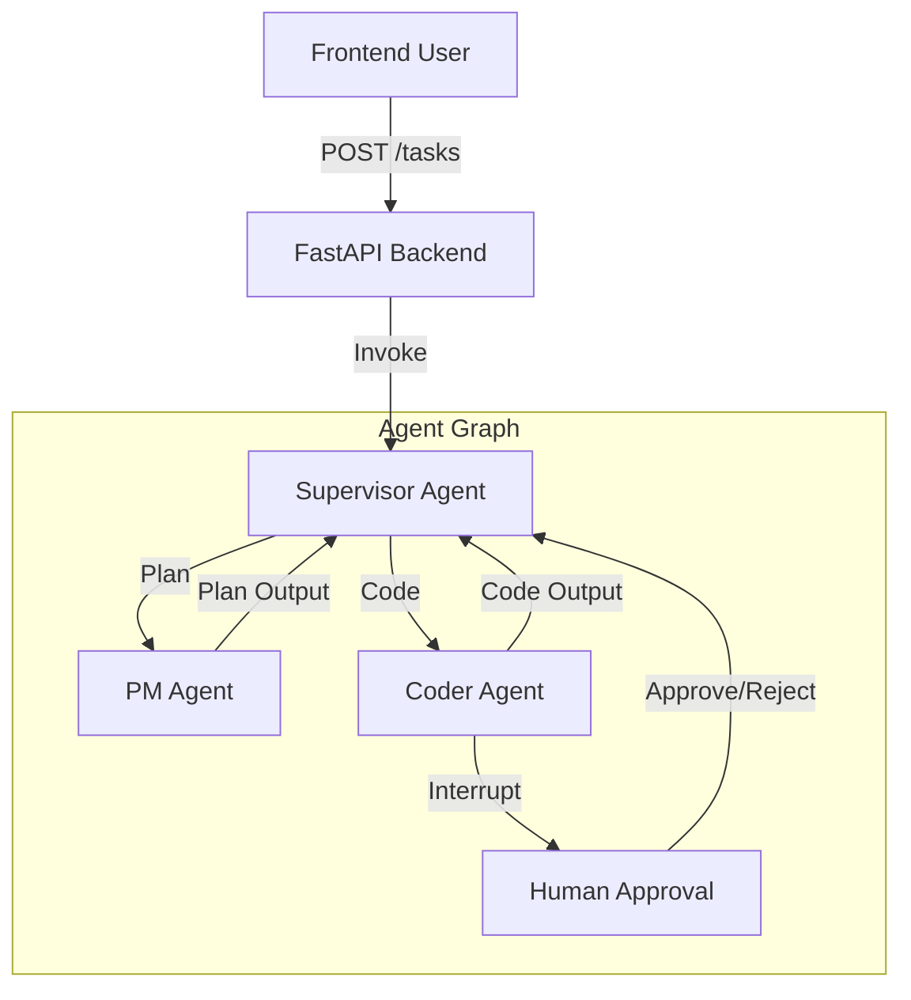

# AGENTS.md - AI Native POC Project Guide

"文档驱动开发 (Doc-Driven Development)"：先锁定文档 -> 拆 `taskNNN` -> 实现与验证 -> 回写文档。

---

## 0. 核心原则 (Core Principles)
- **质量第一**：代码质量和系统安全不可妥协。
- **文档为真**：需求、交互、接口只能来自 `docs/` 下的 `spec/plan/tech-refer/adr`。
- **原子任务**：单次仅处理一个原子任务 `taskNNN`；必须说明验证方式。
- **闭环回写**：实现完成必须回写 `task_*`、`change_*`，必要时更新 `spec_*`。

---

## 1. 仓库结构 (Repository Structure)
- **Codebase**:
  - `backend/`: FastAPI + LangGraph 应用核心
  - `frontend/`: React + Vite + TailwindCSS 任务控制台 (Mission Control)
  - `.ai-context/`: Agent 运行时状态存储
  - `prompts/`: 独立管理的 Prompt 文件
- **Documentation**:
  - `docs/`: 全局项目文档 (Implementation Plans, Specs)
  - `.agent/`: 此 Agent 规则配置
  - `.phrase/`: Phase 工作流文档 (按需启用)

---

## 2. Phase 工作流 (Workflow)
1. **Phase Gate**: 在新 `phase-*` 目录创建最小集文档 (`plan`, `task`)。
2. **In-Phase Loop**:
   - 新需求 -> 更新 `plan` -> 拆 `taskNNN`。
   - 实现 -> 执行任务 -> 验证。
   - 问题 -> 记录 `issueNNN` -> 修复 -> 回写。
3. **Task 闭环**:
   - 标记 `taskNNN [x]`。
   - 更新 `change_*` 记录变更。

---

## 3. 开发环境与构建 (Build & Dev)

### Backend (Python)
- **管理工具**: `uv` (必选)
- **环境隔离**: `uv venv`
- **依赖安装**: `uv sync`
- **运行开发**: `uv run fastapi dev app/main.py`
- **测试执行**: `uv run pytest`

### Frontend (React)
- **管理工具**: `pnpm` (必选)
- **依赖安装**: `pnpm install`
- **运行开发**: `pnpm dev`

---

## 4. 编码规范 (Coding Standards)

### Python (Backend)
- **Typing**: 严格类型注解 (`TypedDict`, `Pydantic Models`)。
- **Style**: 遵循 PEP8，使用 `ruff` 或 `black` 格式化。
- **Structure**: 模块化 Agent Node 设计，分离 Logic 与 Prompt。

### TypeScript/React (Frontend)
- **Component**: Functional Components, Hooks 优先。
- **Styling**: TailwindCSS Utility First。
- **State**: 明确区分 UI State (Local) 与 Server Data (React Query/SWR)。
- **Constants**: 避免硬编码，使用常量文件。

---

## 5. 可视化架构 (Architecture)

### Supervisor Mode Pattern

---

## 6. 提交与文档 (Commit & Docs)
- **Git Commit**: 使用 Conventional Commits (`feat:`, `fix:`, `docs:`, `chore:`)。
- **Task Association**: 提交信息尽量关联 `taskNNN`。
- **Changelog**: 维护 `change_*` 文件，记录每次实质性变更。