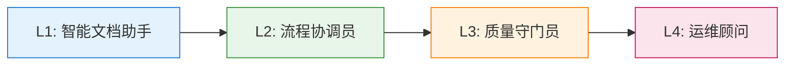

# AI 原生研发系统概念白皮书

## 1. 核心愿景：从“工具”到“伙伴”

传统的软件研发流程中，AI (如 Copilot) 仅作为辅助工具存在，需要人类开发者主动调用并持续纠偏。
**AI 原生 (AI-Native)** 系统的核心愿景是将 AI 的角色从“副驾驶”提升为**“数字化合伙人” (Digital Partner)**。

在这个系统中，AI 具备以下特征：
- **主动性 (Agentic)**：不仅响应指令，更主动感知上下文，提出建议甚至发起任务。
- **全知性 (Context-Aware)**：深度理解业务需求、技术架构、历史代码及运维数据。
- **闭环能力 (Closed-Loop)**：具备从规划、执行到验证的完整行动能力，人类仅需在关键节点进行决策审视。

---

## 2. SDLC 全流程深度集成

### 2.1 需求与产品阶段 (Product & Requirements)
*   **市场洞察赋能**：利用 RAG 技术实时聚合竞品动态与用户反馈，辅助产品决策。
*   **PRD 自动生成与演进**：通过人机对话澄清模糊需求，自动生成标准化的 PRD 文档。
*   **逻辑一致性校验**：AI 自动扫描 PRD，识别逻辑冲突、边缘情况遗漏（如异常流程未定义）及技术可行性风险。

### 2.2 设计阶段 (Design & Architecture)
*   **架构探索与模拟**：AI 依据需求推荐最佳架构模式（如微服务拆分建议），并模拟潜在的性能瓶颈。
*   **契约优先 (Contract-First)**：自动生成 API Swagger/OpenAPI 定义及数据库 Schema，确保前后端开发并行且对齐。
*   **测试前置 (AI-TDD)**：在编码前，AI 根据需求自动生成验收测试用例 (Acceptance Tests)，确立“完成的标准”。

### 2.3 开发阶段 (Development)
*   **Agent 自主编码**：针对明确定义的模块，AI Agent 独立完成代码编写、依赖安装及初步自测。
*   **语义级代码审查**：超越 Lint 检查，AI 理解业务逻辑，指出潜在的业务漏洞、安全隐患（如越权风险）及代码异味。
*   **自动重构与债务管理**：AI 持续监控代码复杂度，在不改变行为的前提下主动发起重构提案（如提取重复逻辑）。

### 2.4 测试与验证阶段 (QA & Verification)
*   **智能探索性测试**：AI 模拟真实用户行为路径，进行非脚本化的探索性测试，发现未知 Bug。
*   **视觉回归分析**：基于计算机视觉对比 UI 变更，精准识别非预期的样式破坏。
*   **根因分析 (RCA)**：测试失败时，AI 自动关联代码变更与日志，生成故障根因假设。

### 2.5 部署与运维阶段 (Deployment & Ops)
*   **语义化监控**：不再仅关注 CPU/内存，AI 监控业务指标（如“订单成功率突降”），并关联系统变更。
*   **故障自愈 (Self-Healing)**：针对常见故障（如服务假死、配置漂移），AI 自动执行预案（重启、回滚、扩容）并通知人工介入。

---

## 3. 流程对比 (Process Comparison)

### 3.1 传统 vs. AI 原生流程图

```mermaid
graph TD
    subgraph Traditional [传统研发流程：线性与孤岛]
        T_Req[需求分析] -->|人工撰写| T_PRD[文档输出]
        T_PRD -->|人工理解| T_Des[架构设计]
        T_Des -->|手工编码| T_Code[开发实现]
        T_Code -->|人工编写| T_UT[单元测试]
        T_UT -->|手工/脚本| T_QA[测试验收]
        T_QA -->|人工操作| T_Dep[部署上线]
        
        style T_Req fill:#f9f9f9,stroke:#333,stroke-width:1px
        style T_QA fill:#f9f9f9,stroke:#333,stroke-width:1px
    end

    subgraph AINative [AI 原生流程：协作与闭环]
        A_Req[需求意图] -->|RAG 市场洞察| A_AI_PRD[AI 生成 PRD]
        A_AI_PRD -->|自动一致性校验| A_AI_Des[AI 生成契约/测试用例]
        A_AI_Des -->|Agent 自主编码| A_Code[代码实现]
        A_Code -.->|实时语义审查| A_Fix[AI 自动修复]
        A_Fix --> A_Code
        A_Code -->|AI 探索性测试| A_QA[质量验证]
        A_QA -->|语义化监控| A_Dep[智能运维]

        style A_AI_PRD fill:#e1f5fe,stroke:#01579b,stroke-width:2px
        style A_AI_Des fill:#e1f5fe,stroke:#01579b,stroke-width:2px
        style A_Code fill:#ffecb3,stroke:#ff6f00,stroke-width:2px
        style A_Fix fill:#ffecb3,stroke:#ff6f00,stroke-width:2px
    end
```

### 3.2 关键差异点

| 环节 | 传统模式 (Traditional) | AI 原生模式 (AI-Native) |
| :--- | :--- | :--- |
| **流转方式** | 依赖文档与人工会议，信息损耗大 | 数据驱动，AI 维持上下文一致性 |
| **质量控制** | 后置验证 (测试阶段发现问题) | **左移 (Shift-Left)**：设计阶段即生成测试，编码时实时拦截 |
| **开发者角色** | 实现者 (编写具体逻辑) | **决策者/架构师** (审核 AI 产出，处理高阶问题) |
| **反馈环** | 慢 (数小时甚至数天) | **实时** (秒级/分钟级) |

---

## 4. 预期效果 (Expected Effects)

1.  **极速交付 (Velocity)**：消除重复性劳动（样板代码、基础测试），研发周期缩短 40%-60%。
2.  **原生质量 (Quality)**：代码在产生之初即经过 AI 审查与测试，Bug 逃逸率大幅降低。
3.  **认知减负 (Joy)**：开发者从繁琐细节中解放，专注于核心业务逻辑与架构创新，提升职业成就感。
4.  **知识沉淀**：所有决策过程数据化，系统自动维护最新的项目文档，解决人员流动带来的知识断层。

---

## 5. 市场定位与差异化 (Market Positioning)

### 5.1 产品定位

**DevSmart 是什么**：
AI 原生的研发流程编排与协调平台，专注于提升研发团队的协作效率。

**DevSmart 不是什么**：
- 不是 IDE 或代码编辑器
- 不是代码补全工具
- 不是自主编码 Agent
- 开发者仍在现有 IDE（VS Code/JetBrains 等）中进行编码

### 5.2 竞品分析

| 类别 | 代表产品 | DevSmart 差异化 |
|:---|:---|:---|
| **直接竞品** | Linear、Height、Notion AI | 专注研发全流程，端到端 Agent 编排 |
| **间接竞品** | Jira + AI、Confluence + AI | 原生 AI 设计，非后期集成 |
| **非竞品** | Copilot、Cursor、Devin | 我们不做编码辅助，聚焦流程协调 |

### 5.3 核心价值主张

| 维度 | 传统工具 | DevSmart |
|:---|:---|:---|
| 目标用户 | 开发者个人 | 研发团队/组织 |
| 核心场景 | 工具使用 | 流程编排 |
| 价值点 | 功能丰富 | 协作高效、流程智能 |
| AI 角色 | 辅助功能 | 数字化合伙人 |

---

## 6. 风险与挑战 (Risks & Challenges)

### 6.1 技术风险

| 风险 | 描述 | 应对策略 |
|:---|:---|:---|
| **AI 理解偏差** | AI 可能误解需求语义 | 人机审批机制 + 多轮澄清对话 |
| **上下文丢失** | 长会话中关键信息可能被遗忘 | 向量数据库持久化 + 显式上下文管理 |
| **延迟问题** | LLM 调用耗时影响体验 | 流式输出 + 异步任务队列 |
| **模型依赖** | 过度依赖特定 LLM 厂商 | 抽象接口层，支持多模型切换 |

### 6.2 组织风险

| 风险 | 描述 | 应对策略 |
|:---|:---|:---|
| **流程变革阻力** | 团队可能抵触新工作方式 | 渐进式引入 + 充分培训 |
| **权责边界模糊** | AI 产出的责任归属不清 | 明确审批机制 + 可追溯日志 |
| **技能转型** | 部分岗位职责可能发生变化 | 提前沟通 + 能力提升计划 |

### 6.3 集成风险

| 风险 | 描述 | 应对策略 |
|:---|:---|:---|
| **IDE 兼容性** | 需与多种 IDE 协同工作 | 标准化上下文协议 + 插件适配 |
| **工具链断裂** | 与现有 CI/CD、监控工具的集成复杂度 | 能力抽象层 + Adapter 模式 |
| **数据孤岛** | 各工具间数据不互通 | 统一知识基础设施 |

---

## 7. 渐进式成熟度模型 (Maturity Model)

### 7.1 四级演进路径

### 7.2 各级详细定义

| 级别 | 名称 | 核心能力 | 人机关系 | 验收标准 |
|:---|:---|:---|:---|:---|
| **L1** | 智能文档助手 | PRD 生成、需求澄清、文档校验 | AI 建议，人类决策 | PRD 生成效率提升 50% |
| **L2** | 流程协调员 | 任务分发、状态同步、上下文传递 | AI 调度，人类执行 | 任务流转时间减少 40% |
| **L3** | 质量守门员 | 测试策略、用例生成、Review 建议 | AI 检测，人类确认 | Bug 拦截左移至开发阶段 80% |
| **L4** | 运维顾问 | 告警分析、根因定位、修复建议 | AI 诊断，人类执行 | MTTD 降低 90% |

### 7.3 演进原则

1. **渐进式信任**：每一级需要通过验收才进入下一级
2. **人类在回路**：所有级别均保留人类审批节点
3. **可回退性**：任何阶段可安全回退到上一级别
4. **领域特化**：不同团队可处于不同成熟度级别

---

## 8. 验证与指标体系 (Verification & Metrics)

为了验证 AI 原生系统的有效性，我们需要建立一套**以结果为导向**的指标体系：

### 8.1 分角色效能指标 (Role-Based AI Impact)

为了确保 AI 价值对每个岗位都可感知，我们将指标拆解到具体角色：

#### 🧑‍💻 产品经理 (PM/PO)
| 关注点 | 指标名称 | 定义 | 预期变化 |
| :--- | :--- | :--- | :--- |
| **决策质量** | **需求澄清轮次** | 从 PRD 初稿到研发认可所需的沟通轮次 | ⬇️ 3轮 -> 1轮 (AI 预审核) |
| **交付速度** | **Idea-to-PRD 耗时** | 从原始想法到生成标准 PRD 文档的时间 | ⬇️ 2天 -> 2小时 |
| **完整性** | **边缘场景覆盖率** | AI 扫描发现的未定义异常流程数量 | ⬆️ 提升 40%+ |

#### 👨‍💻 研发工程师 (Developer)
| 关注点 | 指标名称 | 定义 | 预期变化 |
| :--- | :--- | :--- | :--- |
| **生产力** | **AI 代码采纳率** | IDE 中 AI 补全/生成代码的保留比例 | 🎯 目标 > 50% |
| **专注度** | **心流中断频率** | 因查文档/配环境等低价值事务打断开发的次数 | ⬇️ 显著降低 |
| **维护性** | **技术债务密度** | 每千行代码的圈复杂度/重复率 (AI 自动重构) | ⬇️ 持续下降 |

#### 🕵️ 质量工程师 (QA)
| 关注点 | 指标名称 | 定义 | 预期变化 |
| :--- | :--- | :--- | :--- |
| **左移效果** | **Bug 拦截阶段分布** | Bug 在 开发/测试/线上 阶段被发现的比例 | ⬅️ 80% 拦截在开发阶段 |
| **覆盖率** | **场景化用例生成率** | AI 自动生成的有效业务场景测试用例占比 | 🎯 目标 > 70% |
| **效率** | **回归测试周期** | 完整回归测试执行所需时间 (AI 精准筛选用例) | ⬇️ 4小时 -> 15分钟 |

#### 👷 运维/SRE (Ops)
| 关注点 | 指标名称 | 定义 | 预期变化 |
| :--- | :--- | :--- | :--- |
| **稳定性** | **自愈成功率** | 常见故障由 AI Agent 自动修复成功的比例 | 🎯 目标 > 90% |
| **恢复速度** | **平均诊断时间 (MTTD)** | 从告警发生到定位出准确根因的时间 | ⬇️ 30分钟 -> 1分钟 |

### 8.2 协作质量评价 (Cross-Role Evaluation)

除了自我视角的效能，我们需要引入**下游角色对上游交付物**的评价，以衡量协作质量：

| 被评价方 (上游) | 评价方 (下游) | 评价指标 | 定义 (What Success Look Like) |
| :--- | :--- | :--- | :--- |
| **产品经理 (PM)** | **研发 & 测试** | **PRD 可执行度** | 研发无需反复询问业务逻辑细节；测试可直接基于 PRD 生成完备用例。 |
| **产品经理 (PM)** | **UI/UX 设计** | **原型一致性** | 需求描述与原型图逻辑无冲突，交互说明清晰。 |
| **研发 (Dev)** | **测试 (QA)** | **提测质量分** | 提测版本是否包含“低级错误”（如冒烟测试即挂）；环境部署是否一次成功。 |
| **研发 (Dev)** | **运维 (Ops)** | **可观测性评分** | 日志是否清晰包含 TraceID；报错信息是否具备明确的排查指引。 |
| **测试 (QA)** | **研发 (Dev)** | **Bug 报告精准度** | Bug 描述是否包含复现步骤、日志片段及预期行为，是否直接指向根因。 |

### 8.3 面向未来的核心指标 (Future-Proof Metrics for Next 3-5 Years)

随着 AI 从 Copilot 向 Agent 演进，传统的研发效能指标（如代码行数、工时）将逐渐失效。我们需要引入衡量**人机协作新范式**的指标：

#### 🤖 代理自主度 (Agent Autonomy)
衡量“AI 独立完成工作”的能力，而非仅仅是辅助。
*   **L4 级任务占比 (Autonomous Task Rate)**：无需人类介入即可从头到尾（Plan -> Code -> Test -> Deploy）闭环完成的任务比例。
*   **人机交互带宽比 (Prompt-to-Code Ratio)**：开发者每输入 1 个 Token 的指令，AI 能生成并确认为有效的代码 Token 数量。比值越高（如 1:1000），说明人类只需做高阶指引，AI 执行力越强。

#### 🧠 知识复利 (Knowledge Compounding)
衡量系统是否“越用越聪明”，而非每次从零开始。
*   **组织记忆命中率 (Knowledge Reuse Rate)**：AI 生成的代码或方案中，有多少是基于公司历史文档、过往类似 Feature 的经验复用的。
*   **错误免疫率 (Error Immunity)**：同一个类型的 Bug（如某类并发问题）在被修复一次后，AI 在后续项目中的自动拦截成功率（目标应为 100%）。

#### 💡 创新盈余 (Innovation Surplus)
衡量 AI 是否真正把人从繁琐中解放出来去做更有价值的事。
*   **战略工作时长占比**：研发团队在“架构设计、业务创新、复杂算法研究”上的时间投入，对比“CRUD、配环境、修 Bug”的时间投入。AI 时代，前者应大幅上升。

### 8.4 验证方法
1.  **A/B 实验**：选取两个复杂度相当的模块，一组采用传统流程，一组采用 AI 原生流程，对比上述指标。
2.  **全链路回放**：选取历史真实 Bug，输入 AI 系统，验证 AI 是否能在开发阶段提前发现。
3.  **主观满意度调研**：定期调研团队成员对 AI“合伙人”的信任度与满意度。
