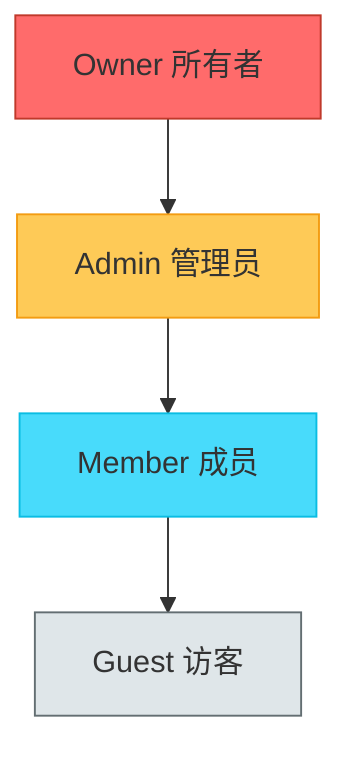
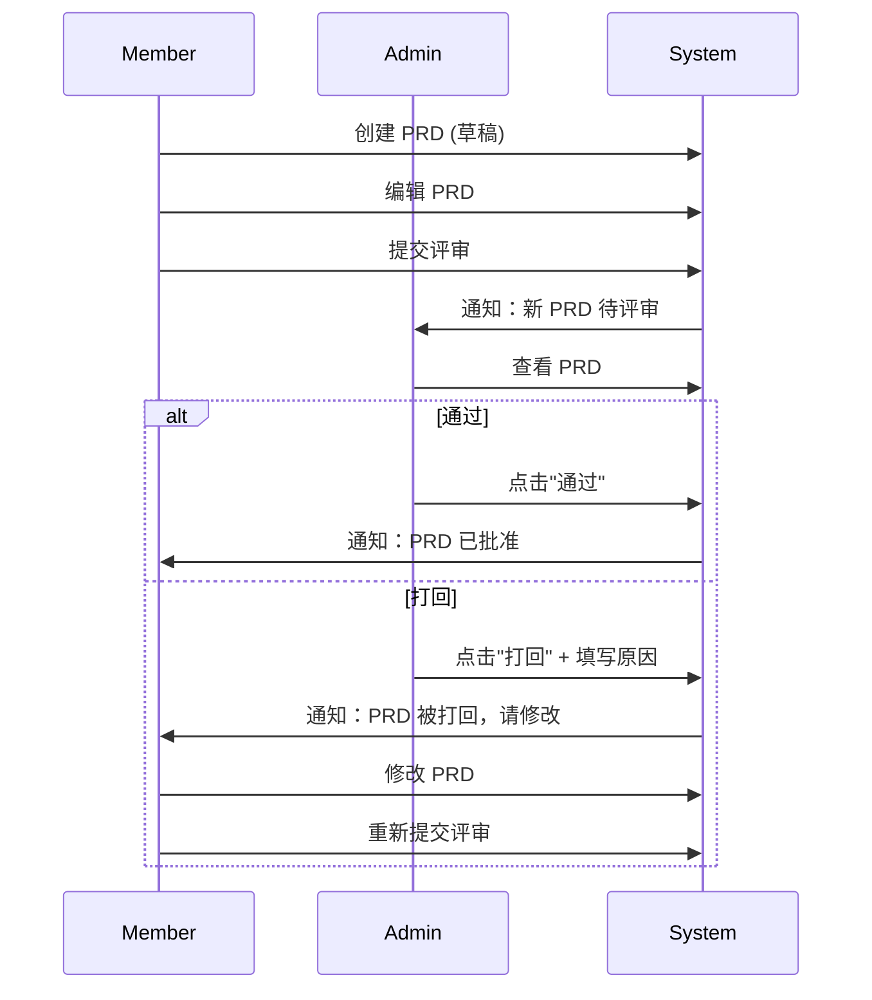
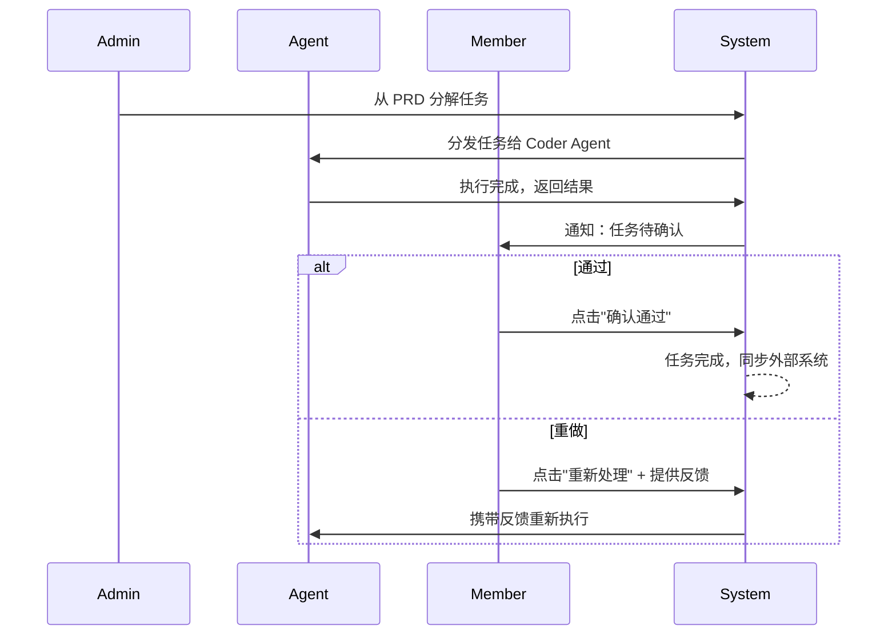

# DevSmart 权限矩阵

本文档定义了 DevSmart 平台的角色权限体系，包括角色定义、功能权限矩阵和数据访问规则。

---

## 1. 角色定义

### 1.1 角色层级



### 1.2 角色说明

| 角色 | 英文 | 说明 | 典型用户 |
|:---|:---|:---|:---|
| **Owner** | 所有者 | 组织创建者，拥有全部权限，包括计费和删除组织 | CEO、CTO、团队创始人 |
| **Admin** | 管理员 | 团队管理员，可管理成员、配置系统、审批 PRD | Tech Lead、PM Lead |
| **Member** | 成员 | 普通成员，可使用核心功能，创建和编辑自己的内容 | 开发者、产品经理、QA |
| **Guest** | 访客 | 受邀访客，只读权限，适合外部顾问或临时查看 | 外部顾问、客户代表 |

### 1.3 角色分配规则

- 每个组织必须有且仅有一个 **Owner**
- **Owner** 可以转让所有权给其他 Admin
- **Admin** 可以邀请新成员并分配 Member/Guest 角色
- **Member** 不能修改任何人的角色
- **Guest** 不能邀请其他人

---

## 2. 功能权限矩阵

### 2.1 项目管理

| 功能 | Owner | Admin | Member | Guest | 说明 |
|:---|:---:|:---:|:---:|:---:|:---|
| 创建项目 | ✅ | ✅ | ❌ | ❌ | |
| 查看项目列表 | ✅ | ✅ | ✅ | ✅ | 仅可见所属团队的项目 |
| 查看项目详情 | ✅ | ✅ | ✅ | ✅ | |
| 编辑项目信息 | ✅ | ✅ | ❌ | ❌ | 名称、描述、技术栈等 |
| 配置项目集成 | ✅ | ✅ | ❌ | ❌ | Git 仓库、Jira 等 |
| 归档项目 | ✅ | ✅ | ❌ | ❌ | |
| 删除项目 | ✅ | ❌ | ❌ | ❌ | 仅 Owner 可永久删除 |

### 2.2 PRD 管理

| 功能 | Owner | Admin | Member | Guest | 说明 |
|:---|:---:|:---:|:---:|:---:|:---|
| 创建 PRD | ✅ | ✅ | ✅ | ❌ | |
| 查看 PRD 列表 | ✅ | ✅ | ✅ | ✅ | |
| 查看 PRD 详情 | ✅ | ✅ | ✅ | ✅ | |
| 编辑 PRD（草稿） | ✅ | ✅ | ✅* | ❌ | *Member 仅能编辑自己创建的 |
| 提交 PRD 评审 | ✅ | ✅ | ✅* | ❌ | *Member 仅能提交自己创建的 |
| 评审 PRD（通过/打回） | ✅ | ✅ | ❌ | ❌ | |
| 删除 PRD | ✅ | ✅ | ❌ | ❌ | 仅草稿状态可删除 |
| 归档 PRD | ✅ | ✅ | ❌ | ❌ | |
| AI 生成 PRD | ✅ | ✅ | ✅ | ❌ | |
| 查看 PRD 版本历史 | ✅ | ✅ | ✅ | ✅ | |

### 2.3 任务管理

| 功能 | Owner | Admin | Member | Guest | 说明 |
|:---|:---:|:---:|:---:|:---:|:---|
| 查看任务看板 | ✅ | ✅ | ✅ | ✅ | |
| 查看任务详情 | ✅ | ✅ | ✅ | ✅ | |
| 手动创建任务 | ✅ | ✅ | ✅ | ❌ | |
| 从 PRD 分解任务 | ✅ | ✅ | ❌ | ❌ | |
| 分配任务 | ✅ | ✅ | ❌ | ❌ | 分配给 Agent 或人员 |
| 确认任务结果 | ✅ | ✅ | ✅* | ❌ | *Member 仅能确认分配给自己的任务 |
| 取消任务 | ✅ | ✅ | ❌ | ❌ | |
| 修改任务优先级 | ✅ | ✅ | ❌ | ❌ | |
| 同步到外部系统 | ✅ | ✅ | ❌ | ❌ | Jira/Linear 同步 |
| 查看任务上下文 | ✅ | ✅ | ✅ | ✅ | 注入的代码、文档等 |

### 2.4 Agent 管理

| 功能 | Owner | Admin | Member | Guest | 说明 |
|:---|:---:|:---:|:---:|:---:|:---|
| 查看 Agent 列表 | ✅ | ✅ | ✅ | ✅ | |
| 查看 Agent 详情 | ✅ | ✅ | ✅ | ✅ | 配置、状态、执行历史 |
| 创建 Agent | ✅ | ✅ | ❌ | ❌ | |
| 编辑 Agent 配置 | ✅ | ✅ | ❌ | ❌ | 模型、参数、工具权限 |
| 启动/停止 Agent | ✅ | ✅ | ❌ | ❌ | |
| 暂停/恢复 Agent | ✅ | ✅ | ❌ | ❌ | |
| 删除 Agent | ✅ | ❌ | ❌ | ❌ | |
| 查看执行日志 | ✅ | ✅ | ✅ | ✅ | |
| 回放执行过程 | ✅ | ✅ | ✅ | ✅ | Time Travel 功能 |

### 2.5 知识库管理

| 功能 | Owner | Admin | Member | Guest | 说明 |
|:---|:---:|:---:|:---:|:---:|:---|
| 搜索知识库 | ✅ | ✅ | ✅ | ✅ | |
| 查看文档内容 | ✅ | ✅ | ✅ | ✅ | |
| 上传文档 | ✅ | ✅ | ✅ | ❌ | |
| 编辑文档 | ✅ | ✅ | ✅* | ❌ | *Member 仅能编辑自己上传的 |
| 删除文档 | ✅ | ✅ | ❌ | ❌ | |
| 管理文档分类 | ✅ | ✅ | ❌ | ❌ | |

### 2.6 团队管理

| 功能 | Owner | Admin | Member | Guest | 说明 |
|:---|:---:|:---:|:---:|:---:|:---|
| 查看团队成员 | ✅ | ✅ | ✅ | ✅ | |
| 邀请新成员 | ✅ | ✅ | ❌ | ❌ | |
| 移除成员 | ✅ | ✅* | ❌ | ❌ | *Admin 不能移除 Owner/其他 Admin |
| 修改成员角色 | ✅ | ❌ | ❌ | ❌ | 仅 Owner 可修改角色 |
| 转让 Owner | ✅ | ❌ | ❌ | ❌ | 转让给 Admin |
| 创建团队 | ✅ | ❌ | ❌ | ❌ | 组织内创建新团队 |
| 删除团队 | ✅ | ❌ | ❌ | ❌ | |

### 2.7 系统设置

| 功能 | Owner | Admin | Member | Guest | 说明 |
|:---|:---:|:---:|:---:|:---:|:---|
| 查看系统设置 | ✅ | ✅ | ❌ | ❌ | |
| 配置第三方集成 | ✅ | ✅ | ❌ | ❌ | Git、Jira、Slack 等 |
| 配置通知规则 | ✅ | ✅ | ❌ | ❌ | |
| 查看审计日志 | ✅ | ✅ | ❌ | ❌ | |
| 导出审计日志 | ✅ | ❌ | ❌ | ❌ | |
| 管理 API Keys | ✅ | ✅ | ❌ | ❌ | |
| 查看用量统计 | ✅ | ✅ | ❌ | ❌ | Token 消耗、API 调用 |
| 计费管理 | ✅ | ❌ | ❌ | ❌ | 订阅、付款、发票 |
| 删除组织 | ✅ | ❌ | ❌ | ❌ | 危险操作，需二次确认 |

---

## 3. 数据访问规则

### 3.1 数据可见性范围

| 数据类型 | Owner | Admin | Member | Guest |
|:---|:---|:---|:---|:---|
| **组织数据** | 全部 | 全部 | 所属团队 | 所属团队 |
| **团队数据** | 全部团队 | 所管理团队 | 所属团队 | 被邀请的团队 |
| **项目数据** | 全部 | 所属团队全部 | 所属团队全部 | 被授权的项目 |
| **PRD 数据** | 全部 | 所属团队全部 | 所属团队全部 | 被授权的项目内 |
| **任务数据** | 全部 | 所属团队全部 | 所属团队全部 | 被授权的项目内 |
| **执行日志** | 全部 | 所属团队全部 | 所属团队全部 | 被授权的项目内 |
| **审计日志** | 全部 | 所属团队 | ❌ | ❌ |
| **计费数据** | 全部 | ❌ | ❌ | ❌ |

### 3.2 数据操作范围

**Member 角色的"自己创建"规则**：

```
Member 可编辑的 PRD = created_by == current_user AND status == 'draft'
Member 可确认的任务 = assigned_to == current_user AND status == 'human_review'
Member 可编辑的文档 = uploaded_by == current_user
```

### 3.3 跨团队数据隔离

- 不同团队的数据完全隔离
- 用户加入多个团队时，需切换团队上下文
- 跨团队数据共享需通过 Owner 授权

---

## 4. 特殊权限场景

### 4.1 PRD 评审工作流



### 4.2 任务确认工作流



### 4.3 敏感操作二次确认

以下操作需要二次确认：

| 操作 | 确认方式 | 仅限角色 |
|:---|:---|:---|
| 删除项目 | 输入项目名称确认 | Owner |
| 删除组织 | 输入组织名称 + 密码确认 | Owner |
| 移除 Admin | 输入用户邮箱确认 | Owner |
| 转让 Owner | 输入新 Owner 邮箱 + 密码确认 | Owner |
| 批量删除任务 | 勾选确认框 | Admin+ |

---

## 5. API 权限控制

### 5.1 认证方式

- **JWT Token**：用于 Web 端用户认证
- **API Key**：用于服务端集成，绑定特定权限范围

### 5.2 权限检查中间件

```python
# 示例：权限装饰器
@require_permission("prd:approve")
def approve_prd(prd_id: UUID, user: User):
    # 1. 检查用户角色是否有 prd:approve 权限
    # 2. 检查用户是否属于该 PRD 所在团队
    # 3. 执行审批逻辑
    pass
```

### 5.3 权限代码映射

| 权限代码 | 说明 | 最低角色 |
|:---|:---|:---|
| `project:create` | 创建项目 | Admin |
| `project:delete` | 删除项目 | Owner |
| `prd:create` | 创建 PRD | Member |
| `prd:approve` | 审批 PRD | Admin |
| `prd:delete` | 删除 PRD | Admin |
| `task:assign` | 分配任务 | Admin |
| `task:confirm` | 确认任务 | Member (仅自己的) |
| `agent:manage` | 管理 Agent | Admin |
| `agent:delete` | 删除 Agent | Owner |
| `team:manage` | 管理团队 | Owner |
| `billing:manage` | 管理计费 | Owner |

---

## 6. 审计日志

### 6.1 记录的操作

所有权限相关操作都会记录审计日志：

- 用户登录/登出
- 角色变更
- 敏感数据访问
- 配置修改
- 删除操作

### 6.2 日志格式

```json
{
  "timestamp": "2024-01-15T10:30:00Z",
  "user_id": "uuid",
  "user_email": "user@example.com",
  "action": "prd:approve",
  "resource_type": "prd",
  "resource_id": "uuid",
  "team_id": "uuid",
  "ip_address": "192.168.1.1",
  "user_agent": "Mozilla/5.0...",
  "details": {
    "from_status": "reviewing",
    "to_status": "approved"
  }
}
```
