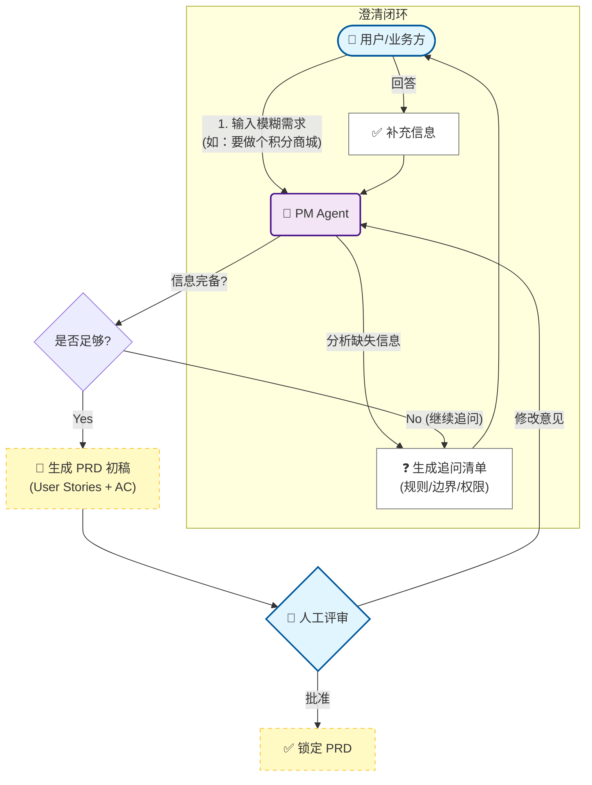
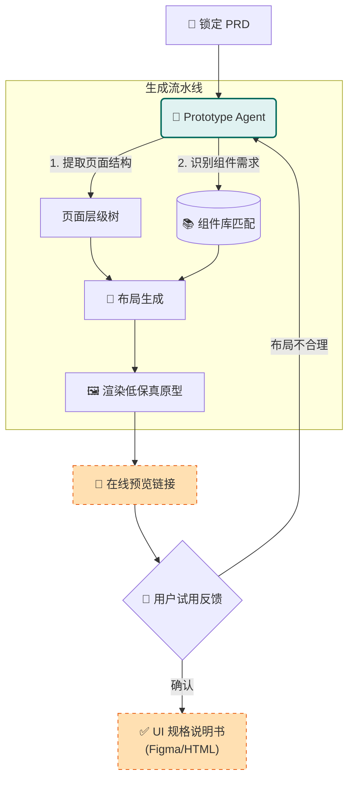
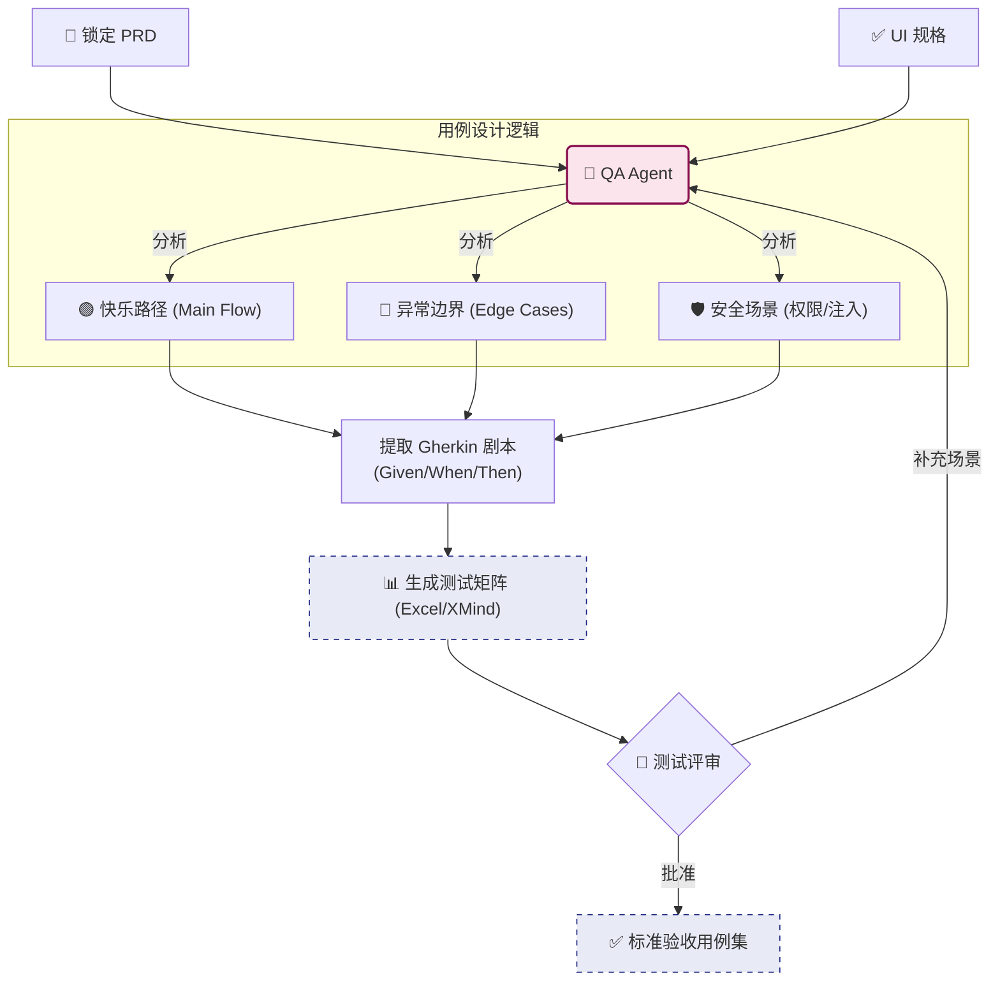

# DevSmart 分角色详解流程图

为展示更深度的业务逻辑，以下将核心流程拆解为三个独立的泳道：**需求分析**、**原型设计**、**测试生成**。

## 1. 需求分析流 (The PM Workflow)
**目标**：将"一句话需求"转化为"无歧义的结构化 PRD"。

---

## 2. 原型设计流 (The Prototype Workflow)
**目标**：将文字 PRD 转化为可视化原型，消除"想象力偏差"。

---

## 3. 测试设计流 (The QA Workflow)
**目标**：在写代码之前，先把"怎么测"定好 (TDD 思想)。

