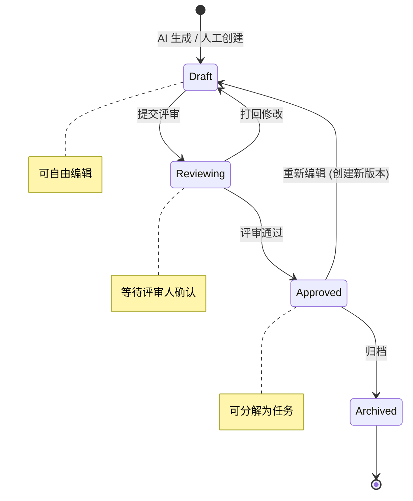
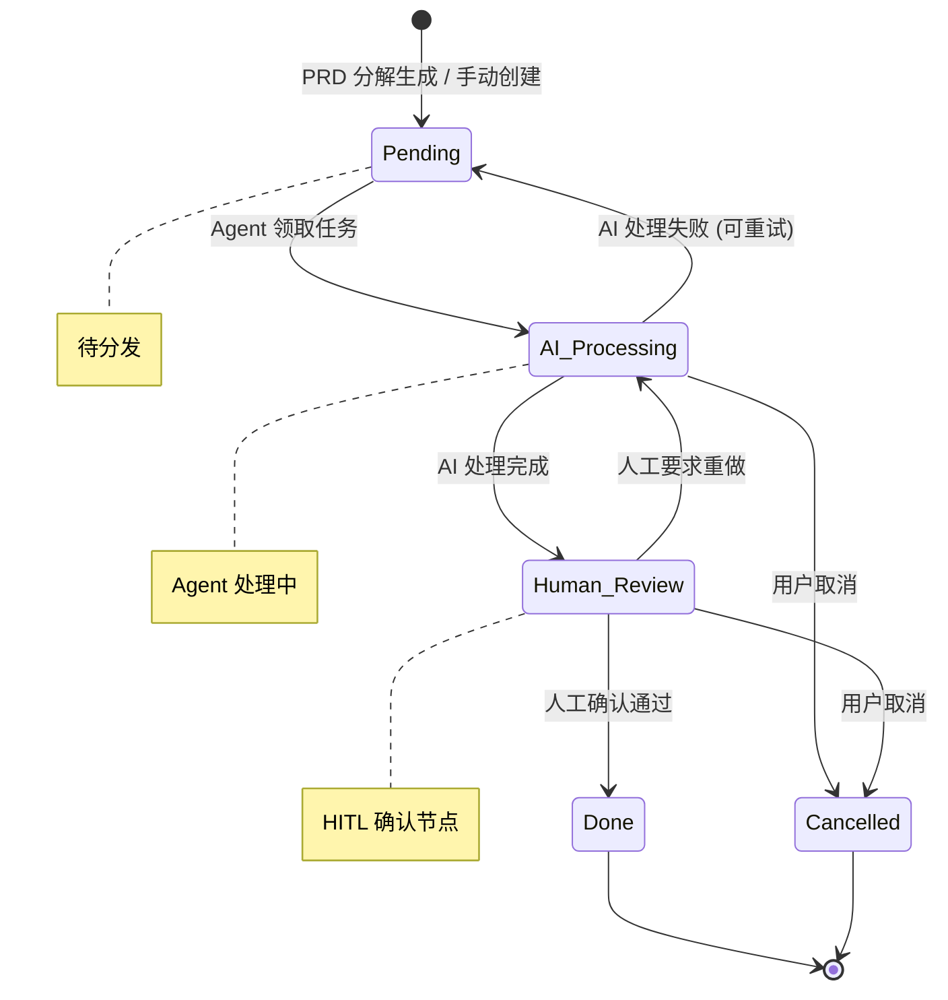
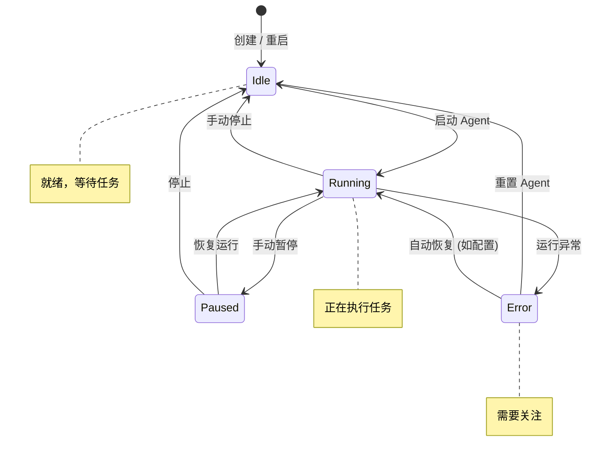

# DevSmart 状态机定义

本文档定义了 DevSmart 平台中核心实体的状态流转规则，包括 PRD、Task 和 Agent 的状态机。

---

## 1. PRD 状态流转

### 1.1 状态图



### 1.2 状态定义

| 状态 | 英文 | 说明 | UI 显示 |
|:---|:---|:---|:---|
| **草稿** | Draft | AI 生成或人工创建后的初始状态，创建者可自由编辑 | 灰色标签，显示在"草稿"区 |
| **评审中** | Reviewing | 已提交评审，等待具有评审权限的用户确认 | 黄色标签，显示在"待评审"区 |
| **已批准** | Approved | 评审通过，可开始分解为开发任务 | 绿色标签，显示在"已批准"区 |
| **已归档** | Archived | PRD 完成生命周期，归档保存供查阅 | 灰色淡化，显示在"归档"区 |

### 1.3 状态转换规则

| 转换 | 触发条件 | 权限要求 | 系统行为 |
|:---|:---|:---|:---|
| `[*] → Draft` | AI 生成完成 / 用户点击"创建 PRD" | Member+ | 创建 PRD 记录，设置 `generated_by` |
| `Draft → Reviewing` | 用户点击"提交评审" | 创建者 / Admin+ | 发送通知给评审人，锁定编辑 |
| `Reviewing → Draft` | 评审人点击"打回修改"并填写原因 | Admin+ | 解锁编辑，记录评审意见 |
| `Reviewing → Approved` | 评审人点击"通过" | Admin+ | 记录评审人和时间，触发任务分解提示 |
| `Approved → Archived` | 用户点击"归档" | Admin+ | 标记归档时间，从活跃列表移除 |
| `Approved → Draft` | 用户点击"创建新版本" | Member+ | 复制内容创建新 PRD，版本号递增 |

### 1.4 状态约束

- **Draft**：
  - 允许操作：编辑内容、提交评审、删除
  - 禁止操作：分解任务、归档

- **Reviewing**：
  - 允许操作：查看、评论、通过、打回
  - 禁止操作：编辑内容（已锁定）

- **Approved**：
  - 允许操作：分解任务、创建新版本、归档、查看
  - 禁止操作：直接编辑（需创建新版本）

- **Archived**：
  - 允许操作：查看、恢复（创建新版本）
  - 禁止操作：编辑、分解任务

---

## 2. Task 状态流转

### 2.1 状态图



### 2.2 状态定义

| 状态 | 英文 | 说明 | UI 显示 |
|:---|:---|:---|:---|
| **待处理** | Pending | 任务已创建，等待 Agent 或人工认领 | 灰色卡片，在"待分发"列 |
| **AI 处理中** | AI_Processing | Agent 正在处理该任务 | 蓝色卡片 + 动画，在"AI 处理中"列 |
| **待人工确认** | Human_Review | Agent 处理完成，等待人工确认结果 | 黄色卡片，在"待确认"列 |
| **已完成** | Done | 任务完成，人工验收通过 | 绿色卡片，在"已完成"列 |
| **已取消** | Cancelled | 任务被取消（需求变更等原因） | 灰色删除线，在"已取消"列 |

### 2.3 状态转换规则

| 转换 | 触发条件 | 权限要求 | 系统行为 |
|:---|:---|:---|:---|
| `[*] → Pending` | PRD 自动分解 / 用户手动创建 | Member+ | 创建任务，设置优先级 |
| `Pending → AI_Processing` | Coder Agent 调度分发 | 系统自动 | 注入上下文，启动 Agent 执行 |
| `AI_Processing → Human_Review` | Agent 执行成功返回结果 | 系统自动 | 保存输出，通知相关人员 |
| `AI_Processing → Pending` | Agent 执行失败（可重试） | 系统自动 | 记录错误，增加重试计数 |
| `AI_Processing → Cancelled` | 用户点击"取消任务" | Admin+ | 终止 Agent 执行，记录原因 |
| `Human_Review → Done` | 用户点击"确认通过" | Member+ | 记录完成时间，同步外部系统 |
| `Human_Review → AI_Processing` | 用户点击"重新处理"并提供反馈 | Member+ | 将反馈作为额外上下文重新执行 |
| `Human_Review → Cancelled` | 用户点击"取消任务" | Admin+ | 记录取消原因 |

### 2.4 状态约束

- **Pending**：
  - 最大等待时间：可配置告警阈值
  - 自动调度：根据优先级和 Agent 负载自动分发

- **AI_Processing**：
  - 超时处理：默认 30 分钟超时，自动转为 Pending 重试
  - 最大重试次数：3 次，超过后需人工介入

- **Human_Review**：
  - HITL 节点：必须有人工确认才能完成
  - 超时提醒：超过 24 小时未确认发送提醒

- **Done**：
  - 外部同步：自动同步到 Jira/Linear（如已配置）

---

## 3. Agent 状态流转

### 3.1 状态图



### 3.2 状态定义

| 状态 | 英文 | 说明 | UI 显示 |
|:---|:---|:---|:---|
| **空闲** | Idle | Agent 已就绪，可接收任务 | 绿色圆点，显示"就绪" |
| **运行中** | Running | Agent 正在执行任务 | 蓝色动画，显示"运行中" + 当前任务 |
| **已暂停** | Paused | Agent 被手动暂停，不接收新任务 | 黄色圆点，显示"已暂停" |
| **异常** | Error | Agent 遇到错误，需人工介入 | 红色圆点，显示"异常" + 错误信息 |

### 3.3 状态转换规则

| 转换 | 触发条件 | 权限要求 | 系统行为 |
|:---|:---|:---|:---|
| `[*] → Idle` | 创建新 Agent / 系统重启 | Admin+ | 初始化配置，注册到调度器 |
| `Idle → Running` | 收到任务调度 / 用户点击"启动" | Admin+ | 开始任务轮询，更新心跳 |
| `Running → Paused` | 用户点击"暂停" | Admin+ | 完成当前任务后暂停，不接新任务 |
| `Running → Error` | 执行异常 / 心跳超时 | 系统自动 | 记录错误日志，发送告警 |
| `Running → Idle` | 用户点击"停止" / 任务队列为空 | Admin+ | 优雅关闭，释放资源 |
| `Paused → Running` | 用户点击"恢复" | Admin+ | 重新加入调度 |
| `Paused → Idle` | 用户点击"停止" | Admin+ | 完全停止 |
| `Error → Idle` | 用户点击"重置" | Admin+ | 清除错误状态，重新初始化 |
| `Error → Running` | 自动恢复（如配置） | 系统自动 | 重试启动，最多 3 次 |

### 3.4 状态约束

- **Idle**：
  - 心跳检测：每 30 秒上报一次
  - 资源占用：最小化，仅保持连接

- **Running**：
  - 并发控制：单个 Agent 同时处理任务数可配置（默认 1）
  - 资源监控：CPU、内存、Token 消耗实时监控

- **Error**：
  - 告警通知：立即通知管理员
  - 自动恢复：可配置是否自动尝试恢复

---

## 4. 状态持久化

### 4.1 数据库存储

状态使用 PostgreSQL ENUM 类型存储：

```sql
-- PRD 状态
CREATE TYPE prd_status AS ENUM ('draft', 'reviewing', 'approved', 'archived');

-- Task 状态
CREATE TYPE task_status AS ENUM ('pending', 'ai_processing', 'human_review', 'done', 'cancelled');

-- Agent 状态
CREATE TYPE agent_status AS ENUM ('idle', 'running', 'paused', 'error');
```

### 4.2 状态变更日志

所有状态变更记录到 `status_change_log` 表：

```sql
CREATE TABLE status_change_log (
    id UUID PRIMARY KEY,
    entity_type VARCHAR(50) NOT NULL,  -- 'prd', 'task', 'agent'
    entity_id UUID NOT NULL,
    from_status VARCHAR(50),
    to_status VARCHAR(50) NOT NULL,
    changed_by UUID,  -- 变更人（系统自动为 NULL）
    reason TEXT,      -- 变更原因
    metadata JSONB,   -- 附加信息
    created_at TIMESTAMP DEFAULT NOW()
);

CREATE INDEX idx_status_log_entity ON status_change_log(entity_type, entity_id);
CREATE INDEX idx_status_log_time ON status_change_log(created_at DESC);
```

---

## 5. 状态机实现建议

### 5.1 前端实现

使用 XState 或类似状态机库：

```typescript
// 示例：PRD 状态机
import { createMachine } from 'xstate';

const prdMachine = createMachine({
  id: 'prd',
  initial: 'draft',
  states: {
    draft: {
      on: {
        SUBMIT_REVIEW: 'reviewing',
        DELETE: 'deleted'
      }
    },
    reviewing: {
      on: {
        APPROVE: 'approved',
        REJECT: 'draft'
      }
    },
    approved: {
      on: {
        ARCHIVE: 'archived',
        CREATE_VERSION: 'draft'
      }
    },
    archived: {
      type: 'final'
    }
  }
});
```

### 5.2 后端实现

使用领域事件驱动状态变更：

```python
# 示例：状态变更服务
class PRDStateService:
    def submit_for_review(self, prd_id: UUID, user: User) -> PRD:
        prd = self.repository.get(prd_id)

        # 验证当前状态
        if prd.status != PRDStatus.DRAFT:
            raise InvalidStateTransition("只有草稿状态可以提交评审")

        # 验证权限
        if not self.can_submit(user, prd):
            raise PermissionDenied()

        # 执行状态变更
        prd.status = PRDStatus.REVIEWING
        prd.updated_at = datetime.now()

        # 记录日志
        self.log_change(prd, PRDStatus.DRAFT, PRDStatus.REVIEWING, user)

        # 发送通知
        self.notify_reviewers(prd)

        return self.repository.save(prd)
```
