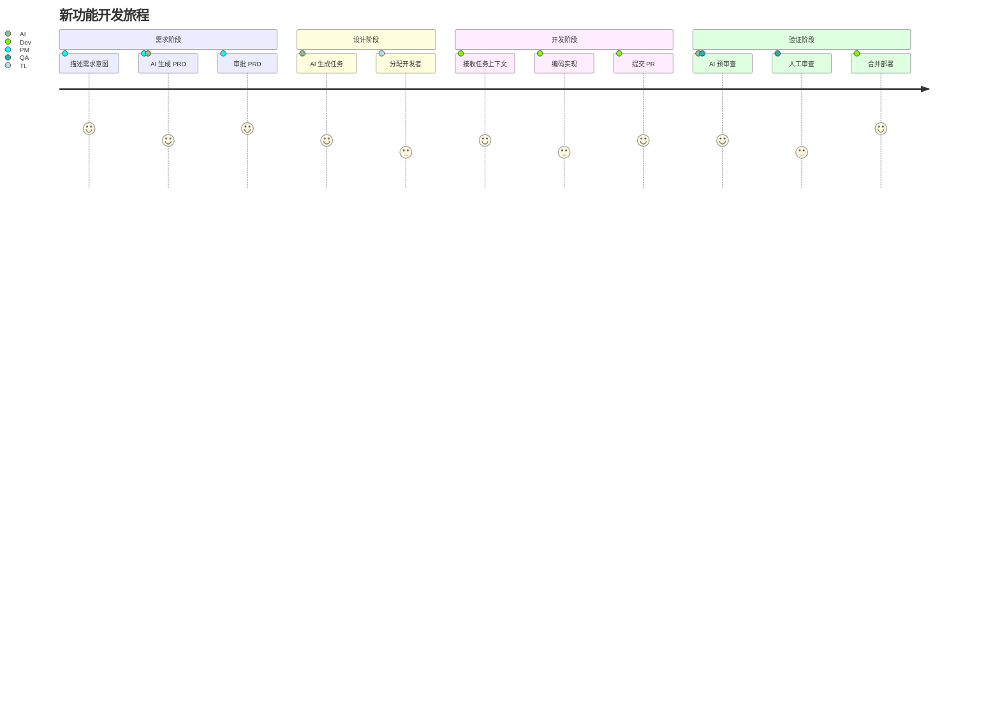

# 用户旅程地图 (User Journey Map)

## 概述

本文档展示用户从"产生需求"到"功能上线"的完整路径，标注每个阶段的用户情绪、AI 介入点和人机交互节点。

---

## 旅程 1：新功能开发

### 阶段概览



### 详细旅程

| 阶段 | 用户行为 | AI 行为 | 用户情绪 | 交互点 |
|:---|:---|:---|:---|:---|
| **1. 需求输入** | PM 用自然语言描述需求 | - | 😊 期待 | 文本输入 |
| **2. PRD 生成** | 等待 AI 处理 | PM Agent 生成 PRD 初稿 | 😐 等待 | 流式输出 |
| **3. 需求澄清** | 回答 AI 的追问 | 主动询问模糊点 | 🤔 思考 | 多轮对话 |
| **4. PRD 审批** | 审阅 PRD，点击批准 | 展示一致性检查结果 | ✅ 确认 | **审批按钮** |
| **5. 任务分发** | TL 查看任务列表 | Supervisor 拆解任务 | 😊 轻松 | 任务看板 |
| **6. 接收任务** | Dev 查看任务详情 | 自动注入代码上下文 | 😊 清晰 | 任务卡片 |
| **7. 编码** | Dev 在 IDE 中开发 | - (不介入) | 😐 专注 | - |
| **8. 提交 PR** | Dev 提交代码 | QA Agent 自动预审 | 🤔 忐忑 | PR 页面 |
| **9. 审查反馈** | 查看审查意见 | 生成审查报告 | 😊/😞 | 审查面板 |
| **10. 合并上线** | 确认合并 | 更新任务状态 | 🎉 完成 | **合并按钮** |

---

## 旅程 2：紧急 Bug 修复

| 阶段 | 用户行为 | AI 行为 | 用户情绪 | 交互点 |
|:---|:---|:---|:---|:---|
| **1. 告警触发** | 收到告警通知 | Ops Agent 捕获告警 | 😰 紧张 | 通知推送 |
| **2. 根因分析** | 查看分析报告 | 自动关联日志、变更 | 😐 等待 | 分析看板 |
| **3. 任务创建** | 确认修复任务 | 生成任务上下文 | 🤔 思考 | **确认按钮** |
| **4. 修复实现** | Dev 编码修复 | - (不介入) | 😰 压力 | - |
| **5. 验证部署** | 确认修复结果 | 自动运行回归 | 😊 放松 | 部署按钮 |

---

## 关键交互节点

以下节点需要**人类明确操作**（Human-in-the-Loop）：

| 节点 | 触发条件 | 用户操作 | 超时处理 |
|:---|:---|:---|:---|
| **PRD 审批** | PRD 生成完成 | 批准/拒绝 | 24h 提醒 |
| **任务确认** | 任务分配到人 | 接受/转派 | 自动升级 |
| **代码合并** | 审查通过 | 确认合并 | 等待 |
| **修复确认** | Ops Agent 建议修复 | 批准执行 | 不自动执行 |

---

## 情绪曲线

```
😊 高 ─────┐     ┌─────┐           ┌─────
          │     │     │           │
😐 中 ────┼─────┼─────┼───────────┼─────
          │     │     │     │     │
😰 低 ────┴─────┴─────┴─────┴─────┴─────
         需求   等待   澄清   开发   上线
```

**设计原则**：
- 减少"等待"阶段的焦虑（流式输出、进度提示）
- 在"审批"节点给予用户控制感
- 在"完成"时强化成就感
