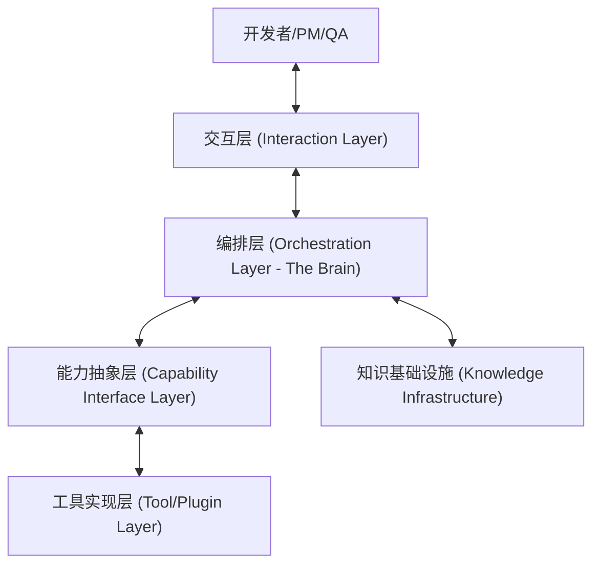
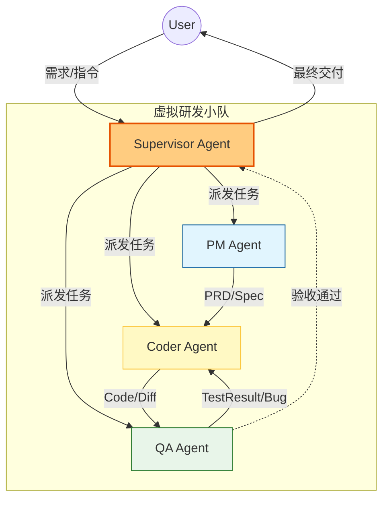

# AI 原生研发系统 - 总体逻辑架构设计

基于 **LangGraph** 编排引擎，本架构采用 **分层抽象 (Layered Abstraction)** 设计，确保核心逻辑与具体工具解耦，支持未来的灵活性与扩展性。

## 1. 架构总览 (High-Level Architecture)

系统划分为五大逻辑层级：



---

## 2. 分层详解

### 2.1 交互层 (Interaction Layer)
*用户触达系统的界面，支持多模态交互。*
*   **IDE Copilot Plugin**: 沉浸式编码辅助 (VS Code/JetBrains)，处理代码补全、实时 Lint。
*   **Chatbot Interface**: 对话式任务指令 ("帮我创建订单模块")，支持 Slack/钉钉/网页。
*   **Observability Dashboard**: "上帝视角"看板，展示 Agent 运行状态、任务进度及效能指标。

### 2.2 编排层 (Orchestration Layer - The Brain)
*基于 LangGraph 的核心状态机，负责“思考”与“调度”。*
*   **Supervisor Agent**: 总控节点，理解用户意图，拆解任务，分发给子 Agent。
*   **Specialized Agents**: 垂类专家 Agent。
    *   *PM Agent*: 负责需求分析、PRD 生成（**执行器**）。
    *   *Coder Agent*: 负责任务分发、上下文注入、状态同步（**协调器，不直接写代码**）。
    *   *QA Agent*: 负责测试用例生成、Bug 分析（**执行器**）。
*   **State Manager**: 利用 LangGraph Checkpointer 管理全局状态（Context），支持“时光倒流”和“断点续传”。

### 2.3 能力抽象层 (Capability Interface Layer)
*【关键】定义标准接口，解耦具体工具。系统只调用接口，不感知实现。*

| 能力域 | 接口定义 (Interface) | 核心方法示例 |
| :--- | :--- | :--- |
| **代码库管理** | `ICodeRepository` | `clone()`, `create_branch()`, `create_pull_request()`, `get_file_content()` |
| **事项追踪** | `IIssueTracker` | `create_ticket()`, `update_status()`, `get_comments()`, `link_pr()` |
| **流水线** | `IPipelineProvider` | `trigger_build()`, `get_build_status()`, `get_test_report()` |
| **文档知识** | `IKnowledgeBase` | `search_docs()`, `index_document()`, `retrieve_context()` |
| **即时通讯** | `IMessenger` | `send_notification()`, `ask_for_approval()` |

### 2.4 工具实现层 (Tool/Plugin Layer)
*能力的具体实现（Adapter模式），通过 MCP (Model Context Protocol) 或 API 接入。*
*   **SCM Adapters**: GitHub Adapter, GitLab Adapter, Bitbucket Adapter.
*   **PM Adapters**: Jira Adapter, Linear Adapter, Trello Adapter.
*   **CI/CD Adapters**: Jenkins Adapter, GitHub Actions Adapter.
*   **Environment**: Docker Sandbox (用于安全执行代码), K8s Client.

### 2.5 知识基础设施 (Knowledge Infrastructure)
*系统的长期记忆与知识底座。*
*   **Vector DB (语义记忆)**: 存储需求文档、历史 Bug、技术方案的 Embedding (Chroma/Milvus)。
*   **Code Graph (结构记忆)**: 基于 AST 分析的代码调用关系图 (Neo4j)，用于精准的代码导航与重构分析。
*   **Trace Store (过程记忆)**: 存储 Agent 的所有思考过程与操作日志 (LangSmith)，用于审计与优化。

---

---

## 3. 核心 Agent 拓扑设计 (Core Agent Topology)

采用 **Supervisor (监督者)** 模式与 **Hierarchical (层级)** 模式的混合架构，确保任务有序流转。

### 3.1 研发协作拓扑图



### 3.2 角色职责与状态流转

#### 👑 Supervisor Agent (总控)
*   **职责**：语义路由、任务拆解、全局状态监控。
*   **决策逻辑**：
    *   *收到模糊需求* -> 路由给 `PM Agent`。
    *   *收到明确 Bug* -> 路由给 `Coder Agent`（附带 Context）。
    *   *收到代码提交* -> 路由给 `QA Agent`。

#### 📝 PM Agent (产品)
*   **工具**：RAG (查竞品/历史需求), Issue Tracker (Jira)。
*   **输出**：结构化 PRD (Markdown/JSON)，包含验收标准 (Acceptance Criteria)。

#### 💻 Coder Agent (开发协调智能体)
*   **定位**：**协调器 (Coordinator)** 而非执行器，**不直接编写代码**。
*   **核心职责**：
    *   *任务分发*：将拆解后的 Task 转换为标准指令，分发给外部 **Code CLI**（如 Cursor CLI、Copilot CLI）或通过 IDE 插件通知人类开发者。
    *   *上下文注入*：自动为任务附加必要的 RAG 上下文（相关代码文件、架构规范、接口定义、历史讨论）。
    *   *状态同步*：监听外部工具的执行结果（Commit/PR），实时更新任务状态到系统看板。
    *   *质量把关*：触发 Code Review 流程，收集反馈并决定是否需要返工。

> **重要说明**：Coder Agent 的价值在于"编排"而非"编码"。它是人类开发者和 AI 编码工具之间的桥梁，确保任务有充分的上下文、结果有完整的追踪。具体的代码生成工作由外部专业工具（如 Cursor、GitHub Copilot）完成。

#### 🔍 QA Agent (质量守门员)
*   **工具**：对接外部测试平台 (Test Platform), CI 流水线。
*   **策略**：
    *   *策略生成*：AI 生成测试计划与核心 Case。
    *   *执行调度*：唤起外部自动化测试工具执行。
    *   *结果分析*：分析外部回传的测试报告，提取关键失败信息反馈给 Supervisor。

---

---

## 4. 关键设计模式

### 4.1 外部工具联动协议 (External Linkage Protocol)
鉴于“术业有专攻”，系统不直接接管所有重度编码工作，而是通过 **协议 (Protocol)** 与外部专业工具（CLI / IDE / 垂直SaaS）关联。

*   **协议格式**：标准 JSON/YAML 指令。
    *   `Step 1`: Supervisor 生成 `task_context.json` (包含 PRD 摘要、技术约束)。
    *   `Step 2`: 唤起外部 `code-cli` (如 `cursor-cli`, `dev-agent-cli`)，传入 Context。
    *   `Step 3`: 外部工具执行完毕，回传 `result_summary.json` (包含 PR Link, Diff Summary)。
    *   `Step 4`: Supervisor 更新全局状态。

### 4.2 动态工具加载 (Dynamic Tool Loading)
Supervisor Agent 不直接加载所有工具。它根据任务类型（如“修Bug”），通过能力层接口动态加载 `ICodeRepository` 和 `IIssueTracker` 的具体实现（如 GitLab + Jira）。这使得系统可以同时服务于使用不同工具链的团队。

### 4.3 异步事件驱动工作流 (Async Event-Driven Workflow)
针对“缺陷修复”等长链路、跨角色场景，系统通过 **事件总线 (Event Bus)** 实现异步联动，保障流程不因等待而阻塞。

**场景示例：QA 提单 -> 开发修复 -> 回归验证**

1.  **事件捕获 (Event Ingestion)**：
    *   QA 在外部系统（如 Jira）提交 Bug。
    *   系统通过 Webhook 捕获 `issue.created` 事件，解析上下文（Bug 描述、优先级）。
2.  **状态映射 (State Mapping)**：
    *   Supervisor 将该 Bug 映射为内部的一个此系统的 `Task`，状态标记为 `PENDING_DEV`。
    *   Supervisor 唤起 `Coder Agent`（或通知人类开发），传入 Bug 上下文。
3.  **异步挂起 (Async Suspend)**：
    *   若开发决定“稍后修复”，Supervisor 将 Task 挂起，系统进入低功耗监听模式，不持续占用资源。
4.  **回调唤醒 (Callback & Wakeup)**：
    *   当开发在外部工具提交修复（Git Merge 或 Jira 状态变为 `Resolved`）。
    *   系统捕获 `issue.updated` 或 `pr.merged` 事件。
    *   Supervisor **唤醒** 关联的 `Waitable Node`，自动触发 QA Agent 启动回归测试流程。

---

## 5. Vibe Coding 架构对齐 (Alignment with Vibe Coding)

响应 **Vibe Coding** 理念，我们在系统中显式定义以下两个关键子系统，以强化“工程化”与“标准化”：

### 5.1 提示词工程系统 (Prompt Engineering System)
对应 Vibe Coding 中的 `提示词工程` 模块，我们不将 Prompt 硬编码在 Agent 中，而是作为只有版本的**代码资产**进行管理。

*   **Prompt Library (提示词库)**：
    *   *通用提示词*：如 `Role_Definition`, `Output_Format_JSON`.
    *   *流程化提示词*：如 `PRD_Generation_Template`, `Code_Review_Checklist`.
*   **Prompt Lifecycle (生命周期)**：
    *   `Dev`: 在 Playground 中调试 Prompt。
    *   `Version`: Git 管理 `prompts/v1.0/coder.yaml`。
    *   `Eval`: 每次 Prompt 变更需跑通 `Golden Dataset` 测试集，确保不发生“智力退化”。

### 5.2 标准化文档结构 (Standardized Doc Structure)
对应 Vibe Coding 中的 `文档管理` 模块，系统强制约定项目结构，便于 AI 快速索引。

```text
/project-root
  /.ai-context/          # AI 专用上下文缓存
    active_task.json     # 当前任务状态
    memory.sqlite        # 长期记忆库
  /docs/
    /01-requirements/    # 需求 (PRD) - AI 读取源
    /02-architecture/    # 架构 (ADR) - AI 遵循规范
    /03-api/            # 接口 (OpenAPI) - AI 生成/校验
  /prompts/             # 项目级专属 Prompt
```

这一结构确保了 AI 在“从想法到产品”的全流程中，始终知道去哪里读数据，往哪里写产物。
