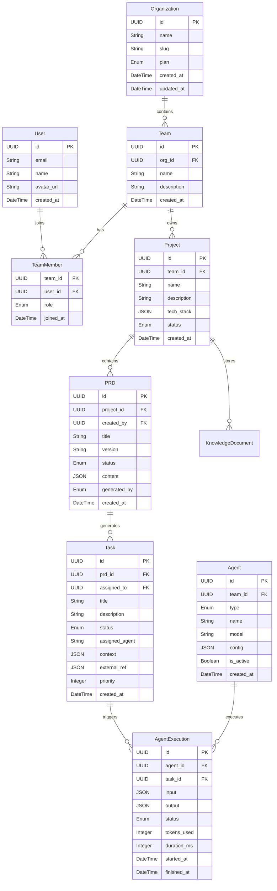

# DevSmart 数据模型设计

本文档定义了 DevSmart 平台的核心数据模型，包括实体关系、字段定义和索引设计。

---

## 1. 实体关系图 (ER Diagram)



---

## 2. 核心实体定义

### 2.1 Organization (组织/租户)

多租户系统的顶层实体，代表一个付费组织。

| 字段 | 类型 | 约束 | 说明 |
|:---|:---|:---|:---|
| `id` | UUID | PK, NOT NULL | 主键 |
| `name` | VARCHAR(100) | NOT NULL | 组织名称 |
| `slug` | VARCHAR(50) | UNIQUE, NOT NULL | URL 友好标识，用于路由 |
| `plan` | ENUM | NOT NULL, DEFAULT 'free' | 订阅计划：`free`/`pro`/`enterprise` |
| `settings` | JSONB | - | 组织级配置（通知偏好、默认时区等） |
| `created_at` | TIMESTAMP | NOT NULL, DEFAULT NOW() | 创建时间 |
| `updated_at` | TIMESTAMP | NOT NULL, DEFAULT NOW() | 更新时间 |

### 2.2 Team (团队)

组织下的工作团队，是资源隔离的基本单位。

| 字段 | 类型 | 约束 | 说明 |
|:---|:---|:---|:---|
| `id` | UUID | PK, NOT NULL | 主键 |
| `org_id` | UUID | FK → Organization, NOT NULL | 所属组织 |
| `name` | VARCHAR(100) | NOT NULL | 团队名称 |
| `description` | TEXT | - | 团队描述 |
| `avatar_url` | VARCHAR(500) | - | 团队头像 |
| `created_at` | TIMESTAMP | NOT NULL, DEFAULT NOW() | 创建时间 |
| `updated_at` | TIMESTAMP | NOT NULL, DEFAULT NOW() | 更新时间 |

### 2.3 User (用户)

系统用户，可加入多个团队。

| 字段 | 类型 | 约束 | 说明 |
|:---|:---|:---|:---|
| `id` | UUID | PK, NOT NULL | 主键 |
| `email` | VARCHAR(255) | UNIQUE, NOT NULL | 邮箱（登录凭证） |
| `name` | VARCHAR(100) | NOT NULL | 用户姓名 |
| `avatar_url` | VARCHAR(500) | - | 头像 URL |
| `password_hash` | VARCHAR(255) | - | 密码哈希（OAuth 用户可为空） |
| `oauth_provider` | VARCHAR(50) | - | OAuth 提供商（google/github/etc） |
| `oauth_id` | VARCHAR(255) | - | OAuth 用户 ID |
| `last_login_at` | TIMESTAMP | - | 最后登录时间 |
| `created_at` | TIMESTAMP | NOT NULL, DEFAULT NOW() | 创建时间 |

### 2.4 TeamMember (团队成员关系)

用户与团队的多对多关系，携带角色信息。

| 字段 | 类型 | 约束 | 说明 |
|:---|:---|:---|:---|
| `team_id` | UUID | PK, FK → Team | 团队 ID |
| `user_id` | UUID | PK, FK → User | 用户 ID |
| `role` | ENUM | NOT NULL, DEFAULT 'member' | 角色：`owner`/`admin`/`member`/`guest` |
| `joined_at` | TIMESTAMP | NOT NULL, DEFAULT NOW() | 加入时间 |
| `invited_by` | UUID | FK → User | 邀请人 |

### 2.5 Project (项目)

研发项目，是 PRD 和任务的容器。

| 字段 | 类型 | 约束 | 说明 |
|:---|:---|:---|:---|
| `id` | UUID | PK, NOT NULL | 主键 |
| `team_id` | UUID | FK → Team, NOT NULL | 所属团队 |
| `name` | VARCHAR(200) | NOT NULL | 项目名称 |
| `description` | TEXT | - | 项目描述 |
| `tech_stack` | JSONB | - | 技术栈约束 `{"languages": [...], "frameworks": [...]}` |
| `repository_url` | VARCHAR(500) | - | 代码仓库地址 |
| `status` | ENUM | NOT NULL, DEFAULT 'active' | 状态：`active`/`archived`/`paused` |
| `settings` | JSONB | - | 项目级配置 |
| `created_at` | TIMESTAMP | NOT NULL, DEFAULT NOW() | 创建时间 |
| `updated_at` | TIMESTAMP | NOT NULL, DEFAULT NOW() | 更新时间 |

### 2.6 PRD (产品需求文档)

需求文档实体，支持版本管理和状态流转。

| 字段 | 类型 | 约束 | 说明 |
|:---|:---|:---|:---|
| `id` | UUID | PK, NOT NULL | 主键 |
| `project_id` | UUID | FK → Project, NOT NULL | 所属项目 |
| `created_by` | UUID | FK → User, NOT NULL | 创建者 |
| `title` | VARCHAR(500) | NOT NULL | PRD 标题 |
| `version` | VARCHAR(20) | NOT NULL, DEFAULT 'v1.0' | 版本号 |
| `status` | ENUM | NOT NULL, DEFAULT 'draft' | 状态：`draft`/`reviewing`/`approved`/`archived` |
| `content` | JSONB | NOT NULL | 结构化内容 |
| `generated_by` | ENUM | NOT NULL | 来源：`ai`/`human` |
| `parent_id` | UUID | FK → PRD | 父版本（用于版本追溯） |
| `reviewed_by` | UUID | FK → User | 评审人 |
| `reviewed_at` | TIMESTAMP | - | 评审时间 |
| `created_at` | TIMESTAMP | NOT NULL, DEFAULT NOW() | 创建时间 |
| `updated_at` | TIMESTAMP | NOT NULL, DEFAULT NOW() | 更新时间 |

**`content` 字段结构**：
```json
{
  "background": "业务背景描述",
  "objectives": ["目标1", "目标2"],
  "user_stories": [
    {
      "role": "作为用户",
      "action": "我希望...",
      "benefit": "以便..."
    }
  ],
  "acceptance_criteria": [
    {"id": "AC001", "description": "验收标准描述", "priority": "high"}
  ],
  "non_functional": {
    "performance": "性能要求",
    "security": "安全要求"
  },
  "out_of_scope": ["不包含的内容"]
}
```

### 2.7 Task (任务)

从 PRD 分解出的开发任务。

| 字段 | 类型 | 约束 | 说明 |
|:---|:---|:---|:---|
| `id` | UUID | PK, NOT NULL | 主键 |
| `prd_id` | UUID | FK → PRD, NOT NULL | 来源 PRD |
| `title` | VARCHAR(500) | NOT NULL | 任务标题 |
| `description` | TEXT | - | 任务描述 |
| `status` | ENUM | NOT NULL, DEFAULT 'pending' | 状态：`pending`/`ai_processing`/`human_review`/`done` |
| `assigned_agent` | VARCHAR(50) | - | 分配的 Agent 类型 |
| `assigned_to` | UUID | FK → User | 分配的人工处理者 |
| `context` | JSONB | - | 注入的上下文信息 |
| `external_ref` | JSONB | - | 外部系统引用 `{"jira_id": "...", "linear_id": "..."}` |
| `priority` | INTEGER | NOT NULL, DEFAULT 0 | 优先级（数值越大越优先） |
| `estimated_points` | INTEGER | - | 估算工作量（Story Points） |
| `due_date` | DATE | - | 截止日期 |
| `created_at` | TIMESTAMP | NOT NULL, DEFAULT NOW() | 创建时间 |
| `updated_at` | TIMESTAMP | NOT NULL, DEFAULT NOW() | 更新时间 |
| `completed_at` | TIMESTAMP | - | 完成时间 |

**`context` 字段结构**：
```json
{
  "related_files": ["src/api/user.ts", "src/models/user.ts"],
  "api_docs": ["POST /api/users - 创建用户"],
  "related_commits": ["abc123", "def456"],
  "architecture_notes": "遵循 Repository 模式",
  "dependencies": ["task-uuid-1", "task-uuid-2"]
}
```

### 2.8 Agent (智能体配置)

Agent 实例配置，每个团队可自定义 Agent 参数。

| 字段 | 类型 | 约束 | 说明 |
|:---|:---|:---|:---|
| `id` | UUID | PK, NOT NULL | 主键 |
| `team_id` | UUID | FK → Team, NOT NULL | 所属团队 |
| `type` | ENUM | NOT NULL | 类型：`pm`/`coder`/`qa`/`designer`/`supervisor`/`ops` |
| `name` | VARCHAR(100) | NOT NULL | 显示名称（如 "PM-01"） |
| `model` | VARCHAR(100) | NOT NULL | LLM 模型（gpt-4o/claude-3-opus/etc） |
| `config` | JSONB | - | Agent 特定配置 |
| `is_active` | BOOLEAN | NOT NULL, DEFAULT true | 是否启用 |
| `status` | ENUM | NOT NULL, DEFAULT 'idle' | 运行状态：`idle`/`running`/`paused`/`error` |
| `created_at` | TIMESTAMP | NOT NULL, DEFAULT NOW() | 创建时间 |
| `updated_at` | TIMESTAMP | NOT NULL, DEFAULT NOW() | 更新时间 |

**`config` 字段结构示例（Coder Agent）**：
```json
{
  "temperature": 0.3,
  "max_tokens": 4096,
  "tools_enabled": ["code_repository", "issue_tracker"],
  "auto_context_injection": true,
  "external_cli": "cursor-cli",
  "notification_channel": "slack"
}
```

### 2.9 AgentExecution (执行记录)

Agent 执行任务的详细记录，用于审计和优化。

| 字段 | 类型 | 约束 | 说明 |
|:---|:---|:---|:---|
| `id` | UUID | PK, NOT NULL | 主键 |
| `agent_id` | UUID | FK → Agent, NOT NULL | 执行 Agent |
| `task_id` | UUID | FK → Task | 关联任务（可为空，如系统任务） |
| `input` | JSONB | NOT NULL | 输入内容 |
| `output` | JSONB | - | 输出内容 |
| `status` | ENUM | NOT NULL | 状态：`running`/`success`/`failed`/`cancelled` |
| `error_message` | TEXT | - | 错误信息（失败时） |
| `tokens_used` | INTEGER | - | Token 消耗 |
| `duration_ms` | INTEGER | - | 执行时长（毫秒） |
| `trace_id` | VARCHAR(100) | - | LangSmith Trace ID（用于调试） |
| `started_at` | TIMESTAMP | NOT NULL, DEFAULT NOW() | 开始时间 |
| `finished_at` | TIMESTAMP | - | 结束时间 |

### 2.10 KnowledgeDocument (知识文档)

知识库中的文档，支持向量检索。

| 字段 | 类型 | 约束 | 说明 |
|:---|:---|:---|:---|
| `id` | UUID | PK, NOT NULL | 主键 |
| `project_id` | UUID | FK → Project, NOT NULL | 所属项目 |
| `title` | VARCHAR(500) | NOT NULL | 文档标题 |
| `content` | TEXT | NOT NULL | 文档内容 |
| `type` | ENUM | NOT NULL | 类型：`api_doc`/`architecture`/`guide`/`meeting_note` |
| `source_url` | VARCHAR(500) | - | 来源 URL |
| `embedding_id` | VARCHAR(100) | - | 向量库中的 ID |
| `metadata` | JSONB | - | 元数据 |
| `created_at` | TIMESTAMP | NOT NULL, DEFAULT NOW() | 创建时间 |
| `updated_at` | TIMESTAMP | NOT NULL, DEFAULT NOW() | 更新时间 |

---

## 3. 索引设计

### 3.1 主键索引
所有实体的 `id` 字段自动创建主键索引。

### 3.2 外键索引
```sql
-- Team
CREATE INDEX idx_team_org_id ON team(org_id);

-- TeamMember
CREATE INDEX idx_team_member_user_id ON team_member(user_id);

-- Project
CREATE INDEX idx_project_team_id ON project(team_id);
CREATE INDEX idx_project_status ON project(status);

-- PRD
CREATE INDEX idx_prd_project_id ON prd(project_id);
CREATE INDEX idx_prd_status ON prd(status);
CREATE INDEX idx_prd_created_by ON prd(created_by);

-- Task
CREATE INDEX idx_task_prd_id ON task(prd_id);
CREATE INDEX idx_task_status ON task(status);
CREATE INDEX idx_task_assigned_agent ON task(assigned_agent);
CREATE INDEX idx_task_priority ON task(priority DESC);

-- Agent
CREATE INDEX idx_agent_team_id ON agent(team_id);
CREATE INDEX idx_agent_type ON agent(type);
CREATE INDEX idx_agent_status ON agent(status);

-- AgentExecution
CREATE INDEX idx_execution_agent_id ON agent_execution(agent_id);
CREATE INDEX idx_execution_task_id ON agent_execution(task_id);
CREATE INDEX idx_execution_status ON agent_execution(status);
CREATE INDEX idx_execution_started_at ON agent_execution(started_at DESC);

-- KnowledgeDocument
CREATE INDEX idx_knowledge_project_id ON knowledge_document(project_id);
CREATE INDEX idx_knowledge_type ON knowledge_document(type);
```

### 3.3 复合索引（常用查询场景）
```sql
-- 查询团队下活跃项目的待处理任务
CREATE INDEX idx_task_project_status ON task(prd_id, status)
    WHERE status IN ('pending', 'ai_processing');

-- 查询用户在特定团队的角色
CREATE INDEX idx_member_team_role ON team_member(team_id, role);

-- 查询 Agent 执行历史（按时间倒序）
CREATE INDEX idx_execution_agent_time ON agent_execution(agent_id, started_at DESC);
```

---

## 4. 数据库选型建议

| 组件 | 推荐方案 | 说明 |
|:---|:---|:---|
| **主数据库** | PostgreSQL 15+ | 关系型数据，支持 JSONB、全文检索 |
| **向量数据库** | Chroma / Milvus | 知识库语义检索，存储 Embedding |
| **缓存** | Redis 7+ | 会话管理、热点数据缓存、实时状态 |
| **消息队列** | Redis Streams / RabbitMQ | Agent 任务队列、事件驱动 |
| **搜索引擎** | Elasticsearch (可选) | 日志分析、全文检索增强 |

---

## 5. 数据迁移注意事项

1. **UUID 生成**：使用 UUID v7（时间有序）以优化索引性能
2. **软删除**：关键实体（Project、PRD、Task）建议添加 `deleted_at` 字段实现软删除
3. **审计字段**：所有实体应包含 `created_at` 和 `updated_at`，通过触发器自动更新
4. **JSONB 字段**：使用 JSONB 而非 JSON，支持索引和高效查询
