# DevSmart 安全与可观测性架构

本文档详细描述 DevSmart 平台的安全架构设计和可观测性体系，涵盖身份认证、权限控制、数据安全、监控告警等关键领域。

---

# Part 1: 安全架构

## 1.1 身份认证

### 1.1.1 认证架构总览

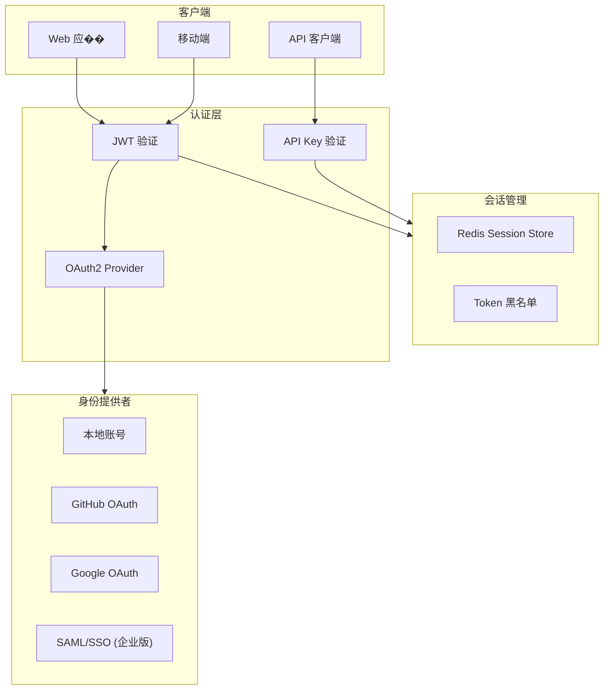
```mermaid
graph TB
    subgraph Client["客户端"]
        Web["Web 应��"]
        Mobile["移动端"]
        API_Client["API 客户端"]
    end

    subgraph Auth["认证层"]
        JWT["JWT 验证"]
        OAuth["OAuth2 Provider"]
        APIKey["API Key 验证"]
    end

    subgraph IdP["身份提供者"]
        Local["本地账号"]
        GitHub["GitHub OAuth"]
        Google["Google OAuth"]
        SAML["SAML/SSO (企业版)"]
    end

    subgraph Session["会话管理"]
        Redis["Redis Session Store"]
        Blacklist["Token 黑名单"]
    end

    Web --> JWT
    Mobile --> JWT
    API_Client --> APIKey

    JWT --> OAuth
    OAuth --> IdP

    JWT --> Session
    APIKey --> Session
```

### 1.1.2 JWT Token 机制

**Token 结构**:

```json
{
  "header": {
    "alg": "RS256",
    "typ": "JWT",
    "kid": "key-2024-01"
  },
  "payload": {
    "iss": "https://api.devsmart.io",
    "sub": "user_uuid",
    "aud": "devsmart-web",
    "exp": 1735689600,
    "iat": 1735686000,
    "jti": "unique-token-id",
    "org_id": "org_uuid",
    "team_id": "team_uuid",
    "role": "admin",
    "permissions": ["prd:write", "task:read"]
  },
  "signature": "RS256(header.payload, privateKey)"
}
```

**Token 生命周期**:

| Token 类型 | 有效期 | 用途 | 存储位置 |
|:---|:---|:---|:---|
| Access Token | 15 分钟 | API 访问 | 内存 / localStorage |
| Refresh Token | 7 天 | 刷新 Access Token | HttpOnly Cookie |
| API Key | 永久 (可撤销) | 程序化访问 | 服务端 |

**安全配置**:

```yaml
jwt:
  algorithm: RS256
  access_token_expire_minutes: 15
  refresh_token_expire_days: 7
  issuer: https://api.devsmart.io
  audience: devsmart-web
  key_rotation_days: 90

security:
  bcrypt_rounds: 12
  password_min_length: 8
  require_special_char: true
  max_login_attempts: 5
  lockout_duration_minutes: 15
```

### 1.1.3 OAuth2 集成

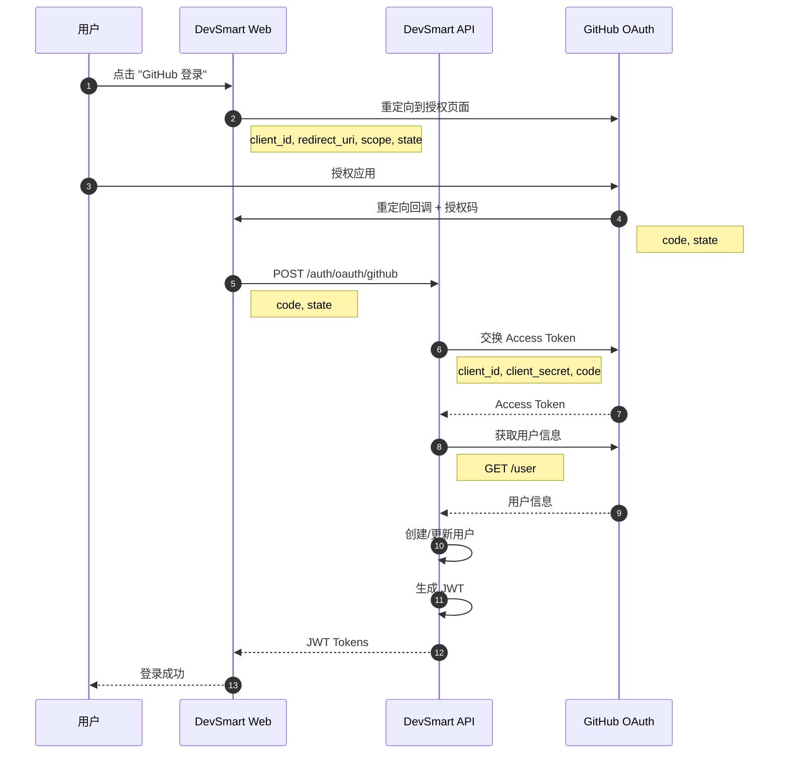
```mermaid
sequenceDiagram
    autonumber
    participant User as 用户
    participant Web as DevSmart Web
    participant API as DevSmart API
    participant GitHub as GitHub OAuth

    User->>Web: 点击 "GitHub 登录"
    Web->>GitHub: 重定向到授权页面
    Note right of Web: client_id, redirect_uri, scope, state

    User->>GitHub: 授权应用
    GitHub->>Web: 重定向回调 + 授权码
    Note right of GitHub: code, state

    Web->>API: POST /auth/oauth/github
    Note right of Web: code, state

    API->>GitHub: 交换 Access Token
    Note right of API: client_id, client_secret, code

    GitHub-->>API: Access Token

    API->>GitHub: 获取用户信息
    Note right of API: GET /user

    GitHub-->>API: 用户信息

    API->>API: 创建/更新用户
    API->>API: 生成 JWT

    API-->>Web: JWT Tokens
    Web-->>User: 登录成功
```

**支持的 OAuth 提供商**:

| 提供商 | Scope | 获取信息 |
|:---|:---|:---|
| GitHub | `user:email`, `read:org` | 邮箱、头像、组织 |
| Google | `openid`, `email`, `profile` | 邮箱、姓名、头像 |
| GitLab | `read_user` | 邮箱、用户名 |

### 1.1.4 Session 管理

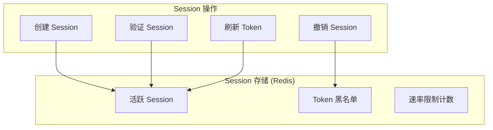
```mermaid
graph TB
    subgraph SessionStore["Session 存储 (Redis)"]
        Active["活跃 Session"]
        Blacklist["Token 黑名单"]
        RateLimit["速率限制计数"]
    end

    subgraph Operations["Session 操作"]
        Create["创建 Session"]
        Validate["验证 Session"]
        Refresh["刷新 Token"]
        Revoke["撤销 Session"]
    end

    Create --> Active
    Validate --> Active
    Refresh --> Active
    Revoke --> Blacklist
```

**Redis 数据结构**:

```
# 活跃 Session
session:{user_id}:{session_id} -> {
  "user_id": "uuid",
  "device_info": "Chrome/Windows",
  "ip": "1.2.3.4",
  "created_at": "2024-01-01T00:00:00Z",
  "last_active": "2024-01-01T12:00:00Z"
}
TTL: 7 days

# Token 黑名单
blacklist:{jti} -> "revoked"
TTL: token_remaining_time

# 用户所有 Session
user_sessions:{user_id} -> Set[session_id, ...]
```

---

## 1.2 权限控制

### 1.2.1 RBAC 实现

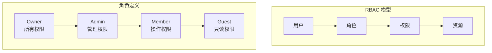
```mermaid
graph TB
    subgraph RBAC["RBAC 模型"]
        User["用户"]
        Role["角色"]
        Permission["权限"]
        Resource["资源"]
    end

    subgraph Roles["角色定义"]
        Owner["Owner<br/>所有权限"]
        Admin["Admin<br/>管理权限"]
        Member["Member<br/>操作权限"]
        Guest["Guest<br/>只读权限"]
    end

    User --> Role
    Role --> Permission
    Permission --> Resource

    Owner --> Admin
    Admin --> Member
    Member --> Guest
```

**角色权限映射**:

```python
ROLE_PERMISSIONS = {
    "owner": {
        "project": ["create", "read", "update", "delete", "manage"],
        "prd": ["create", "read", "update", "delete", "approve", "archive"],
        "task": ["create", "read", "update", "delete", "assign", "confirm"],
        "agent": ["create", "read", "update", "delete", "start", "stop"],
        "team": ["invite", "remove", "update_role", "read"],
        "settings": ["read", "update", "billing"]
    },
    "admin": {
        "project": ["create", "read", "update"],
        "prd": ["create", "read", "update", "delete", "approve"],
        "task": ["create", "read", "update", "assign", "confirm"],
        "agent": ["create", "read", "update", "start", "stop"],
        "team": ["invite", "remove", "read"],
        "settings": ["read", "update"]
    },
    "member": {
        "project": ["read"],
        "prd": ["create", "read", "update"],  # 只能更新自己的
        "task": ["read", "confirm"],  # 只能确认分配给自己的
        "agent": ["read"],
        "team": ["read"],
        "settings": ["read"]
    },
    "guest": {
        "project": ["read"],
        "prd": ["read"],
        "task": ["read"],
        "agent": ["read"],
        "team": ["read"]
    }
}
```

### 1.2.2 API 级别权限

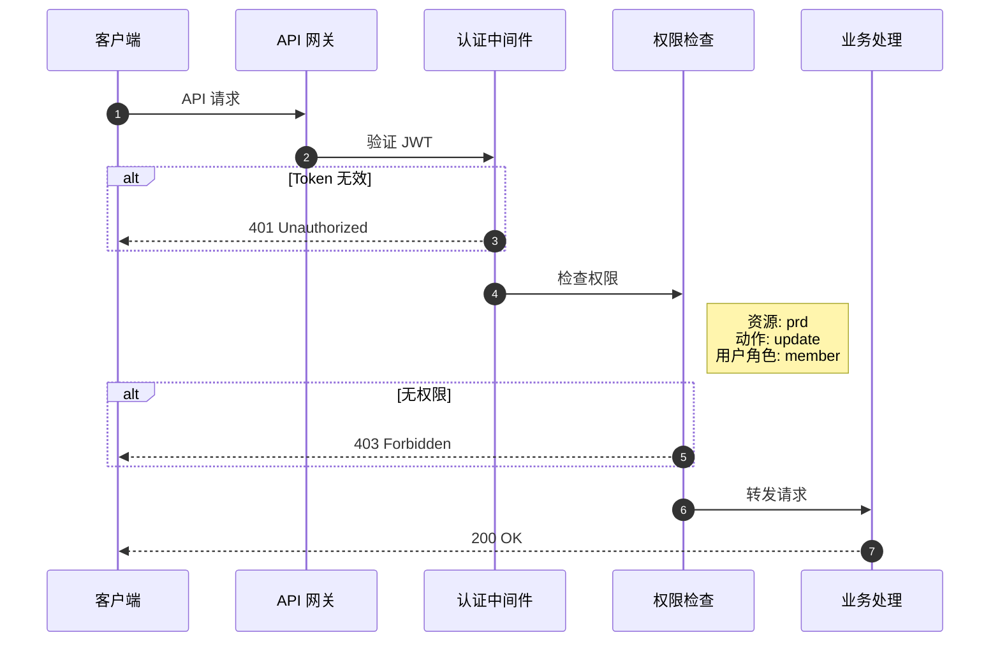
```mermaid
sequenceDiagram
    autonumber
    participant Client as 客户端
    participant Gateway as API 网关
    participant Auth as 认证中间件
    participant RBAC as 权限检查
    participant Handler as 业务处理

    Client->>Gateway: API 请求
    Gateway->>Auth: 验证 JWT

    alt Token 无效
        Auth-->>Client: 401 Unauthorized
    end

    Auth->>RBAC: 检查权限
    Note right of RBAC: 资源: prd<br/>动作: update<br/>用户角色: member

    alt 无权限
        RBAC-->>Client: 403 Forbidden
    end

    RBAC->>Handler: 转发请求
    Handler-->>Client: 200 OK
```

**权限装饰器示例**:

```python
from functools import wraps
from fastapi import HTTPException, Depends

def require_permission(resource: str, action: str):
    def decorator(func):
        @wraps(func)
        async def wrapper(*args, current_user: User = Depends(get_current_user), **kwargs):
            if not has_permission(current_user, resource, action):
                raise HTTPException(
                    status_code=403,
                    detail=f"Permission denied: {resource}:{action}"
                )
            return await func(*args, current_user=current_user, **kwargs)
        return wrapper
    return decorator

# 使用示例
@router.put("/prds/{prd_id}")
@require_permission("prd", "update")
async def update_prd(prd_id: UUID, data: PRDUpdate, current_user: User):
    ...
```

### 1.2.3 数据行级权限

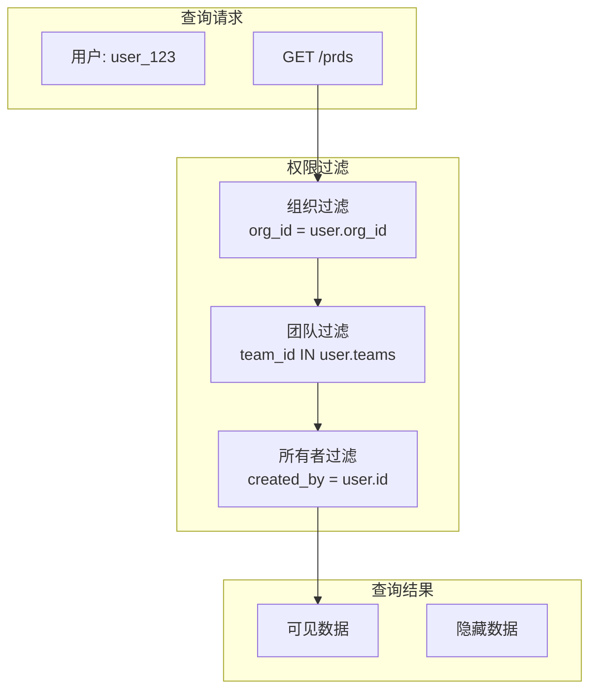
```mermaid
graph TB
    subgraph Query["查询请求"]
        User["用户: user_123"]
        Request["GET /prds"]
    end

    subgraph Filter["权限过滤"]
        OrgFilter["组织过滤<br/>org_id = user.org_id"]
        TeamFilter["团队过滤<br/>team_id IN user.teams"]
        OwnerFilter["所有者过滤<br/>created_by = user.id"]
    end

    subgraph Result["查询结果"]
        Visible["可见数据"]
        Hidden["隐藏数据"]
    end

    Request --> OrgFilter
    OrgFilter --> TeamFilter
    TeamFilter --> OwnerFilter
    OwnerFilter --> Visible
```

**行级安全策略 (PostgreSQL)**:

```sql
-- 启用行级安全
ALTER TABLE prds ENABLE ROW LEVEL SECURITY;

-- 组织级隔离策略
CREATE POLICY org_isolation ON prds
    FOR ALL
    USING (org_id = current_setting('app.current_org_id')::uuid);

-- 团队级访问策略
CREATE POLICY team_access ON prds
    FOR SELECT
    USING (
        team_id IN (
            SELECT team_id FROM team_members
            WHERE user_id = current_setting('app.current_user_id')::uuid
        )
    );

-- Member 只能编辑自己创建的 PRD
CREATE POLICY member_edit ON prds
    FOR UPDATE
    USING (
        created_by = current_setting('app.current_user_id')::uuid
        OR current_setting('app.current_role') IN ('owner', 'admin')
    );
```

---

## 1.3 数据安全

### 1.3.1 传输加密 (TLS)

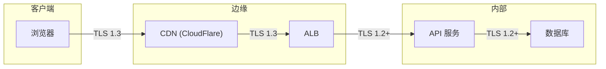
```mermaid
graph LR
    subgraph Client["客户端"]
        Browser["浏览器"]
    end

    subgraph Edge["边缘"]
        CDN["CDN (CloudFlare)"]
        ALB["ALB"]
    end

    subgraph Internal["内部"]
        API["API 服务"]
        DB["数据库"]
    end

    Browser -->|TLS 1.3| CDN
    CDN -->|TLS 1.3| ALB
    ALB -->|TLS 1.2+| API
    API -->|TLS 1.2+| DB
```

**TLS 配置**:

```yaml
tls:
  min_version: TLSv1.2
  preferred_version: TLSv1.3
  cipher_suites:
    - TLS_AES_256_GCM_SHA384
    - TLS_CHACHA20_POLY1305_SHA256
    - TLS_AES_128_GCM_SHA256
  certificate_rotation_days: 90
  hsts:
    enabled: true
    max_age: 31536000
    include_subdomains: true
    preload: true
```

### 1.3.2 存储加密

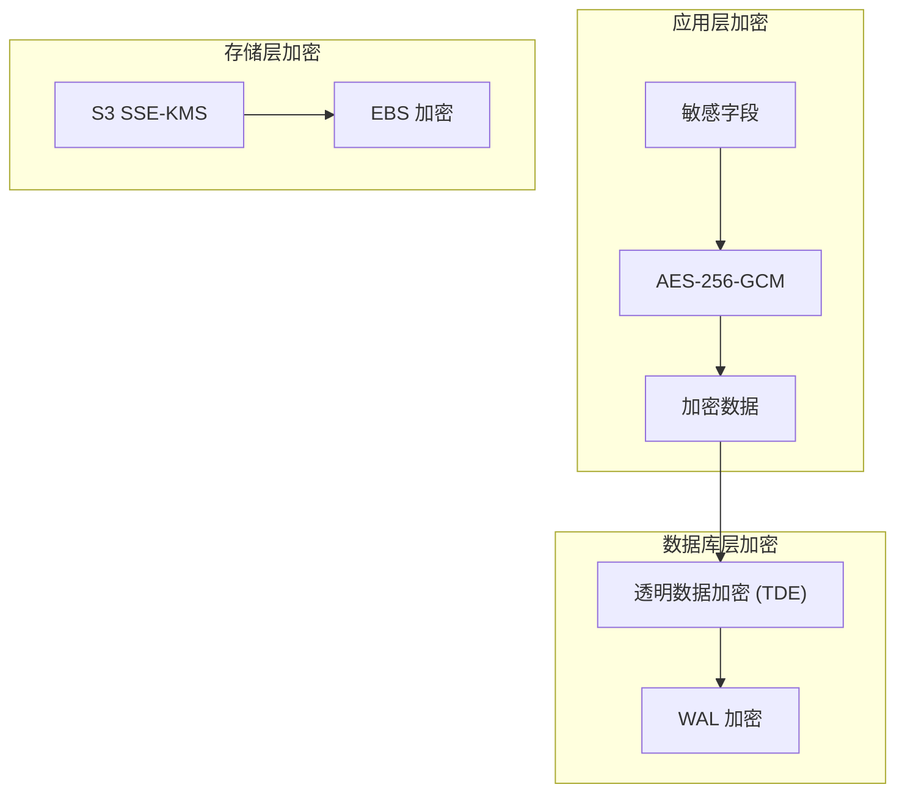
```mermaid
graph TB
    subgraph Application["应用层加密"]
        Sensitive["敏感字段"]
        AES["AES-256-GCM"]
        Encrypted["加密数据"]
    end

    subgraph Database["数据库层加密"]
        TDE["透明数据加密 (TDE)"]
        WAL["WAL 加密"]
    end

    subgraph Storage["存储层加密"]
        S3["S3 SSE-KMS"]
        EBS["EBS 加密"]
    end

    Sensitive --> AES --> Encrypted
    Encrypted --> TDE
    TDE --> WAL
    S3 --> EBS
```

**加密字段配置**:

| 数据类型 | 加密方式 | 密钥管理 |
|:---|:---|:---|
| 用户密码 | bcrypt (hash) | - |
| API Key | AES-256-GCM | KMS |
| OAuth Token | AES-256-GCM | KMS |
| 敏感配置 | AES-256-GCM | Vault |
| 备份数据 | AES-256-GCM | KMS |

### 1.3.3 敏感数据脱敏

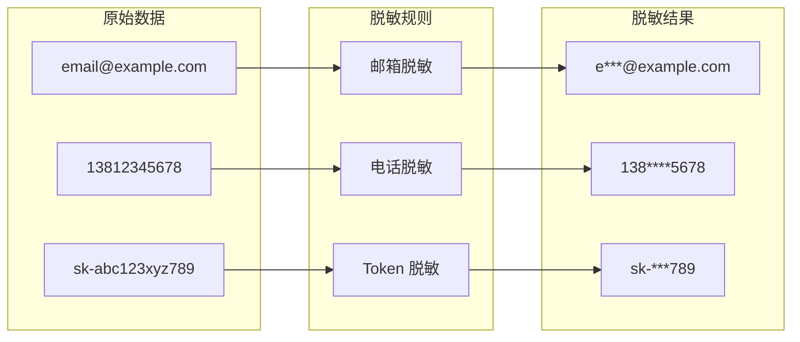
```mermaid
graph LR
    subgraph Input["原始数据"]
        Email["email@example.com"]
        Phone["13812345678"]
        Token["sk-abc123xyz789"]
    end

    subgraph Mask["脱敏规则"]
        EmailMask["邮箱脱敏"]
        PhoneMask["电话脱敏"]
        TokenMask["Token 脱敏"]
    end

    subgraph Output["脱敏结果"]
        EmailOut["e***@example.com"]
        PhoneOut["138****5678"]
        TokenOut["sk-***789"]
    end

    Email --> EmailMask --> EmailOut
    Phone --> PhoneMask --> PhoneOut
    Token --> TokenMask --> TokenOut
```

**脱敏策略**:

```python
MASKING_RULES = {
    "email": {
        "pattern": r"^(.{1}).*(@.*)$",
        "replacement": r"\1***\2"
    },
    "phone": {
        "pattern": r"^(\d{3})\d{4}(\d{4})$",
        "replacement": r"\1****\2"
    },
    "api_key": {
        "pattern": r"^(.{3}).*(.{3})$",
        "replacement": r"\1***\2"
    },
    "credit_card": {
        "pattern": r"^(\d{4})\d{8}(\d{4})$",
        "replacement": r"\1********\2"
    }
}

# 日志脱敏
SENSITIVE_FIELDS = ["password", "token", "secret", "key", "credential"]
```

---

## 1.4 API 安全

### 1.4.1 速率限制

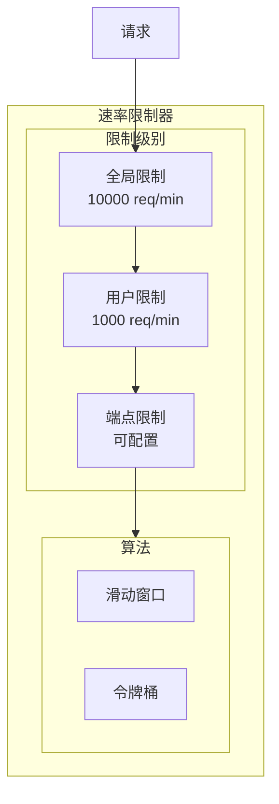
```mermaid
graph TB
    subgraph RateLimiter["速率限制器"]
        subgraph Levels["限制级别"]
            Global["全局限制<br/>10000 req/min"]
            User["用户限制<br/>1000 req/min"]
            Endpoint["端点限制<br/>可配置"]
        end

        subgraph Algorithm["算法"]
            SlidingWindow["滑动窗口"]
            TokenBucket["令牌桶"]
        end
    end

    Request["请求"] --> Global
    Global --> User
    User --> Endpoint
    Endpoint --> Algorithm
```

**速率限制配置**:

```yaml
rate_limit:
  global:
    requests: 10000
    period: 60s

  per_user:
    default:
      requests: 1000
      period: 60s
    premium:
      requests: 5000
      period: 60s

  per_endpoint:
    "/auth/login":
      requests: 10
      period: 60s
    "/prds/generate":
      requests: 20
      period: 60s
    "/knowledge/search":
      requests: 100
      period: 60s
```

**响应头**:

```http
X-RateLimit-Limit: 1000
X-RateLimit-Remaining: 950
X-RateLimit-Reset: 1735689600
Retry-After: 30
```

### 1.4.2 输入验证

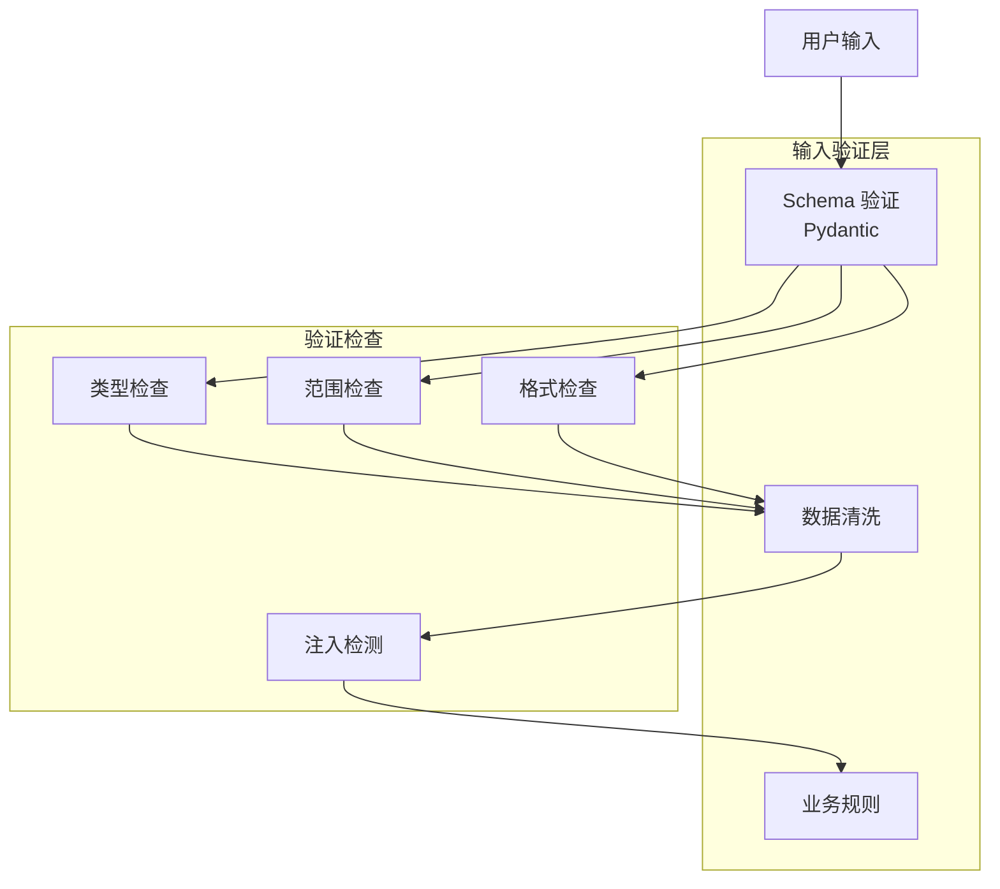
```mermaid
graph TB
    subgraph Validation["输入验证层"]
        Schema["Schema 验证<br/>Pydantic"]
        Sanitize["数据清洗"]
        Business["业务规则"]
    end

    subgraph Checks["验证检查"]
        Type["类型检查"]
        Range["范围检查"]
        Format["格式检查"]
        Injection["注入检测"]
    end

    Input["用户输入"] --> Schema
    Schema --> Type
    Schema --> Range
    Schema --> Format

    Type --> Sanitize
    Range --> Sanitize
    Format --> Sanitize

    Sanitize --> Injection
    Injection --> Business
```

**验证规则示例**:

```python
from pydantic import BaseModel, Field, validator
import bleach

class PRDCreate(BaseModel):
    title: str = Field(..., min_length=1, max_length=200)
    description: str = Field(..., max_length=10000)
    requirement: str = Field(..., min_length=10, max_length=50000)

    @validator('title', 'description', 'requirement')
    def sanitize_html(cls, v):
        # 移除危险 HTML 标签
        return bleach.clean(v, tags=[], strip=True)

    @validator('requirement')
    def check_injection(cls, v):
        # 检测潜在的注入攻击
        dangerous_patterns = [
            r'<script',
            r'javascript:',
            r'on\w+\s*=',
            r'data:text/html'
        ]
        for pattern in dangerous_patterns:
            if re.search(pattern, v, re.IGNORECASE):
                raise ValueError('Potentially dangerous content detected')
        return v
```

### 1.4.3 CORS 配置

```yaml
cors:
  allow_origins:
    - https://app.devsmart.io
    - https://staging.devsmart.io
  allow_methods:
    - GET
    - POST
    - PUT
    - DELETE
    - OPTIONS
  allow_headers:
    - Authorization
    - Content-Type
    - X-Request-ID
  expose_headers:
    - X-RateLimit-Limit
    - X-RateLimit-Remaining
  allow_credentials: true
  max_age: 86400
```

### 1.4.4 安全响应头

```python
SECURITY_HEADERS = {
    "X-Content-Type-Options": "nosniff",
    "X-Frame-Options": "DENY",
    "X-XSS-Protection": "1; mode=block",
    "Referrer-Policy": "strict-origin-when-cross-origin",
    "Content-Security-Policy": (
        "default-src 'self'; "
        "script-src 'self' 'unsafe-inline'; "
        "style-src 'self' 'unsafe-inline'; "
        "img-src 'self' data: https:; "
        "connect-src 'self' https://api.devsmart.io wss://ws.devsmart.io; "
        "frame-ancestors 'none'"
    ),
    "Permissions-Policy": "geolocation=(), microphone=(), camera=()",
    "Strict-Transport-Security": "max-age=31536000; includeSubDomains; preload"
}
```

---

## 1.5 安全架构图

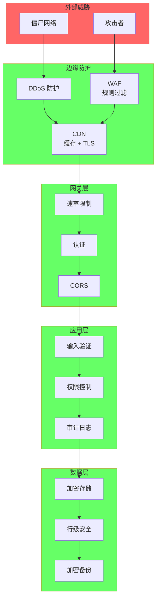
```mermaid
graph TB
    subgraph External["外部威胁"]
        Attacker["攻击者"]
        BotNet["僵尸网络"]
    end

    subgraph Edge["边缘防护"]
        WAF["WAF<br/>规则过滤"]
        DDoS["DDoS 防护"]
        CDN["CDN<br/>缓存 + TLS"]
    end

    subgraph Gateway["网关层"]
        RateLimit["速率限制"]
        Auth["认证"]
        CORS["CORS"]
    end

    subgraph App["应用层"]
        Validation["输入验证"]
        RBAC["权限控制"]
        Audit["审计日志"]
    end

    subgraph Data["数据层"]
        Encryption["加密存储"]
        RLS["行级安全"]
        Backup["加密备份"]
    end

    Attacker --> WAF
    BotNet --> DDoS
    DDoS --> CDN
    WAF --> CDN
    CDN --> RateLimit
    RateLimit --> Auth
    Auth --> CORS
    CORS --> Validation
    Validation --> RBAC
    RBAC --> Audit
    Audit --> Encryption
    Encryption --> RLS
    RLS --> Backup

    style External fill:#f66
    style Edge fill:#6f6
    style Gateway fill:#6f6
    style App fill:#6f6
    style Data fill:#6f6
```

---

# Part 2: 可观测性架构

## 2.1 指标监控 (Metrics)

### 2.1.1 Prometheus 采集架构

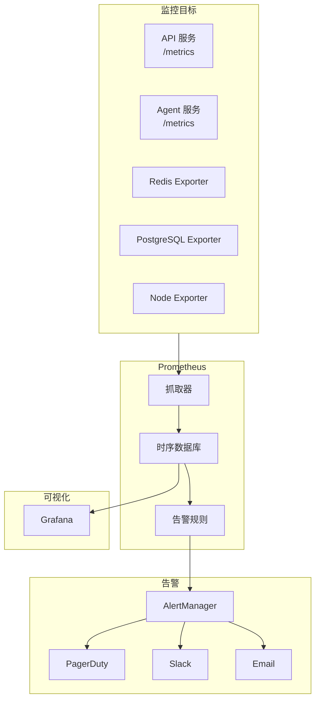
```mermaid
graph TB
    subgraph Targets["监控目标"]
        API["API 服务<br/>/metrics"]
        Agent["Agent 服务<br/>/metrics"]
        Redis["Redis Exporter"]
        PG["PostgreSQL Exporter"]
        Node["Node Exporter"]
    end

    subgraph Prometheus["Prometheus"]
        Scrape["抓取器"]
        TSDB["时序数据库"]
        Rules["告警规则"]
    end

    subgraph Alerting["告警"]
        AlertManager["AlertManager"]
        PagerDuty["PagerDuty"]
        Slack["Slack"]
        Email["Email"]
    end

    subgraph Visualization["可视化"]
        Grafana["Grafana"]
    end

    Targets --> Scrape
    Scrape --> TSDB
    TSDB --> Rules
    Rules --> AlertManager
    AlertManager --> PagerDuty
    AlertManager --> Slack
    AlertManager --> Email
    TSDB --> Grafana
```

### 2.1.2 核心指标定义

**业务指标**:

| 指标名称 | 类型 | 标签 | 说明 |
|:---|:---|:---|:---|
| `devsmart_prd_total` | Counter | status, org_id | PRD 总数 |
| `devsmart_prd_generation_duration_seconds` | Histogram | model | PRD 生成耗时 |
| `devsmart_task_total` | Counter | status, agent_type | 任务总数 |
| `devsmart_agent_execution_duration_seconds` | Histogram | agent_type, status | Agent 执行耗时 |
| `devsmart_llm_tokens_total` | Counter | model, type | Token 消耗 |
| `devsmart_llm_request_duration_seconds` | Histogram | model, endpoint | LLM 请求耗时 |

**系统指标**:

| 指标名称 | 类型 | 说明 |
|:---|:---|:---|
| `http_requests_total` | Counter | HTTP 请求总数 |
| `http_request_duration_seconds` | Histogram | HTTP 请求耗时 |
| `http_requests_in_flight` | Gauge | 正在处理的请求数 |
| `db_connections_active` | Gauge | 活跃数据库连接数 |
| `redis_connections_active` | Gauge | 活跃 Redis 连接数 |

### 2.1.3 Grafana 仪表盘

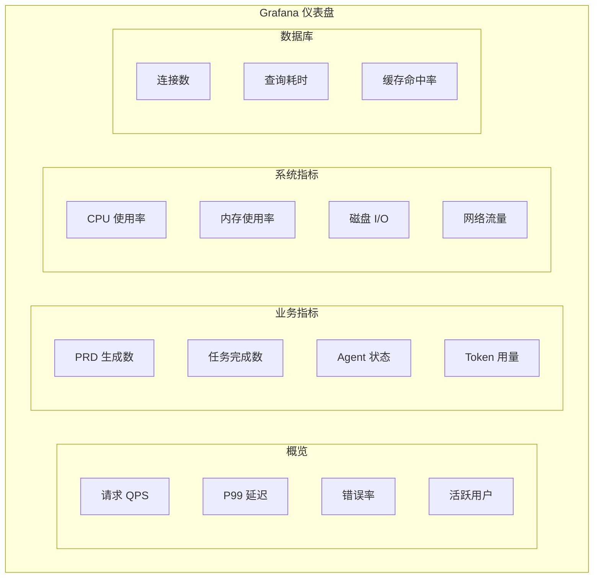
```mermaid
graph TB
    subgraph Dashboard["Grafana 仪表盘"]
        subgraph Overview["概览"]
            QPS["请求 QPS"]
            Latency["P99 延迟"]
            ErrorRate["错误率"]
            ActiveUsers["活跃用户"]
        end

        subgraph Business["业务指标"]
            PRDCount["PRD 生成数"]
            TaskCount["任务完成数"]
            AgentStatus["Agent 状态"]
            TokenUsage["Token 用量"]
        end

        subgraph System["系统指标"]
            CPU["CPU 使用率"]
            Memory["内存使用率"]
            Disk["磁盘 I/O"]
            Network["网络流量"]
        end

        subgraph Database["数据库"]
            DBConn["连接数"]
            QueryTime["查询耗时"]
            CacheHit["缓存命中率"]
        end
    end
```

**关键仪表盘配置**:

```json
{
  "dashboard": {
    "title": "DevSmart Overview",
    "panels": [
      {
        "title": "Request Rate",
        "type": "graph",
        "targets": [{
          "expr": "sum(rate(http_requests_total[5m])) by (method, path)"
        }]
      },
      {
        "title": "P99 Latency",
        "type": "graph",
        "targets": [{
          "expr": "histogram_quantile(0.99, sum(rate(http_request_duration_seconds_bucket[5m])) by (le))"
        }]
      },
      {
        "title": "Error Rate",
        "type": "stat",
        "targets": [{
          "expr": "sum(rate(http_requests_total{status=~\"5..\"}[5m])) / sum(rate(http_requests_total[5m])) * 100"
        }]
      }
    ]
  }
}
```

### 2.1.4 告警规则

```yaml
groups:
  - name: devsmart-alerts
    rules:
      # 高错误率告警
      - alert: HighErrorRate
        expr: |
          sum(rate(http_requests_total{status=~"5.."}[5m]))
          / sum(rate(http_requests_total[5m])) > 0.05
        for: 5m
        labels:
          severity: critical
        annotations:
          summary: "High error rate detected"
          description: "Error rate is {{ $value | humanizePercentage }}"

      # API 延迟告警
      - alert: HighLatency
        expr: |
          histogram_quantile(0.99, sum(rate(http_request_duration_seconds_bucket[5m])) by (le)) > 2
        for: 5m
        labels:
          severity: warning
        annotations:
          summary: "High API latency"
          description: "P99 latency is {{ $value }}s"

      # Agent 失败率告警
      - alert: AgentHighFailureRate
        expr: |
          sum(rate(devsmart_agent_execution_total{status="failed"}[10m])) by (agent_type)
          / sum(rate(devsmart_agent_execution_total[10m])) by (agent_type) > 0.1
        for: 10m
        labels:
          severity: warning
        annotations:
          summary: "Agent {{ $labels.agent_type }} high failure rate"

      # 数据库连接池告警
      - alert: DBConnectionPoolExhausted
        expr: db_connections_active / db_connections_max > 0.9
        for: 5m
        labels:
          severity: critical
        annotations:
          summary: "Database connection pool nearly exhausted"

      # LLM Token 用量告警
      - alert: HighTokenUsage
        expr: |
          sum(increase(devsmart_llm_tokens_total[1h])) > 1000000
        labels:
          severity: warning
        annotations:
          summary: "High LLM token usage in the last hour"
```

---

## 2.2 日志聚合 (Logs)

### 2.2.1 日志架构

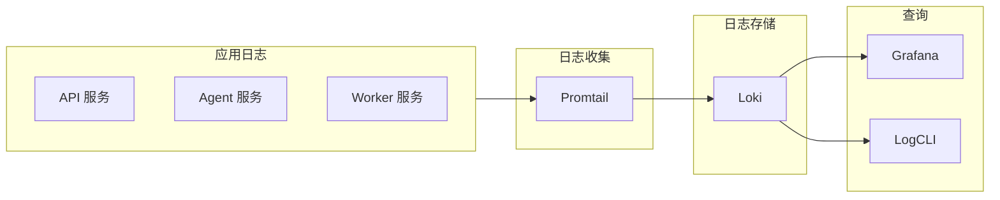
```mermaid
graph LR
    subgraph Apps["应用日志"]
        API["API 服务"]
        Agent["Agent 服务"]
        Worker["Worker 服务"]
    end

    subgraph Collection["日志收集"]
        Promtail["Promtail"]
    end

    subgraph Storage["日志存储"]
        Loki["Loki"]
    end

    subgraph Query["查询"]
        Grafana["Grafana"]
        LogCLI["LogCLI"]
    end

    Apps --> Promtail
    Promtail --> Loki
    Loki --> Grafana
    Loki --> LogCLI
```

### 2.2.2 结构化日志格式

```json
{
  "timestamp": "2024-01-15T10:30:00.123Z",
  "level": "INFO",
  "logger": "devsmart.api.prd",
  "message": "PRD generated successfully",
  "trace_id": "abc123xyz789",
  "span_id": "def456",
  "user_id": "user_uuid",
  "org_id": "org_uuid",
  "request_id": "req_123",
  "duration_ms": 1523,
  "extra": {
    "prd_id": "prd_uuid",
    "model": "gpt-4o",
    "tokens_used": 2500
  }
}
```

**日志级别规范**:

| 级别 | 使用场景 | 示例 |
|:---|:---|:---|
| DEBUG | 开发调试信息 | 变量值、中间状态 |
| INFO | 正常业务流程 | 请求处理、任务完成 |
| WARNING | 可恢复的异常 | 重试、降级 |
| ERROR | 需要关注的错误 | 请求失败、外部服务错误 |
| CRITICAL | 系统级严重错误 | 数据库连接失败、服务不可用 |

### 2.2.3 日志保留策略

| 环境 | 保留时间 | 存储位置 | 压缩 |
|:---|:---|:---|:---|
| 开发 | 7 天 | 本地 | 否 |
| 测试 | 14 天 | Loki | 是 |
| 生产 | 90 天 | Loki + S3 归档 | 是 |
| 审计日志 | 1 年 | S3 冷存储 | 是 |

### 2.2.4 Loki 配置

```yaml
# loki-config.yaml
auth_enabled: false

server:
  http_listen_port: 3100

ingester:
  lifecycler:
    ring:
      kvstore:
        store: inmemory
      replication_factor: 1
  chunk_idle_period: 5m
  chunk_retain_period: 30s

schema_config:
  configs:
    - from: 2024-01-01
      store: boltdb-shipper
      object_store: s3
      schema: v11
      index:
        prefix: index_
        period: 24h

storage_config:
  boltdb_shipper:
    active_index_directory: /loki/index
    cache_location: /loki/cache
    shared_store: s3
  aws:
    s3: s3://devsmart-logs
    region: us-east-1

limits_config:
  enforce_metric_name: false
  reject_old_samples: true
  reject_old_samples_max_age: 168h
  ingestion_rate_mb: 10
  ingestion_burst_size_mb: 20
```

---

## 2.3 分布式追踪 (Traces)

### 2.3.1 OpenTelemetry 集成

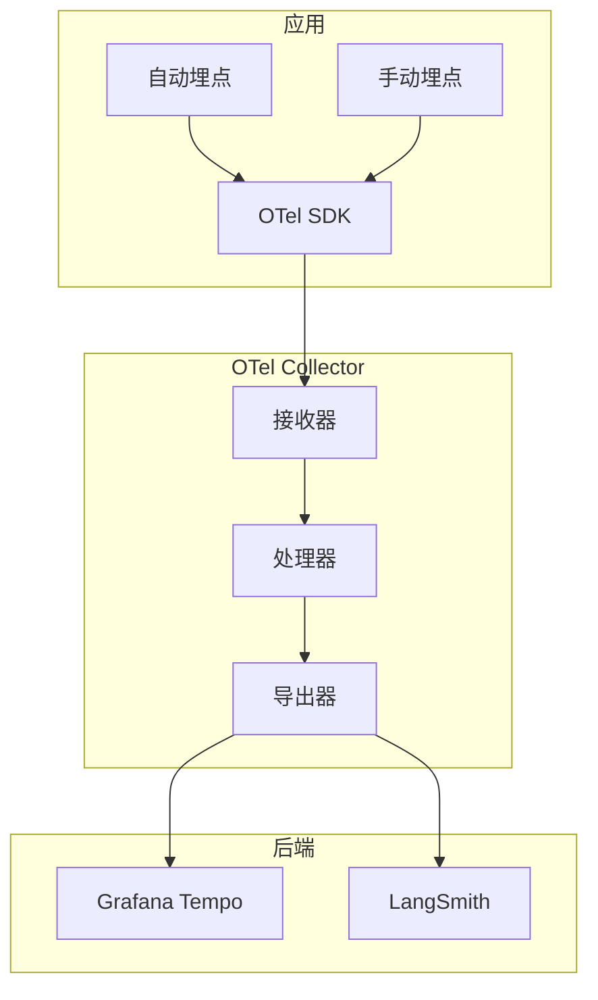
```mermaid
graph TB
    subgraph App["应用"]
        SDK["OTel SDK"]
        Auto["自动埋点"]
        Manual["手动埋点"]
    end

    subgraph Collector["OTel Collector"]
        Receiver["接收器"]
        Processor["处理器"]
        Exporter["导出器"]
    end

    subgraph Backend["后端"]
        Tempo["Grafana Tempo"]
        LangSmith["LangSmith"]
    end

    Auto --> SDK
    Manual --> SDK
    SDK --> Receiver
    Receiver --> Processor
    Processor --> Exporter
    Exporter --> Tempo
    Exporter --> LangSmith
```

### 2.3.2 追踪上下文

```python
from opentelemetry import trace
from opentelemetry.trace import Status, StatusCode

tracer = trace.get_tracer(__name__)

async def generate_prd(request: PRDGenerateRequest):
    with tracer.start_as_current_span("generate_prd") as span:
        span.set_attribute("user_id", str(request.user_id))
        span.set_attribute("org_id", str(request.org_id))

        # 检索上下文
        with tracer.start_span("retrieve_context") as child_span:
            context = await rag_service.retrieve(request.requirement)
            child_span.set_attribute("docs_retrieved", len(context))

        # LLM 调用
        with tracer.start_span("llm_call") as child_span:
            child_span.set_attribute("model", "gpt-4o")
            result = await llm_service.generate(request, context)
            child_span.set_attribute("tokens_used", result.tokens)

        span.set_status(Status(StatusCode.OK))
        return result
```

### 2.3.3 LangSmith 追踪

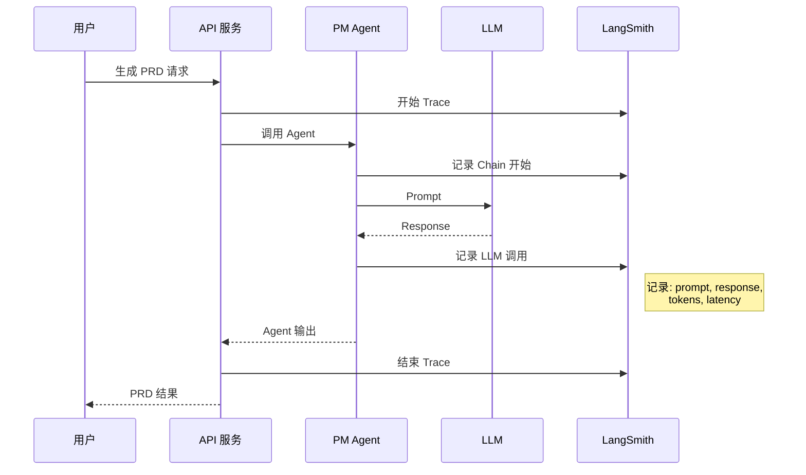
```mermaid
sequenceDiagram
    participant User as 用户
    participant API as API 服务
    participant Agent as PM Agent
    participant LLM as LLM
    participant LangSmith as LangSmith

    User->>API: 生成 PRD 请求
    API->>LangSmith: 开始 Trace
    API->>Agent: 调用 Agent

    Agent->>LangSmith: 记录 Chain 开始
    Agent->>LLM: Prompt
    LLM-->>Agent: Response
    Agent->>LangSmith: 记录 LLM 调用
    Note right of LangSmith: 记录: prompt, response,<br/>tokens, latency

    Agent-->>API: Agent 输出
    API->>LangSmith: 结束 Trace
    API-->>User: PRD 结果
```

### 2.3.4 链路分析

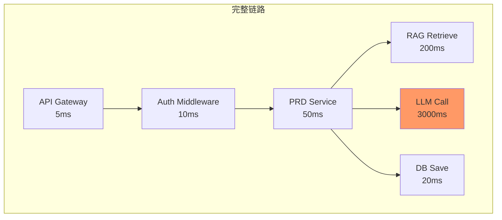
```mermaid
graph TB
    subgraph Trace["完整链路"]
        A["API Gateway<br/>5ms"]
        B["Auth Middleware<br/>10ms"]
        C["PRD Service<br/>50ms"]
        D["RAG Retrieve<br/>200ms"]
        E["LLM Call<br/>3000ms"]
        F["DB Save<br/>20ms"]
    end

    A --> B --> C
    C --> D
    C --> E
    C --> F

    style E fill:#f96
```

**性能分析指标**:

| 阶段 | P50 | P95 | P99 | 目标 |
|:---|:---|:---|:---|:---|
| API 网关 | 5ms | 10ms | 20ms | < 50ms |
| 认证中间件 | 8ms | 15ms | 30ms | < 50ms |
| RAG 检索 | 150ms | 300ms | 500ms | < 500ms |
| LLM 调用 | 2s | 4s | 6s | < 10s |
| 数据库操作 | 10ms | 30ms | 50ms | < 100ms |

---

## 2.4 可观测性架构图

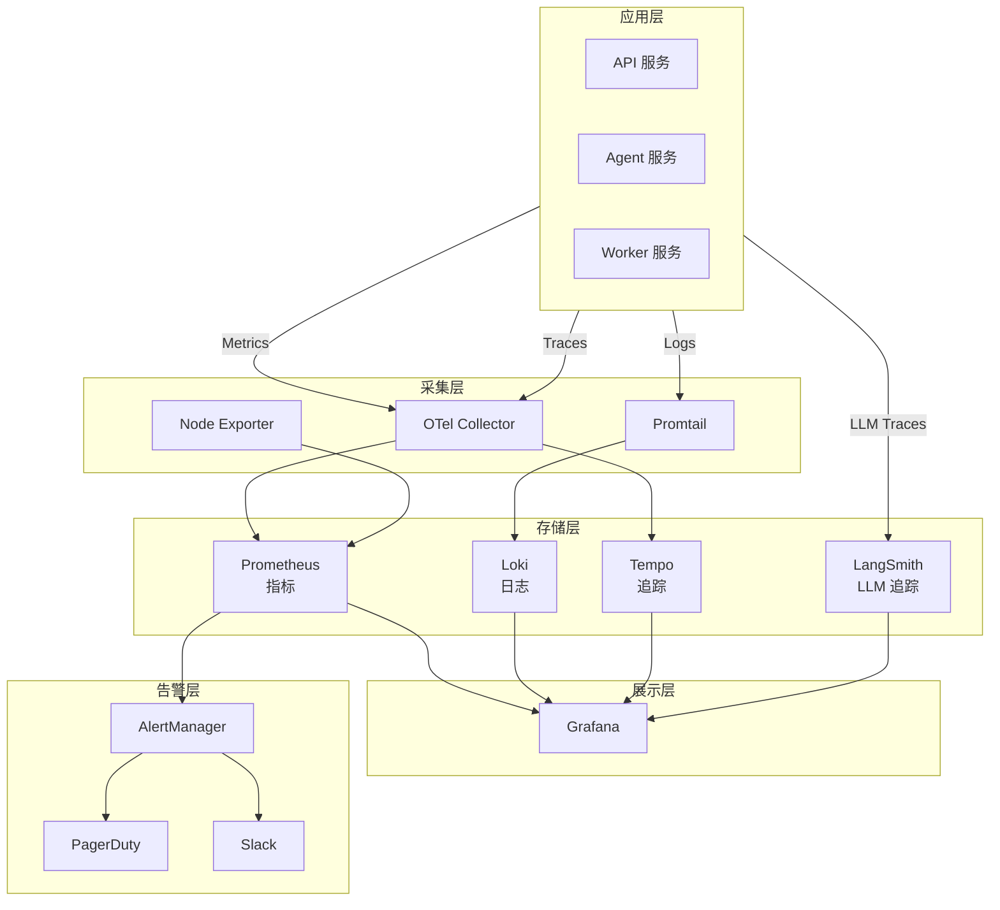
```mermaid
graph TB
    subgraph Applications["应用层"]
        API["API 服务"]
        Agent["Agent 服务"]
        Worker["Worker 服务"]
    end

    subgraph Collection["采集层"]
        OTel["OTel Collector"]
        Promtail["Promtail"]
        NodeExporter["Node Exporter"]
    end

    subgraph Storage["存储层"]
        Prometheus["Prometheus<br/>指标"]
        Loki["Loki<br/>日志"]
        Tempo["Tempo<br/>追踪"]
        LangSmith["LangSmith<br/>LLM 追踪"]
    end

    subgraph Visualization["展示层"]
        Grafana["Grafana"]
    end

    subgraph Alerting["告警层"]
        AlertManager["AlertManager"]
        PagerDuty["PagerDuty"]
        Slack["Slack"]
    end

    Applications -->|Metrics| OTel
    Applications -->|Logs| Promtail
    Applications -->|Traces| OTel
    Applications -->|LLM Traces| LangSmith

    OTel --> Prometheus
    OTel --> Tempo
    Promtail --> Loki
    NodeExporter --> Prometheus

    Prometheus --> Grafana
    Loki --> Grafana
    Tempo --> Grafana
    LangSmith --> Grafana

    Prometheus --> AlertManager
    AlertManager --> PagerDuty
    AlertManager --> Slack
```

---

## 2.5 统一可观测性配置

### 2.5.1 OpenTelemetry Collector 配置

```yaml
# otel-collector-config.yaml
receivers:
  otlp:
    protocols:
      grpc:
        endpoint: 0.0.0.0:4317
      http:
        endpoint: 0.0.0.0:4318

processors:
  batch:
    timeout: 5s
    send_batch_size: 1000
  memory_limiter:
    check_interval: 1s
    limit_mib: 1000
  resource:
    attributes:
      - key: service.environment
        value: production
        action: upsert

exporters:
  prometheus:
    endpoint: 0.0.0.0:8889
  otlp/tempo:
    endpoint: tempo:4317
    tls:
      insecure: true
  loki:
    endpoint: http://loki:3100/loki/api/v1/push

service:
  pipelines:
    traces:
      receivers: [otlp]
      processors: [memory_limiter, batch]
      exporters: [otlp/tempo]
    metrics:
      receivers: [otlp]
      processors: [memory_limiter, batch]
      exporters: [prometheus]
    logs:
      receivers: [otlp]
      processors: [memory_limiter, batch]
      exporters: [loki]
```

### 2.5.2 应用集成示例

```python
# observability.py
from opentelemetry import trace, metrics
from opentelemetry.sdk.trace import TracerProvider
from opentelemetry.sdk.metrics import MeterProvider
from opentelemetry.exporter.otlp.proto.grpc.trace_exporter import OTLPSpanExporter
from opentelemetry.exporter.otlp.proto.grpc.metric_exporter import OTLPMetricExporter
from opentelemetry.sdk.trace.export import BatchSpanProcessor
from opentelemetry.sdk.metrics.export import PeriodicExportingMetricReader
import structlog

def setup_observability():
    # Tracing
    trace.set_tracer_provider(TracerProvider())
    trace.get_tracer_provider().add_span_processor(
        BatchSpanProcessor(OTLPSpanExporter())
    )

    # Metrics
    reader = PeriodicExportingMetricReader(OTLPMetricExporter())
    metrics.set_meter_provider(MeterProvider(metric_readers=[reader]))

    # Structured Logging
    structlog.configure(
        processors=[
            structlog.processors.TimeStamper(fmt="iso"),
            structlog.processors.add_log_level,
            structlog.processors.JSONRenderer()
        ]
    )

# 使用示例
tracer = trace.get_tracer(__name__)
meter = metrics.get_meter(__name__)
logger = structlog.get_logger()

prd_counter = meter.create_counter(
    "devsmart_prd_total",
    description="Total number of PRDs created"
)

async def create_prd(data: PRDCreate):
    with tracer.start_as_current_span("create_prd") as span:
        span.set_attribute("org_id", str(data.org_id))

        logger.info("Creating PRD", org_id=str(data.org_id))

        prd = await prd_service.create(data)

        prd_counter.add(1, {"status": "created", "org_id": str(data.org_id)})

        return prd
```

---

## 附录

### A. 安全检查清单

- [ ] 所有 API 端点需要认证
- [ ] 敏感操作有权限检查
- [ ] 输入验证和清洗
- [ ] SQL 注入防护 (参数化查询)
- [ ] XSS 防护 (输出编码)
- [ ] CSRF 防护 (Token)
- [ ] 速率限制配置
- [ ] TLS 证书有效
- [ ] 安全响应头配置
- [ ] 敏感数据加密
- [ ] 日志脱敏
- [ ] 依赖安全扫描

### B. 可观测性检查清单

- [ ] 所有服务暴露 /metrics 端点
- [ ] 结构化日志配置
- [ ] 追踪上下文传播
- [ ] 关键业务指标定义
- [ ] 告警规则配置
- [ ] Grafana 仪表盘创建
- [ ] 日志保留策略
- [ ] SLO/SLI 定义

### C. 事件响应流程

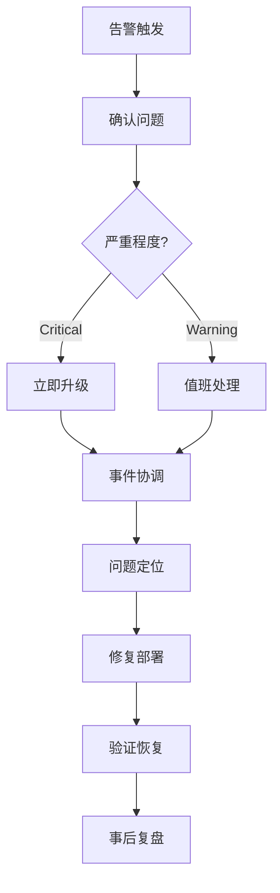
```mermaid
graph TB
    A["告警触发"] --> B["确认问题"]
    B --> C{"严重程度?"}
    C -->|Critical| D["立即升级"]
    C -->|Warning| E["值班处理"]
    D --> F["事件协调"]
    E --> F
    F --> G["问题定位"]
    G --> H["修复部署"]
    H --> I["验证恢复"]
    I --> J["事后复盘"]
```
