# DevSmart 系统流程图

本文档详细描述 DevSmart 平台的核心业务流程，包括用户认证、PRD 生成、任务分发、Agent 协作等关键流程的时序图和流程图。

---

## 1. 用户认证流程

### 1.1 登录/注册时序图

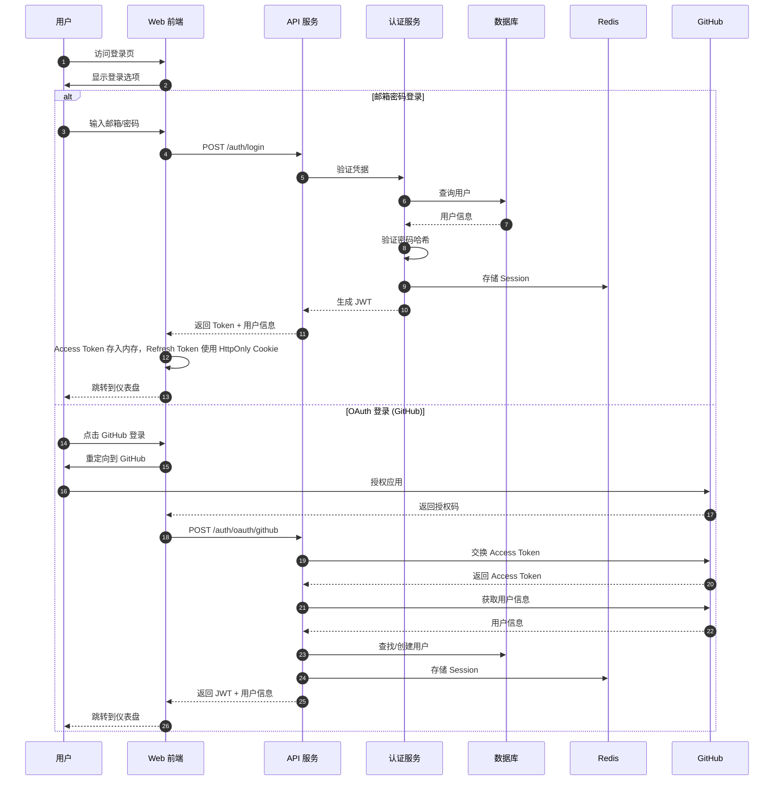
```mermaid
sequenceDiagram
    autonumber
    participant User as 用户
    participant Web as Web 前端
    participant API as API 服务
    participant Auth as 认证服务
    participant DB as 数据库
    participant Redis as Redis

    User->>Web: 访问登录页
    Web->>User: 显示登录选项

    alt 邮箱密码登录
        User->>Web: 输入邮箱/密码
        Web->>API: POST /auth/login
        API->>Auth: 验证凭据
        Auth->>DB: 查询用户
        DB-->>Auth: 用户信息
        Auth->>Auth: 验证密码哈希
        Auth->>Redis: 存储 Session
        Auth-->>API: 生成 JWT
        API-->>Web: 返回 Token + 用户信息
        Web->>Web: Access Token 存入内存，Refresh Token 使用 HttpOnly Cookie
        Web-->>User: 跳转到仪表盘
    else OAuth 登录 (GitHub)
        User->>Web: 点击 GitHub 登录
        Web->>User: 重定向到 GitHub
        User->>GitHub: 授权应用
        GitHub-->>Web: 返回授权码
        Web->>API: POST /auth/oauth/github
        API->>GitHub: 交换 Access Token
        GitHub-->>API: 返回 Access Token
        API->>GitHub: 获取用户信息
        GitHub-->>API: 用户信息
        API->>DB: 查找/创建用户
        API->>Redis: 存储 Session
        API-->>Web: 返回 JWT + 用户信息
        Web-->>User: 跳转到仪表盘
    end
```

### 1.2 OAuth2 授权流程

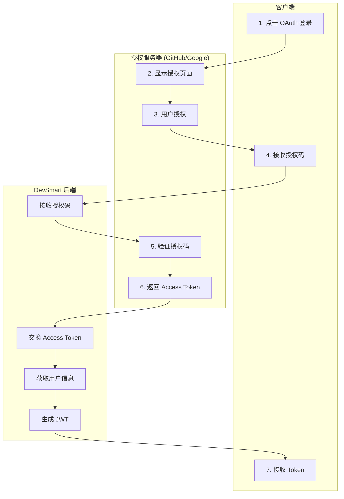
```mermaid
graph TB
    subgraph Client["客户端"]
        A1["1. 点击 OAuth 登录"]
        A2["4. 接收授权码"]
        A3["7. 接收 Token"]
    end

    subgraph AuthServer["授权服务器 (GitHub/Google)"]
        B1["2. 显示授权页面"]
        B2["3. 用户授权"]
        B3["5. 验证授权码"]
        B4["6. 返回 Access Token"]
    end

    subgraph Backend["DevSmart 后端"]
        C1["接收授权码"]
        C2["交换 Access Token"]
        C3["获取用户信息"]
        C4["生成 JWT"]
    end

    A1 --> B1
    B1 --> B2
    B2 --> A2
    A2 --> C1
    C1 --> B3
    B3 --> B4
    B4 --> C2
    C2 --> C3
    C3 --> C4
    C4 --> A3
```

### 1.3 Token 刷新机制

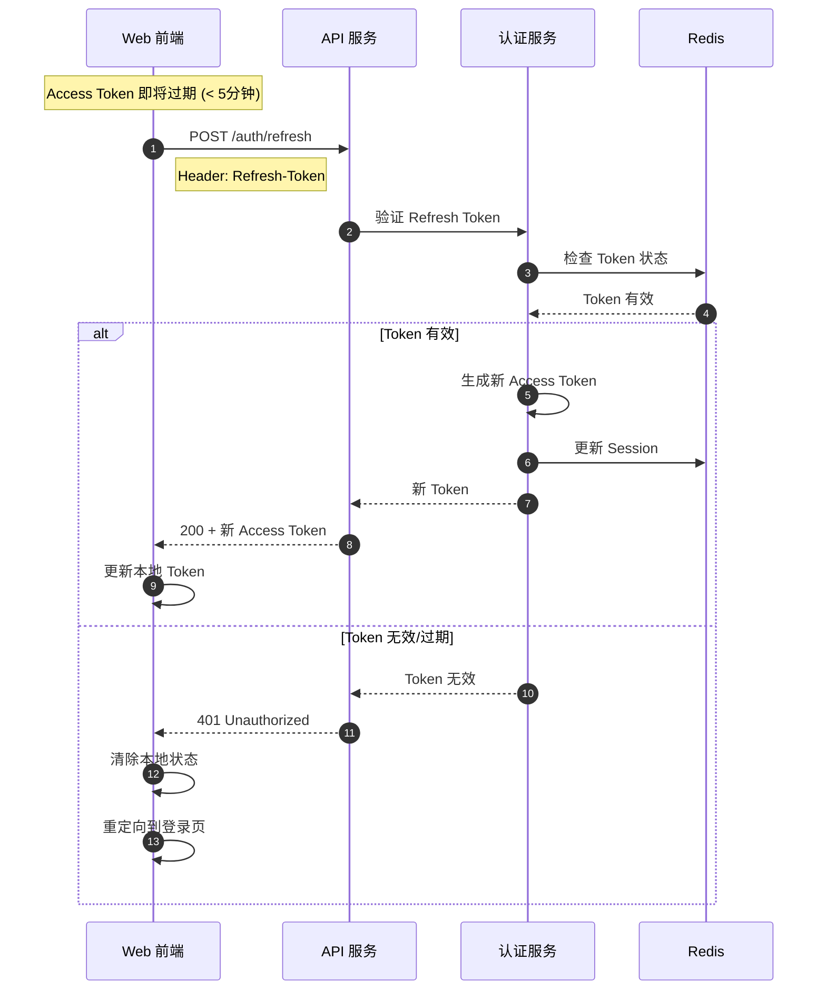
```mermaid
sequenceDiagram
    autonumber
    participant Web as Web 前端
    participant API as API 服务
    participant Auth as 认证服务
    participant Redis as Redis

    Note over Web: Access Token 即将过期 (< 5分钟)

    Web->>API: POST /auth/refresh
    Note right of Web: Header: Refresh-Token

    API->>Auth: 验证 Refresh Token
    Auth->>Redis: 检查 Token 状态
    Redis-->>Auth: Token 有效

    alt Token 有效
        Auth->>Auth: 生成新 Access Token
        Auth->>Redis: 更新 Session
        Auth-->>API: 新 Token
        API-->>Web: 200 + 新 Access Token
        Web->>Web: 更新本地 Token
    else Token 无效/过期
        Auth-->>API: Token 无效
        API-->>Web: 401 Unauthorized
        Web->>Web: 清除本地状态
        Web->>Web: 重定向到登录页
    end
```

### 1.4 Token 结构

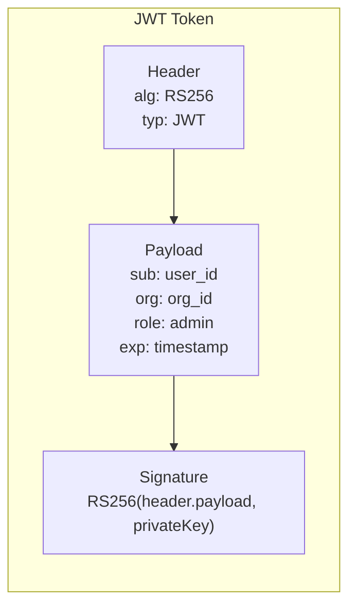
```mermaid
graph LR
    subgraph JWT["JWT Token"]
        Header["Header<br/>alg: RS256<br/>typ: JWT"]
        Payload["Payload<br/>sub: user_id<br/>org: org_id<br/>role: admin<br/>exp: timestamp"]
        Signature["Signature<br/>RS256(header.payload, privateKey)"]
    end

    Header --> Payload --> Signature
```

---

## 2. PRD 生成全流程

### 2.1 用户输入 → AI 生成 → 评审 → 批准

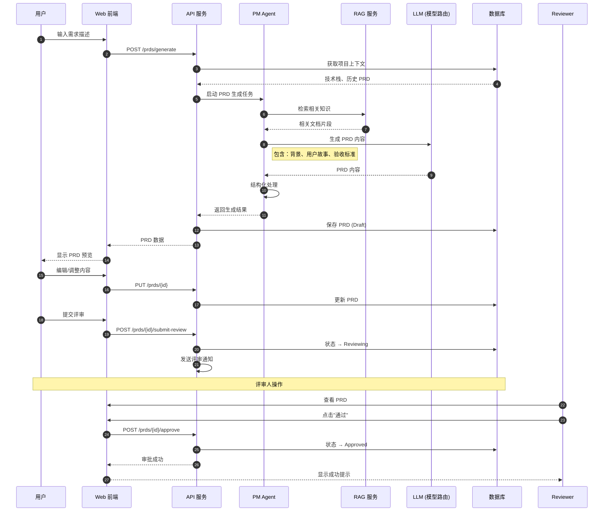
```mermaid
sequenceDiagram
    autonumber
    participant User as 用户
    participant Web as Web 前端
    participant API as API 服务
    participant PM as PM Agent
    participant RAG as RAG 服务
    participant LLM as LLM (模型路由)
    participant DB as 数据库

    User->>Web: 输入需求描述
    Web->>API: POST /prds/generate

    API->>DB: 获取项目上下文
    DB-->>API: 技术栈、历史 PRD

    API->>PM: 启动 PRD 生成任务
    PM->>RAG: 检索相关知识
    RAG-->>PM: 相关文档片段

    PM->>LLM: 生成 PRD 内容
    Note right of PM: 包含：背景、用户故事、验收标准

    LLM-->>PM: PRD 内容
    PM->>PM: 结构化处理

    PM-->>API: 返回生成结果
    API->>DB: 保存 PRD (Draft)
    API-->>Web: PRD 数据

    Web-->>User: 显示 PRD 预览
    User->>Web: 编辑/调整内容
    Web->>API: PUT /prds/{id}
    API->>DB: 更新 PRD

    User->>Web: 提交评审
    Web->>API: POST /prds/{id}/submit-review
    API->>DB: 状态 → Reviewing
    API->>API: 发送评审通知

    Note over User,DB: 评审人操作

    Reviewer->>Web: 查看 PRD
    Reviewer->>Web: 点击"通过"
    Web->>API: POST /prds/{id}/approve
    API->>DB: 状态 → Approved
    API-->>Web: 审批成功
    Web-->>Reviewer: 显示成功提示
```

### 2.2 PRD 状态流转图

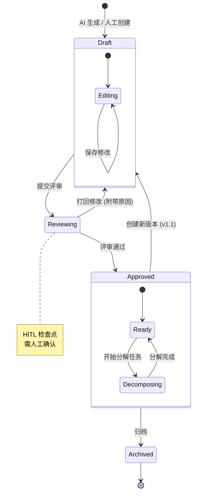
```mermaid
stateDiagram-v2
    [*] --> Draft: AI 生成 / 人工创建

    state Draft {
        [*] --> Editing
        Editing --> Editing: 保存修改
    }

    Draft --> Reviewing: 提交评审
    Reviewing --> Draft: 打回修改 (附带原因)
    Reviewing --> Approved: 评审通过

    state Approved {
        [*] --> Ready
        Ready --> Decomposing: 开始分解任务
        Decomposing --> Ready: 分解完成
    }

    Approved --> Archived: 归档
    Approved --> Draft: 创建新版本 (v1.1)

    Archived --> [*]

    note right of Reviewing
        HITL 检查点
        需人工确认
    end note
```

### 2.3 多角色协作时序图

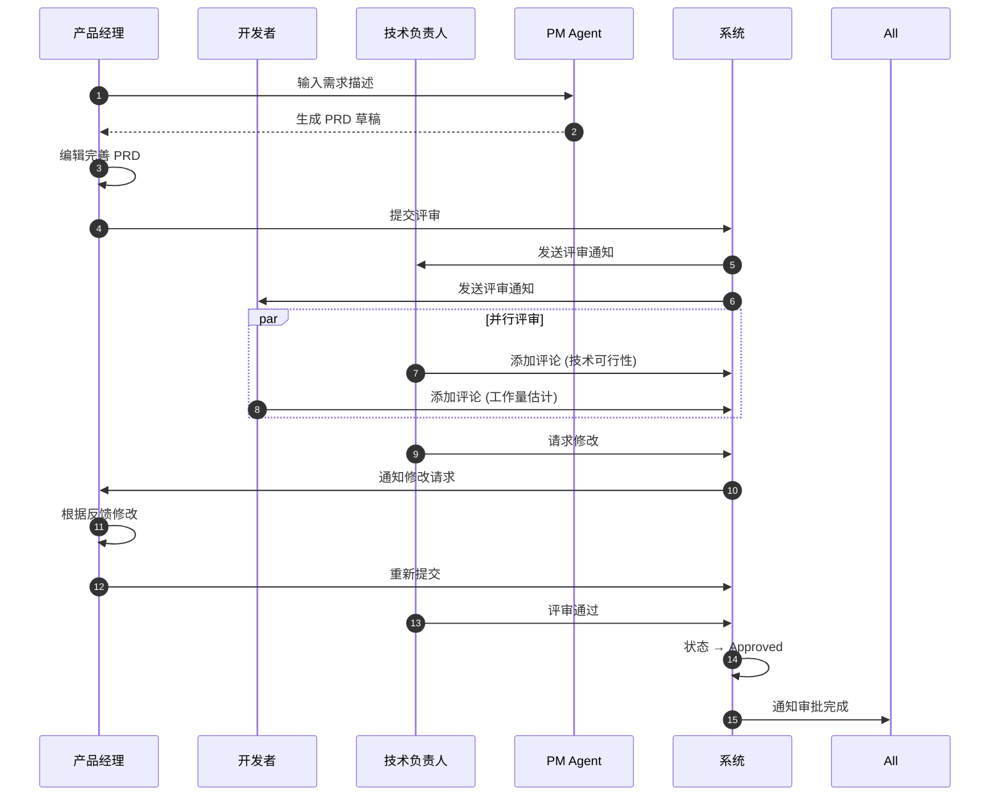
```mermaid
sequenceDiagram
    autonumber
    participant PM as 产品经理
    participant Dev as 开发者
    participant Tech as 技术负责人
    participant AI as PM Agent
    participant System as 系统

    PM->>AI: 输入需求描述
    AI-->>PM: 生成 PRD 草稿

    PM->>PM: 编辑完善 PRD
    PM->>System: 提交评审
    System->>Tech: 发送评审通知
    System->>Dev: 发送评审通知

    par 并行评审
        Tech->>System: 添加评论 (技术可行性)
        Dev->>System: 添加评论 (工作量估计)
    end

    Tech->>System: 请求修改
    System->>PM: 通知修改请求
    PM->>PM: 根据反馈修改
    PM->>System: 重新提交

    Tech->>System: 评审通过
    System->>System: 状态 → Approved
    System->>All: 通知审批完成
```

---

## 3. 任务分发与执行流程

### 3.1 PRD 分解 → 任务创建 → Agent 分发

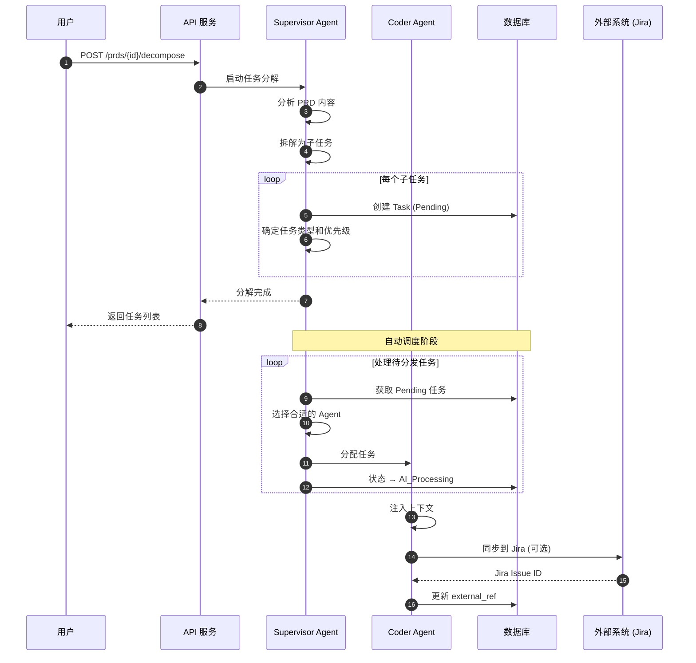
```mermaid
sequenceDiagram
    autonumber
    participant User as 用户
    participant API as API 服务
    participant Supervisor as Supervisor Agent
    participant Coder as Coder Agent
    participant DB as 数据库
    participant External as 外部系统 (Jira)

    User->>API: POST /prds/{id}/decompose
    API->>Supervisor: 启动任务分解

    Supervisor->>Supervisor: 分析 PRD 内容
    Supervisor->>Supervisor: 拆解为子任务

    loop 每个子任务
        Supervisor->>DB: 创建 Task (Pending)
        Supervisor->>Supervisor: 确定任务类型和优先级
    end

    Supervisor-->>API: 分解完成
    API-->>User: 返回任务列表

    Note over Supervisor,DB: 自动调度阶段

    loop 处理待分发任务
        Supervisor->>DB: 获取 Pending 任务
        Supervisor->>Supervisor: 选择合适的 Agent
        Supervisor->>Coder: 分配任务
        Supervisor->>DB: 状态 → AI_Processing
    end

    Coder->>Coder: 注入上下文
    Coder->>External: 同步到 Jira (可选)
    External-->>Coder: Jira Issue ID
    Coder->>DB: 更新 external_ref
```

### 3.2 Coder Agent 协调流程

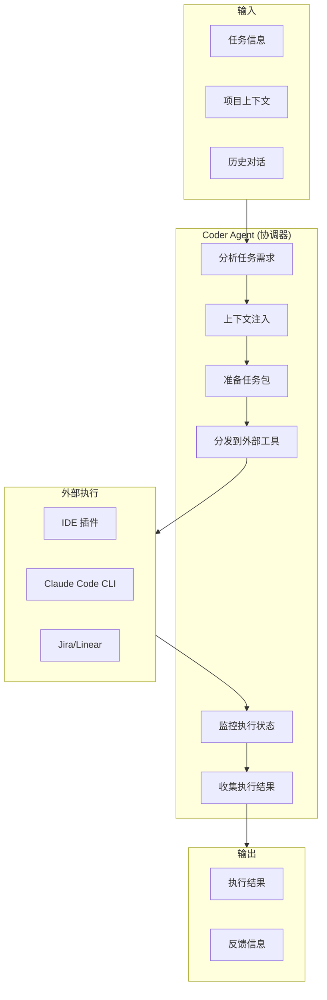
```mermaid
graph TB
    subgraph Input["输入"]
        Task["任务信息"]
        Context["项目上下文"]
        History["历史对话"]
    end

    subgraph CoderAgent["Coder Agent (协调器)"]
        Analyze["分析任务需求"]
        InjectCtx["上下文注入"]
        Prepare["准备任务包"]
        Dispatch["分发到外部工具"]
        Monitor["监控执行状态"]
        Collect["收集执行结果"]
    end

    subgraph External["外部执行"]
        IDE["IDE 插件"]
        CLI["Claude Code CLI"]
        Jira["Jira/Linear"]
    end

    subgraph Output["输出"]
        Result["执行结果"]
        Feedback["反馈信息"]
    end

    Input --> Analyze
    Analyze --> InjectCtx
    InjectCtx --> Prepare
    Prepare --> Dispatch
    Dispatch --> External
    External --> Monitor
    Monitor --> Collect
    Collect --> Output
```

### 3.3 外部工具集成流程

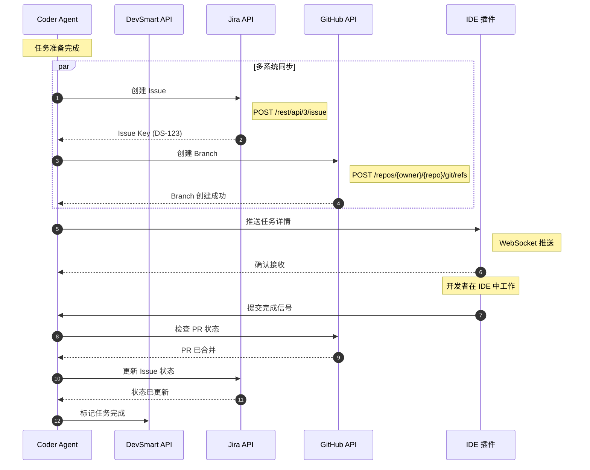
```mermaid
sequenceDiagram
    autonumber
    participant Coder as Coder Agent
    participant API as DevSmart API
    participant Jira as Jira API
    participant GitHub as GitHub API
    participant IDE as IDE 插件

    Note over Coder: 任务准备完成

    par 多系统同步
        Coder->>Jira: 创建 Issue
        Note right of Jira: POST /rest/api/3/issue
        Jira-->>Coder: Issue Key (DS-123)

        Coder->>GitHub: 创建 Branch
        Note right of GitHub: POST /repos/{owner}/{repo}/git/refs
        GitHub-->>Coder: Branch 创建成功
    end

    Coder->>IDE: 推送任务详情
    Note right of IDE: WebSocket 推送

    IDE-->>Coder: 确认接收

    Note over IDE: 开发者在 IDE 中工作

    IDE->>Coder: 提交完成信号
    Coder->>GitHub: 检查 PR 状态
    GitHub-->>Coder: PR 已合并

    Coder->>Jira: 更新 Issue 状态
    Jira-->>Coder: 状态已更新

    Coder->>API: 标记任务完成
```

---

## 4. Agent 协作时序图

### 4.1 Supervisor 路由决策

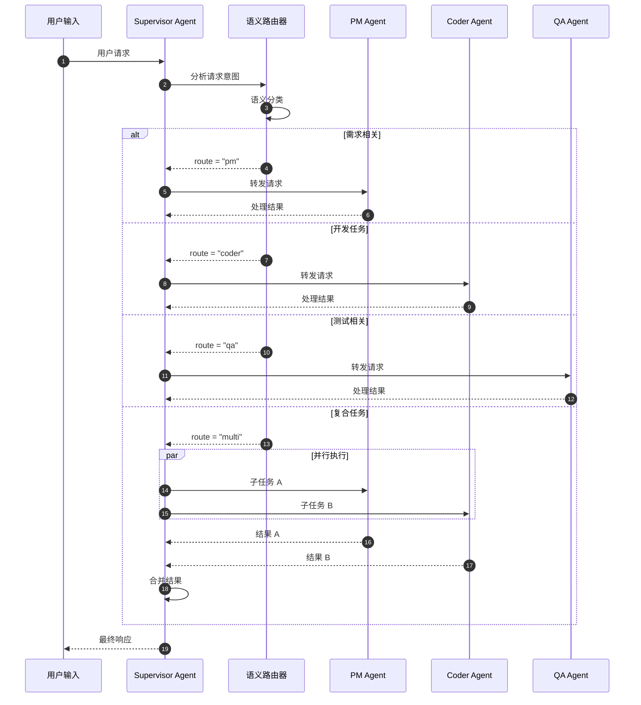
```mermaid
sequenceDiagram
    autonumber
    participant User as 用户输入
    participant Supervisor as Supervisor Agent
    participant Router as 语义路由器
    participant PM as PM Agent
    participant Coder as Coder Agent
    participant QA as QA Agent

    User->>Supervisor: 用户请求

    Supervisor->>Router: 分析请求意图
    Router->>Router: 语义分类

    alt 需求相关
        Router-->>Supervisor: route = "pm"
        Supervisor->>PM: 转发请求
        PM-->>Supervisor: 处理结果
    else 开发任务
        Router-->>Supervisor: route = "coder"
        Supervisor->>Coder: 转发请求
        Coder-->>Supervisor: 处理结果
    else 测试相关
        Router-->>Supervisor: route = "qa"
        Supervisor->>QA: 转发请求
        QA-->>Supervisor: 处理结果
    else 复合任务
        Router-->>Supervisor: route = "multi"
        par 并行执行
            Supervisor->>PM: 子任务 A
            Supervisor->>Coder: 子任务 B
        end
        PM-->>Supervisor: 结果 A
        Coder-->>Supervisor: 结果 B
        Supervisor->>Supervisor: 合并结果
    end

    Supervisor-->>User: 最终响应
```

### 4.2 跨 Agent 通信

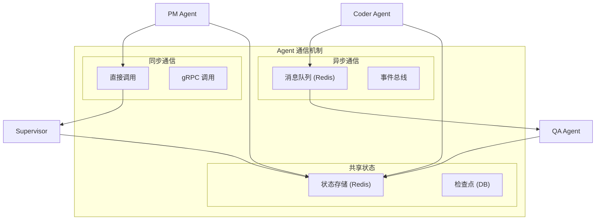
```mermaid
graph TB
    subgraph Communication["Agent 通信机制"]
        subgraph Sync["同步通信"]
            DirectCall["直接调用"]
            RPC["gRPC 调用"]
        end

        subgraph Async["异步通信"]
            MessageQueue["消息队列 (Redis)"]
            EventBus["事件总线"]
        end

        subgraph Shared["共享状态"]
            StateStore["状态存储 (Redis)"]
            Checkpoint["检查点 (DB)"]
        end
    end

    PM["PM Agent"] --> DirectCall
    DirectCall --> Supervisor["Supervisor"]

    Coder["Coder Agent"] --> MessageQueue
    MessageQueue --> QA["QA Agent"]

    PM --> StateStore
    Coder --> StateStore
    QA --> StateStore
    Supervisor --> StateStore
```

### 4.3 状态同步机制

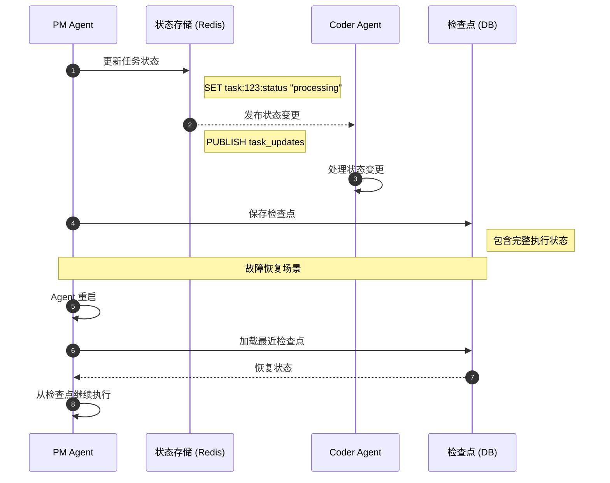
```mermaid
sequenceDiagram
    autonumber
    participant Agent1 as PM Agent
    participant State as 状态存储 (Redis)
    participant Agent2 as Coder Agent
    participant Checkpoint as 检查点 (DB)

    Agent1->>State: 更新任务状态
    Note right of State: SET task:123:status "processing"

    State-->>Agent2: 发布状态变更
    Note right of State: PUBLISH task_updates

    Agent2->>Agent2: 处理状态变更

    Agent1->>Checkpoint: 保存检查点
    Note right of Checkpoint: 包含完整执行状态

    Note over Agent1,Checkpoint: 故障恢复场景

    Agent1->>Agent1: Agent 重启

    Agent1->>Checkpoint: 加载最近检查点
    Checkpoint-->>Agent1: 恢复状态

    Agent1->>Agent1: 从检查点继续执行
```

### 4.4 Agent 状态机

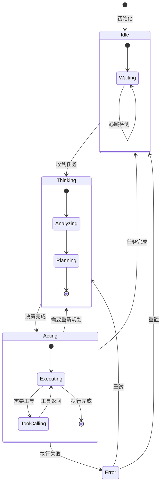
```mermaid
stateDiagram-v2
    [*] --> Idle: 初始化

    state Idle {
        [*] --> Waiting
        Waiting --> Waiting: 心跳检测
    }

    Idle --> Thinking: 收到任务

    state Thinking {
        [*] --> Analyzing
        Analyzing --> Planning
        Planning --> [*]
    }

    Thinking --> Acting: 决策完成

    state Acting {
        [*] --> Executing
        Executing --> ToolCalling: 需要工具
        ToolCalling --> Executing: 工具返回
        Executing --> [*]: 执行完成
    }

    Acting --> Thinking: 需要重新规划
    Acting --> Idle: 任务完成
    Acting --> Error: 执行失败

    Error --> Idle: 重置
    Error --> Thinking: 重试
```

---

## 5. 知识库 RAG 检索流程

### 5.1 文档向量化

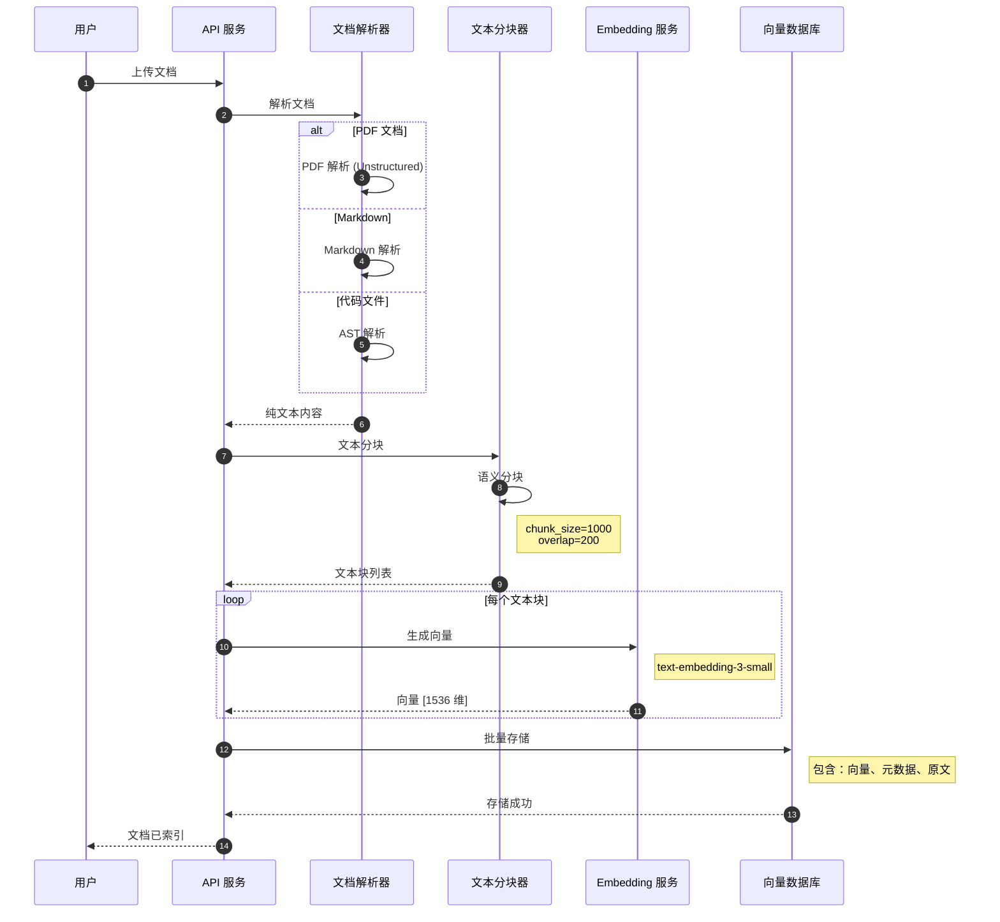
```mermaid
sequenceDiagram
    autonumber
    participant User as 用户
    participant API as API 服务
    participant Parser as 文档解析器
    participant Splitter as 文本分块器
    participant Embedder as Embedding 服务
    participant Vector as 向量数据库

    User->>API: 上传文档
    API->>Parser: 解析文档

    alt PDF 文档
        Parser->>Parser: PDF 解析 (Unstructured)
    else Markdown
        Parser->>Parser: Markdown 解析
    else 代码文件
        Parser->>Parser: AST 解析
    end

    Parser-->>API: 纯文本内容

    API->>Splitter: 文本分块
    Splitter->>Splitter: 语义分块
    Note right of Splitter: chunk_size=1000<br/>overlap=200

    Splitter-->>API: 文本块列表

    loop 每个文本块
        API->>Embedder: 生成向量
        Note right of Embedder: text-embedding-3-small
        Embedder-->>API: 向量 [1536 维]
    end

    API->>Vector: 批量存储
    Note right of Vector: 包含：向量、元数据、原文

    Vector-->>API: 存储成功
    API-->>User: 文档已索引
```

### 5.2 语义检索

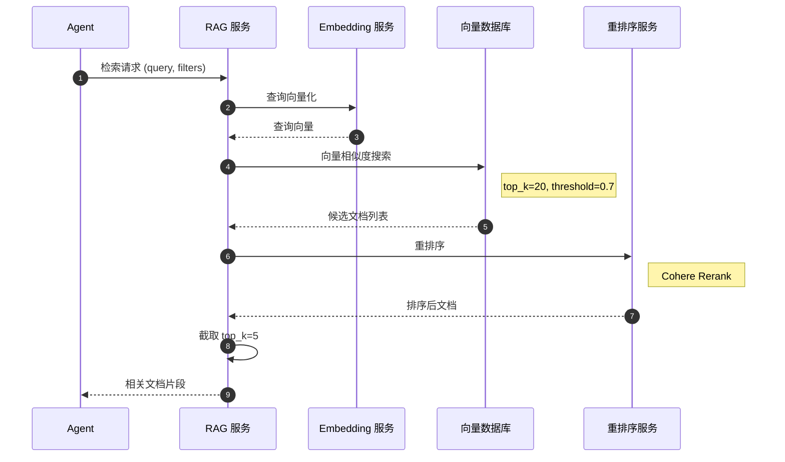
```mermaid
sequenceDiagram
    autonumber
    participant Agent as Agent
    participant RAG as RAG 服务
    participant Embedder as Embedding 服务
    participant Vector as 向量数据库
    participant Reranker as 重排序服务

    Agent->>RAG: 检索请求 (query, filters)

    RAG->>Embedder: 查询向量化
    Embedder-->>RAG: 查询向量

    RAG->>Vector: 向量相似度搜索
    Note right of Vector: top_k=20, threshold=0.7

    Vector-->>RAG: 候选文档列表

    RAG->>Reranker: 重排序
    Note right of Reranker: Cohere Rerank

    Reranker-->>RAG: 排序后文档

    RAG->>RAG: 截取 top_k=5

    RAG-->>Agent: 相关文档片段
```

### 5.3 上下文注入

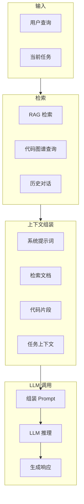
```mermaid
graph TB
    subgraph Input["输入"]
        Query["用户查询"]
        Task["当前任务"]
    end

    subgraph Retrieval["检索"]
        RAG["RAG 检索"]
        CodeGraph["代码图谱查询"]
        History["历史对话"]
    end

    subgraph Context["上下文组装"]
        SystemPrompt["系统提示词"]
        RetrievedDocs["检索文档"]
        CodeSnippets["代码片段"]
        TaskContext["任务上下文"]
    end

    subgraph LLM["LLM 调用"]
        Prompt["组装 Prompt"]
        Call["LLM 推理"]
        Response["生成响应"]
    end

    Input --> Retrieval
    Retrieval --> Context
    Context --> Prompt
    Prompt --> Call
    Call --> Response
```

### 5.4 完整 RAG 流程图

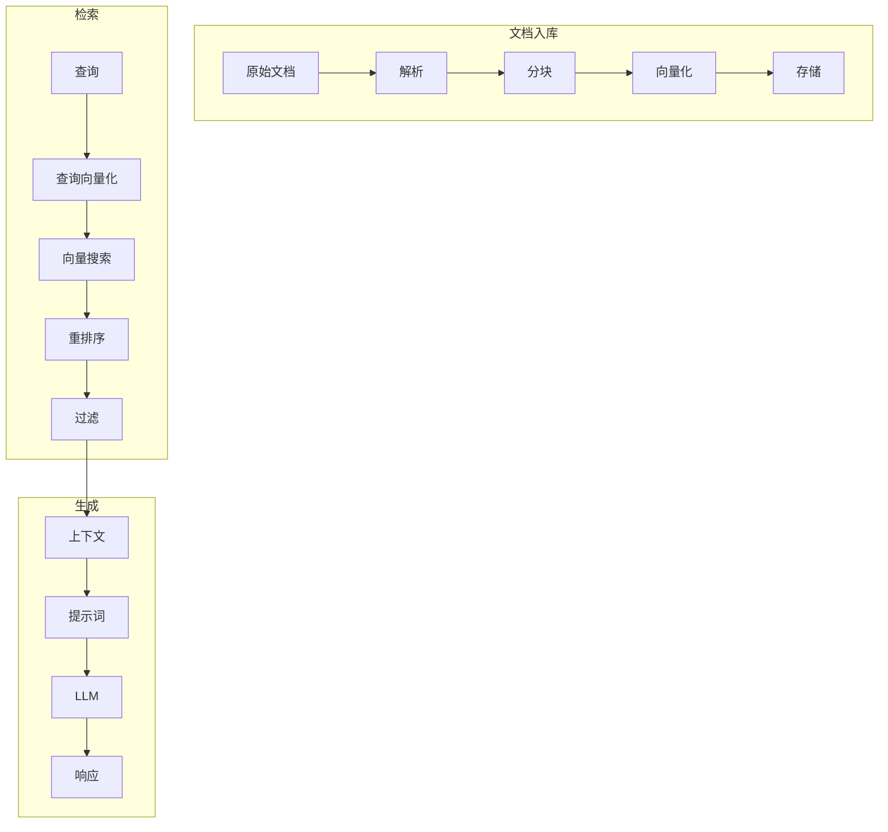
```mermaid
graph TB
    subgraph Ingestion["文档入库"]
        Doc["原始文档"]
        Parse["解析"]
        Chunk["分块"]
        Embed["向量化"]
        Store["存储"]
    end

    subgraph Retrieval["检索"]
        Query["查询"]
        QueryEmbed["查询向量化"]
        Search["向量搜索"]
        Rerank["重排序"]
        Filter["过滤"]
    end

    subgraph Generation["生成"]
        Context["上下文"]
        Prompt["提示词"]
        LLM["LLM"]
        Response["响应"]
    end

    Doc --> Parse --> Chunk --> Embed --> Store
    Query --> QueryEmbed --> Search --> Rerank --> Filter --> Context
    Context --> Prompt --> LLM --> Response
```

---

## 6. 事件驱动架构图

### 6.1 事件总线设计

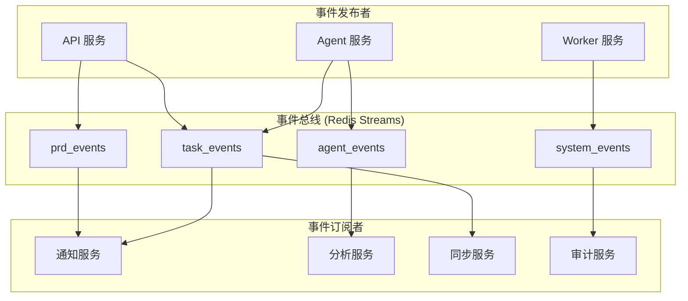
```mermaid
graph TB
    subgraph Publishers["事件发布者"]
        API["API 服务"]
        Agent["Agent 服务"]
        Worker["Worker 服务"]
    end

    subgraph EventBus["事件总线 (Redis Streams)"]
        PRDEvents["prd_events"]
        TaskEvents["task_events"]
        AgentEvents["agent_events"]
        SystemEvents["system_events"]
    end

    subgraph Subscribers["事件订阅者"]
        Notifier["通知服务"]
        Analytics["分析服务"]
        Sync["同步服务"]
        Audit["审计服务"]
    end

    API --> PRDEvents
    API --> TaskEvents
    Agent --> AgentEvents
    Agent --> TaskEvents
    Worker --> SystemEvents

    PRDEvents --> Notifier
    TaskEvents --> Notifier
    TaskEvents --> Sync
    AgentEvents --> Analytics
    SystemEvents --> Audit
```

### 6.2 事件定义

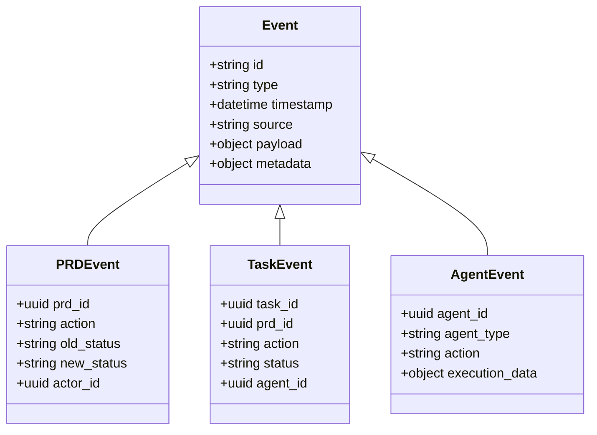
```mermaid
classDiagram
    class Event {
        +string id
        +string type
        +datetime timestamp
        +string source
        +object payload
        +object metadata
    }

    class PRDEvent {
        +uuid prd_id
        +string action
        +string old_status
        +string new_status
        +uuid actor_id
    }

    class TaskEvent {
        +uuid task_id
        +uuid prd_id
        +string action
        +string status
        +uuid agent_id
    }

    class AgentEvent {
        +uuid agent_id
        +string agent_type
        +string action
        +object execution_data
    }

    Event <|-- PRDEvent
    Event <|-- TaskEvent
    Event <|-- AgentEvent
```

### 6.3 异步任务处理

```mermaid
sequenceDiagram
    autonumber
    participant API as API 服务
    participant Queue as 任务队列 (Redis)
    participant Worker as Worker 服务
    participant External as 外部服务

    API->>Queue: 提交任务
    Note right of Queue: LPUSH task_queue

    API-->>User: 202 Accepted
    Note right of API: 返回 task_id

    loop Worker 轮询
        Worker->>Queue: 获取任务
        Note right of Queue: BRPOP task_queue
        Queue-->>Worker: 任务数据
    end

    Worker->>Worker: 执行任务

    alt 需要外部调用
        Worker->>External: API 调用
        External-->>Worker: 响应
    end

    Worker->>Queue: 发布完成事件
    Worker->>DB: 更新任务状态
```

### 6.4 WebSocket 实时推送

```mermaid
sequenceDiagram
    autonumber
    participant Client as 浏览器
    participant WS as WebSocket 服务
    participant Redis as Redis Pub/Sub
    participant Worker as 后台服务

    Client->>WS: 建立 WebSocket 连接
    WS->>WS: 验证 Token
    WS-->>Client: 连接成功

    Client->>WS: 订阅频道
    Note right of WS: subscribe task:{task_id}

    WS->>Redis: SUBSCRIBE task_updates

    Note over Worker: 任务状态变更

    Worker->>Redis: PUBLISH task_updates
    Redis-->>WS: 推送消息

    WS-->>Client: 发送更新
    Client->>Client: 更新 UI
```

---

## 7. 数据流转图

### 7.1 读写路径

```mermaid
graph TB
    subgraph Write["写入路径"]
        W1["API 请求"]
        W2["业务验证"]
        W3["写入主库"]
        W4["发布事件"]
        W5["更新缓存"]
    end

    subgraph Read["读取路径"]
        R1["API 请求"]
        R2["检查缓存"]
        R3["缓存命中?"]
        R4["返回缓存"]
        R5["查询从库"]
        R6["写入缓存"]
        R7["返回数据"]
    end

    W1 --> W2 --> W3 --> W4 --> W5

    R1 --> R2 --> R3
    R3 -->|是| R4
    R3 -->|否| R5 --> R6 --> R7
```

### 7.2 缓存策略

```mermaid
graph LR
    subgraph CacheStrategy["缓存策略"]
        subgraph L1["L1 - 本地缓存"]
            LRU["LRU 缓存<br/>TTL: 1分钟"]
        end

        subgraph L2["L2 - Redis 缓存"]
            Session["Session<br/>TTL: 24小时"]
            HotData["热点数据<br/>TTL: 5分钟"]
            Config["配置数据<br/>TTL: 1小时"]
        end

        subgraph DB["数据库"]
            Primary["主库 (写)"]
            Replica["从库 (读)"]
        end
    end

    Request["请求"] --> LRU
    LRU -->|miss| Session
    Session -->|miss| Primary
    HotData -->|miss| Replica
```

### 7.3 数据同步

```mermaid
sequenceDiagram
    autonumber
    participant API as DevSmart
    participant DB as PostgreSQL
    participant Sync as 同步服务
    participant Jira as Jira
    participant Linear as Linear

    Note over API,Linear: 创建任务同步

    API->>DB: 创建 Task
    DB-->>API: Task 创建成功

    API->>Sync: 触发同步事件

    par 并行同步
        Sync->>Jira: 创建 Issue
        Jira-->>Sync: Issue Key
        Sync->>Linear: 创建 Issue
        Linear-->>Sync: Issue ID
    end

    Sync->>DB: 更新 external_refs

    Note over API,Linear: 状态变更同步

    Jira->>Sync: Webhook: 状态变更
    Sync->>DB: 更新 Task 状态
    Sync->>API: 发布状态事件
    API->>Linear: 同步状态
```

### 7.4 完整数据流图

```mermaid
graph TB
    subgraph Client["客户端"]
        Browser["浏览器"]
        Mobile["移动端"]
    end

    subgraph API["API 层"]
        REST["REST API"]
        WebSocket["WebSocket"]
    end

    subgraph Service["服务层"]
        Auth["认证"]
        PRD["PRD 服务"]
        Task["任务服务"]
        Agent["Agent 服务"]
    end

    subgraph Data["数据层"]
        PG[(PostgreSQL)]
        Redis[(Redis)]
        Vector[(向量库)]
        Neo4j[(Neo4j)]
    end

    subgraph External["外部系统"]
        LLM["LLM API"]
        GitHub["GitHub"]
        Jira["Jira"]
    end

    Browser --> REST
    Browser --> WebSocket
    Mobile --> REST

    REST --> Auth
    REST --> PRD
    REST --> Task
    WebSocket --> Agent

    Auth --> PG
    Auth --> Redis
    PRD --> PG
    PRD --> Vector
    Task --> PG
    Task --> Redis
    Agent --> PG
    Agent --> Redis
    Agent --> Neo4j

    Agent --> LLM
    Task --> GitHub
    Task --> Jira
```

---

## 附录：流程图图例说明

### 图例

| 符号 | 含义 |
|:---|:---|
| 矩形 | 处理步骤 |
| 菱形 | 判断分支 |
| 圆角矩形 | 开始/结束 |
| 圆柱体 | 数据存储 |
| 平行四边形 | 输入/输出 |
| 实线箭头 | 数据/控制流 |
| 虚线箭头 | 异步/可选流 |

### 时序图参与者

| 参与者 | 说明 |
|:---|:---|
| User | 终端用户 |
| Web | 前端应用 |
| API | 后端 API 服务 |
| Agent | AI Agent 服务 |
| DB | 数据库 |
| External | 外部系统 |
