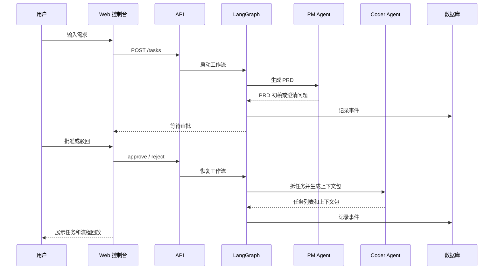
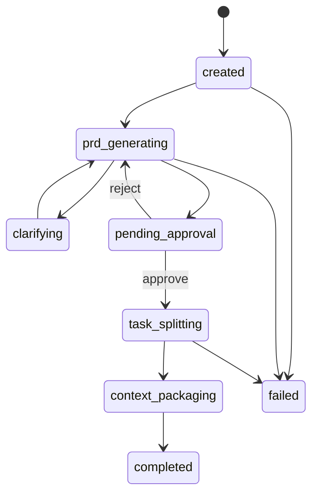

# 系统流程图

## POC 主流程


```mermaid
sequenceDiagram
    participant U as 用户
    participant W as Web 控制台
    participant A as API
    participant G as LangGraph
    participant PM as PM Agent
    participant C as Coder Agent
    participant DB as 数据库

    U->>W: 输入需求
    W->>A: POST /tasks
    A->>G: 启动工作流
    G->>PM: 生成 PRD
    PM-->>G: PRD 初稿或澄清问题
    G->>DB: 记录事件
    G-->>W: 等待审批
    U->>W: 批准或驳回
    W->>A: approve / reject
    A->>G: 恢复工作流
    G->>C: 拆任务并生成上下文包
    C-->>G: 任务列表和上下文包
    G->>DB: 记录事件
    W-->>U: 展示任务和流程回放
```

## 状态流


```mermaid
stateDiagram-v2
    [*] --> created
    created --> prd_generating
    prd_generating --> clarifying
    clarifying --> prd_generating
    prd_generating --> pending_approval
    pending_approval --> prd_generating: reject
    pending_approval --> task_splitting: approve
    task_splitting --> context_packaging
    context_packaging --> completed
    created --> failed
    prd_generating --> failed
    task_splitting --> failed
```

## 安全流程

```text
登录 -> Access Token 存内存 -> Refresh Token 使用 HttpOnly Cookie -> 所有审批写审计事件
```
