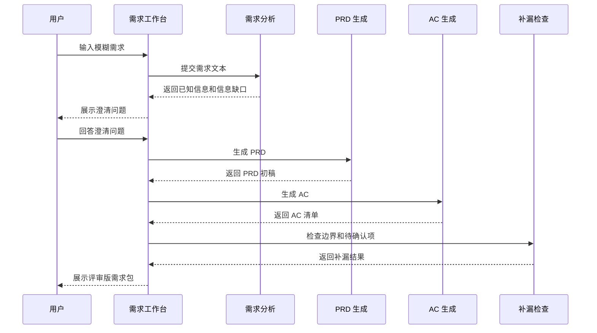
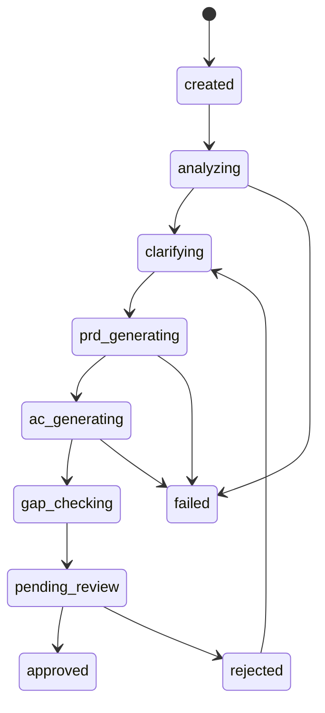

# 系统流程图

## 需求包主流程

```mermaid
sequenceDiagram
    participant U as 用户
    participant W as 需求工作台
    participant A as 需求分析
    participant P as PRD 生成
    participant C as AC 生成
    participant G as 补漏检查

    U->>W: 输入模糊需求
    W->>A: 提交需求文本
    A-->>W: 返回已知信息和信息缺口
    W-->>U: 展示澄清问题
    U->>W: 回答澄清问题
    W->>P: 生成 PRD
    P-->>W: 返回 PRD 初稿
    W->>C: 生成 AC
    C-->>W: 返回 AC 清单
    W->>G: 检查边界和待确认项
    G-->>W: 返回补漏结果
    W-->>U: 展示评审版需求包
```

## 状态流转

```mermaid
stateDiagram-v2
    [*] --> created
    created --> analyzing
    analyzing --> clarifying
    clarifying --> prd_generating
    prd_generating --> ac_generating
    ac_generating --> gap_checking
    gap_checking --> pending_review
    pending_review --> approved
    pending_review --> rejected
    rejected --> clarifying
    analyzing --> failed
    prd_generating --> failed
    ac_generating --> failed
```
