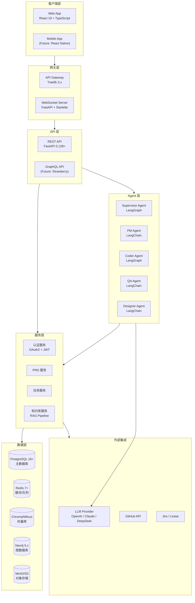
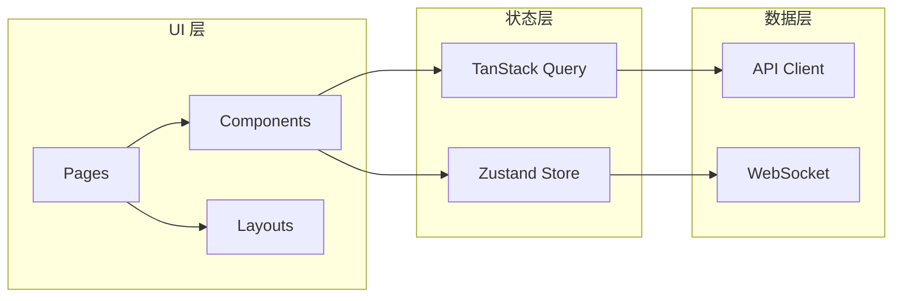
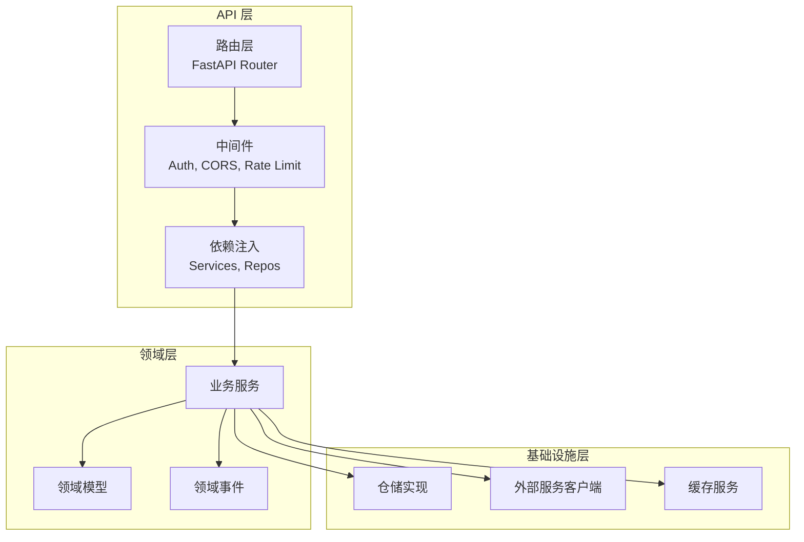
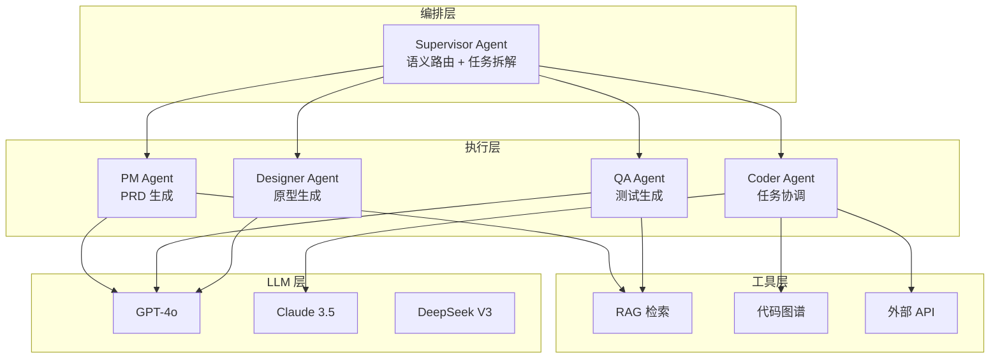
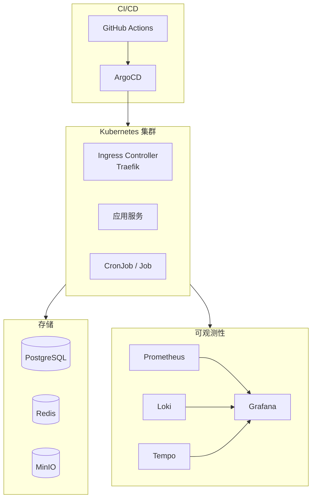
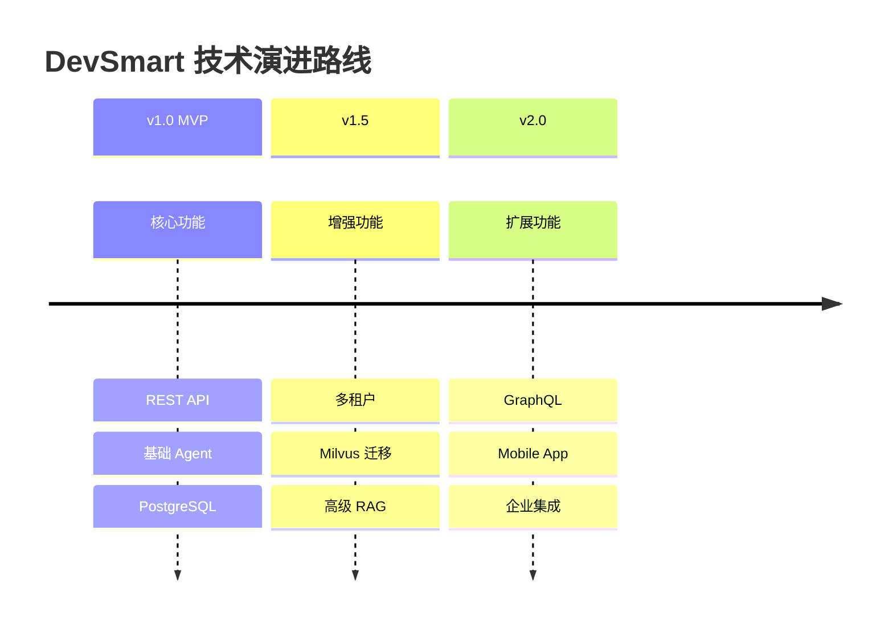

# DevSmart 技术栈总览

本文档详细描述 DevSmart 平台的完整技术栈选型，包括各层级的技术选择、版本要求和设计考量。

---

## 1. 技术选型总表

| 层级 | 技术 | 版本 | 说明 | 选型理由 |
|:---|:---|:---|:---|:---|
| **前端** | React | 19.x | UI 框架 | 生态成熟，Server Components 支持 |
| **前端** | TypeScript | 5.x | 类型系统 | 类型安全，提升代码质量 |
| **前端** | Vite | 7.x | 构建工具 | 快速 HMR，原生 ESM 支持 |
| **前端** | TailwindCSS | 4.x | 样式框架 | 原子化 CSS，快速开发 |
| **前端** | Zustand | 5.x | 状态管理 | 轻量，TypeScript 友好 |
| **后端** | Python | 3.11+ | 运行时 | AI/ML 生态支持 |
| **后端** | FastAPI | 0.128+ | Web 框架 | 高性能，自动 API 文档 |
| **后端** | LangGraph | 1.0+ | Agent 编排 | 状态图，检查点生态，Platform 支持 |
| **后端** | LangChain | 1.2+ | LLM 框架 | UUID7 追踪，摘要增强，RAG 支持 |
| **后端** | Pydantic | 2.x | 数据验证 | 类型安全，FastAPI 集成 |
| **数据库** | PostgreSQL | 16+ | 主数据库 | JSONB 支持，可靠性高 |
| **数据库** | Redis | 7+ | 缓存/消息 | 高性能缓存，Pub/Sub |
| **向量库** | Chroma | 0.5+ | 语义检索 | 轻量，易于部署 |
| **向量库** | Milvus | 2.4+ | 语义检索(生产) | 高性能，分布式支持 |
| **图数据库** | Neo4j | 5.x | 代码图谱 | 图查询优化，可视化 |
| **LLM** | OpenAI GPT-4o | - | 商业模型 | 综合能力强 |
| **LLM** | Claude 3.5 Sonnet | - | 商业模型 | 代码生成优秀 |
| **LLM** | DeepSeek V3 | - | 开源模型 | 成本效益，中文支持 |
| **容器** | Docker | 24+ | 容器化 | 标准化部署 |
| **编排** | Kubernetes | 1.29+ | 容器编排 | 弹性伸缩，高可用 |
| **网关** | Traefik | 3.x | API 网关 | 自动服务发现，中间件 |

---

## 2. 分层架构技术栈图



---

## 3. 前端技术栈详解

### 3.1 核心框架

| 技术 | 版本 | 用途 | 配置说明 |
|:---|:---|:---|:---|
| React | 19.x | UI 组件框架 | 启用 Concurrent Mode |
| TypeScript | 5.x | 类型系统 | strict 模式 |
| Vite | 7.x | 构建打包 | 开发/生产双配置 |

### 3.2 UI 组件与样式

| 技术 | 版本 | 用途 |
|:---|:---|:---|
| TailwindCSS | 4.x | 原子化样式 |
| Radix UI | 1.x | 无样式组件库 |
| Lucide React | latest | 图标库 |
| Framer Motion | 11.x | 动画库 |

### 3.3 状态管理与数据获取

| 技术 | 版本 | 用途 |
|:---|:---|:---|
| Zustand | 5.x | 全局状态管理 |
| TanStack Query | 5.x | 服务端状态/缓存 |
| React Hook Form | 7.x | 表单管理 |
| Zod | 3.x | 运行时类型验证 |

### 3.4 开发工具

| 技术 | 版本 | 用途 |
|:---|:---|:---|
| ESLint | 9.x | 代码检查 |
| Prettier | 3.x | 代码格式化 |
| Vitest | 2.x | 单元测试 |
| Playwright | 1.x | E2E 测试 |
| Storybook | 8.x | 组件文档 |

### 3.5 前端架构图



---

## 4. 后端技术栈详解

### 4.1 核心框架

| 技术 | 版本 | 用途 | 关键特性 |
|:---|:---|:---|:---|
| Python | 3.11+ | 运行时 | 类型提示，性能优化 |
| FastAPI | 0.128+ | Web 框架 | 自动文档，依赖注入 |
| Uvicorn | 0.30+ | ASGI 服务器 | 高并发，HTTP/2 |
| Pydantic | 2.x | 数据验证 | 高性能序列化 |

### 4.2 异步与并发

| 技术 | 版本 | 用途 |
|:---|:---|:---|
| asyncio | 内置 | 异步运行时 |
| httpx | 0.27+ | 异步 HTTP 客户端 |
| aioredis | 2.x | 异步 Redis |
| asyncpg | 0.29+ | 异步 PostgreSQL |

### 4.3 后端架构图



---

## 5. AI/LLM 技术栈详解

### 5.1 Agent 框架

| 技术 | 版本 | 用途 | 关键特性 |
|:---|:---|:---|:---|
| LangGraph | 1.0+ | Agent 编排 | 状态图、检查点生态、Platform 支持 |
| LangChain | 1.2+ | LLM 集成 | 提示模板、链、工具、UUID7 追踪 |
| LangSmith | - | 可观测性 | 追踪、评估、监控 |

### 5.2 LLM 提供商

| 提供商 | 模型 | 用途 | 特点 |
|:---|:---|:---|:---|
| OpenAI | GPT-4o | 通用任务 | 综合能力强，多模态 |
| OpenAI | GPT-4o-mini | 简单任务 | 成本低，响应快 |
| Anthropic | Claude 3.5 Sonnet | 代码生成 | 代码质量高，上下文长 |
| DeepSeek | V3 | 备选方案 | 开源，中文优化 |

### 5.3 RAG 技术栈

| 组件 | 技术 | 说明 |
|:---|:---|:---|
| 文档解析 | Unstructured | 多格式文档解析 |
| 文本分块 | LangChain Splitters | 语义分块 |
| Embedding | OpenAI text-embedding-3 | 向量化 |
| 向量存储 | Chroma / Milvus | 向量检索 |
| 重排序 | Cohere Rerank | 结果优化 |

### 5.4 Agent 架构图



---

## 6. 基础设施技术栈

### 6.1 容器与编排

| 技术 | 版本 | 用途 |
|:---|:---|:---|
| Docker | 24+ | 容器运行时 |
| Docker Compose | 2.x | 本地开发编排 |
| Kubernetes | 1.29+ | 生产环境编排 |
| Helm | 3.x | K8s 包管理 |

### 6.2 CI/CD

| 技术 | 用途 |
|:---|:---|
| GitHub Actions | CI/CD 流水线 |
| ArgoCD | GitOps 部署 |
| Trivy | 安全扫描 |

### 6.3 可观测性

| 技术 | 用途 |
|:---|:---|
| Prometheus | 指标采集 |
| Grafana | 可视化仪表盘 |
| Loki | 日志聚合 |
| Tempo / Jaeger | 分布式追踪 |
| OpenTelemetry | 统一遥测 |

### 6.4 基础设施架构图



---

## 7. 版本兼容性矩阵

### 7.1 核心依赖兼容性

| 组件 A | 组件 B | 兼容版本 | 说明 |
|:---|:---|:---|:---|
| Python 3.11+ | FastAPI 0.128+ | ✅ | 推荐组合 |
| Python 3.11+ | LangChain 1.2+ | ✅ | 需要 3.9+ |
| LangGraph 1.0+ | LangChain 1.2+ | ✅ | 版本需匹配 |
| PostgreSQL 16+ | asyncpg 0.29+ | ✅ | 完整支持 |
| Redis 7+ | aioredis 2.x | ✅ | 推荐组合 |
| React 19 | TypeScript 5.x | ✅ | 完整支持 |
| Vite 7.x | React 19 | ✅ | 官方支持 |

### 7.2 升级路径建议

| 当前版本 | 目标版本 | 升级难度 | 注意事项 |
|:---|:---|:---|:---|
| LangChain 0.3 | 1.2+ | 中等 | API 有变化，需迁移 |
| LangGraph 0.2 | 1.0+ | 中等 | 检查点库独立，需更新依赖 |
| React 18 | 19 | 低 | 向后兼容 |
| PostgreSQL 15 | 16 | 低 | 平滑升级 |

---

## 8. 第三方服务依赖清单

### 8.1 必需服务

| 服务 | 用途 | 替代方案 | 费用模式 |
|:---|:---|:---|:---|
| OpenAI API | LLM 推理 | Claude, DeepSeek | 按 Token 计费 |
| GitHub OAuth | 用户认证 | Google OAuth | 免费 |

### 8.2 可选服务

| 服务 | 用途 | 替代方案 | 费用模式 |
|:---|:---|:---|:---|
| LangSmith | Agent 追踪 | 自建 Tracing | 免费层可用 |
| Cohere | Rerank | 自建模型 | 按请求计费 |
| Jira Cloud | 任务同步 | Linear, 自建 | 按用户计费 |
| Sentry | 错误追踪 | 自建 | 免费层可用 |

### 8.3 云服务商选择

| 场景 | 推荐服务商 | 备选 | 说明 |
|:---|:---|:---|:---|
| Kubernetes | AWS EKS | GKE, AKS | 成熟稳定 |
| PostgreSQL | AWS RDS | Cloud SQL | 托管服务 |
| Redis | AWS ElastiCache | Redis Cloud | 托管服务 |
| 对象存储 | AWS S3 | MinIO (自建) | 成本考量 |

---

## 9. 开发环境配置

### 9.1 本地开发要求

```yaml
# 最低配置
CPU: 4 核
内存: 16GB
存储: 50GB SSD

# 推荐配置
CPU: 8 核
内存: 32GB
存储: 100GB NVMe
```

### 9.2 开发工具链

| 工具 | 用途 | 必需 |
|:---|:---|:---|
| Docker Desktop | 容器运行 | ✅ |
| VS Code | IDE | 推荐 |
| pnpm | 前端包管理 | ✅ |
| uv / Poetry | Python 包管理 | ✅ |
| Make | 任务自动化 | 推荐 |

### 9.3 Docker Compose 服务

```yaml
services:
  postgres:
    image: postgres:16-alpine
  redis:
    image: redis:7-alpine
  chroma:
    image: chromadb/chroma:latest
  neo4j:
    image: neo4j:5-community
  minio:
    image: minio/minio:latest
```

---

## 10. 技术债务与演进计划

### 10.1 当前技术债务

| 项目 | 描述 | 优先级 | 计划版本 |
|:---|:---|:---|:---|
| GraphQL API | 补充 GraphQL 支持 | 低 | v2.0 |
| Mobile App | React Native 移动端 | 低 | v2.0 |
| 多租户隔离 | 数据库级别隔离 | 中 | v1.5 |

### 10.2 技术演进路线



---

## 附录：技术栈决策记录 (ADR)

### ADR-001: 选择 FastAPI 作为后端框架

**状态**: 已采纳

**背景**: 需要一个高性能、支持异步的 Python Web 框架

**决策**: 选择 FastAPI

**理由**:
- 原生异步支持
- 自动 OpenAPI 文档
- Pydantic 集成，类型安全
- 性能优于 Flask/Django

**后果**: 团队需要熟悉 async/await 编程模式

---

### ADR-002: 选择 LangGraph 作为 Agent 编排框架

**状态**: 已采纳

**背景**: 需要支持复杂的 Agent 状态管理和协作

**决策**: 选择 LangGraph

**理由**:
- 状态图原生支持
- 检查点和 Time Travel 功能
- 与 LangChain 生态集成
- Human-in-the-Loop 支持

**后果**: 学习曲线较陡，需要理解图状态机概念

---

### ADR-003: 选择 PostgreSQL 作为主数据库

**状态**: 已采纳

**背景**: 需要可靠的关系型数据库支持复杂查询

**决策**: 选择 PostgreSQL 16+

**理由**:
- JSONB 支持灵活结构
- 丰富的索引类型
- 成熟的生态系统
- 云服务商广泛支持

**后果**: 需要 DBA 经验进行性能调优
